# Table of contents

1. TOC
{:toc}

# Introduction

In this section we will prepare the Splinky. The Splinky is an open-source board based on the RP2040 controller, which acts as the "brains" of your keyboard.
We will install it onto a **shield PCB** (also called **MCU holder**), as well as some reset button and audio jacks.

{: .tip }
In your kit, you might get either an Elite-C, or a Splinky/RP2040-compatible board. Newer kits ship with the Splinky, but if you have an old kit you might have an Elite-C. The installation instructions are the same for both of them, just look carefully at the pictures.

**Please read all the instructions first, and then follow them carefully using the pictures.**

{: .warning }
> Do not install the audio jack and reset button yet
> 
> You will need to prepare one **"Right"** shield pcb, and one **"Left"** - use the legends on the PCB
> 
> We will start with preparing the left side, and after that do the right side

# Left side
## Left side - Required parts

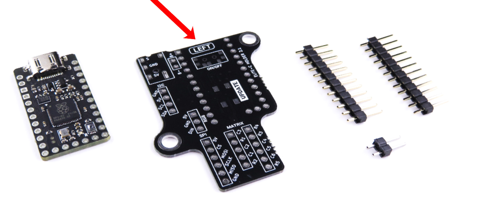

**For the following step, please prepare:**

- 12-pin header (x2)
- 2-pin header
- shield PCB (left)
- splinky 

{: .warning }
Make sure to use the "left" shield PCB. Those are not reversible !

{: .warning }
In the next section, we will install the Splinky onto the shield PCB using the headers. **It is very important to install it on the correct side**, otherwise it will not work. Make sure to look at the pictures carefully ! 

## Left side - Installing the splinky

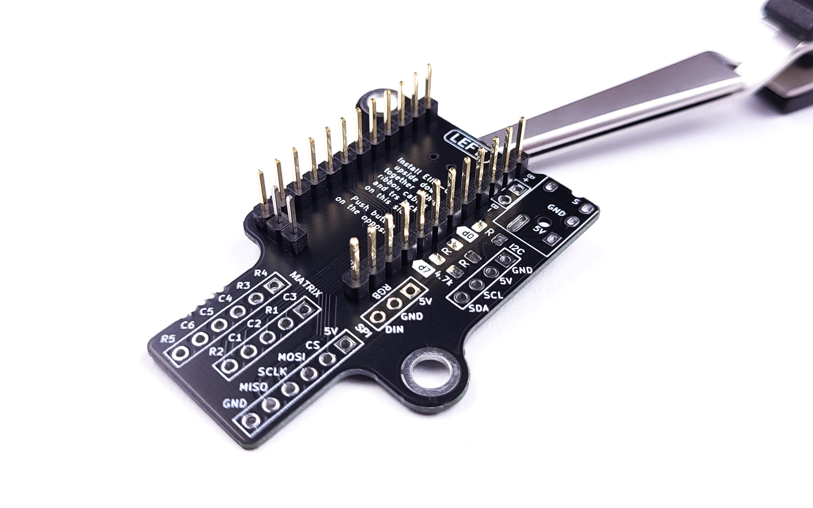

- Install the headers onto the shield PCB
- **Double check against the picture that they are on the correct side**

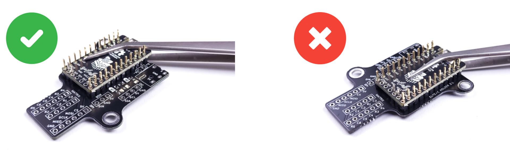

- Install the splinky on the headers, using normally-closed pliers to hold it
- **Double check against the picture that it is on the correct side**
- **The text "install elite-c ... on this side" should be covered by the splinky**

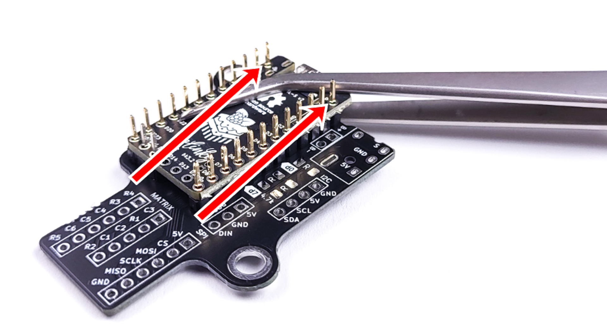

- **At all times, make sure the Splinky is pressed against the PCB**
- there should be no gap between the Splinky, the header pins, and the holder PCB
- Start by soldering the top "5V" and "D0" headers, on the splinky and on the shield (flip the assembly)

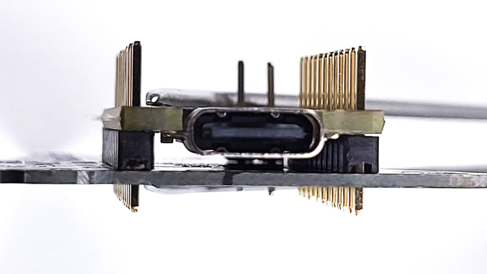

- Inspect the front of the assembly: 
- Make sure that the headers are flush with the Splinky and the shield 

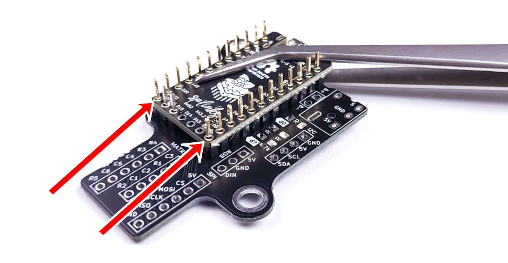

- Solder the 2 bottom "D21" and "D9" headers, on the splinky and the shield (flip the assembly)
- Once again, inspect the front of the assembly and make sure that the headers are flush with the Splinky and the shield 

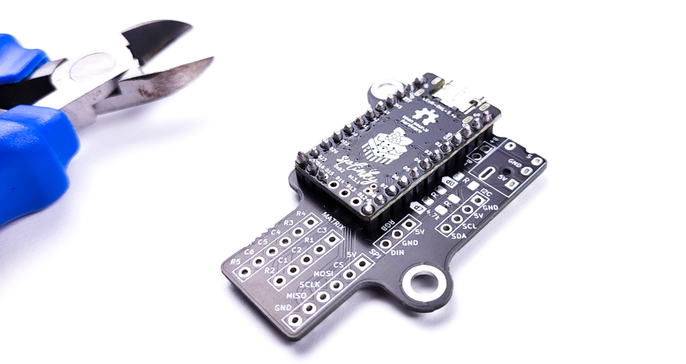

- Solder the rest of the headers
- Using pliers, snip the headers as short as possible

## Left side - Reset button

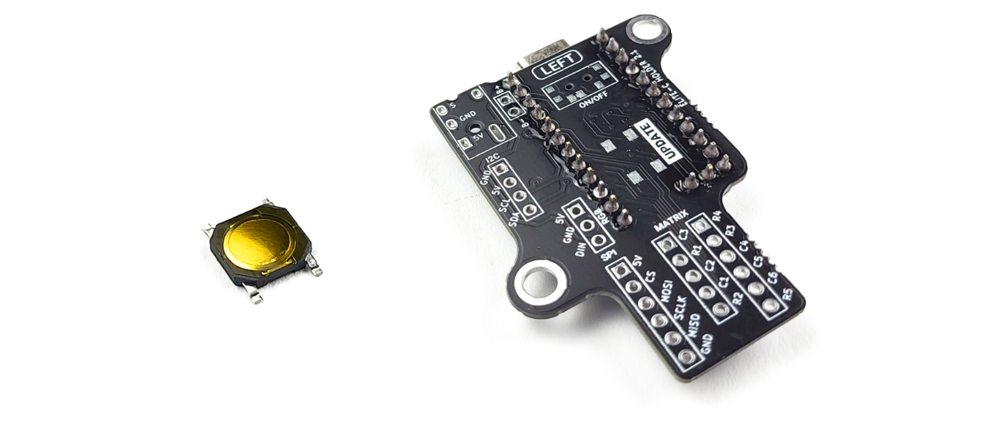

**For the following step, please prepare:**

- shield assembly (left)
- reset button

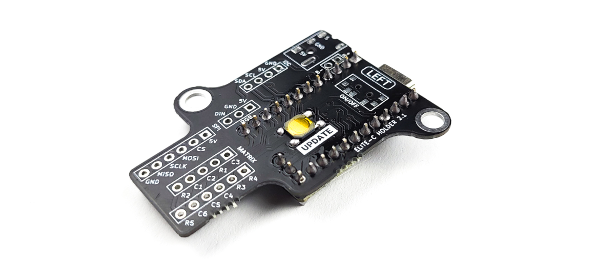

- Solder the reset button on the shield
- Use the same technique as the diodes (pre-tin one pad) 

## Left side - Audio jack

{: .warning }
In this step, we will solder the audio jack. At this point, we will only solder one pad (the 5V). This is so that later we can adjust its exact position once it's inserted into the 3d case.

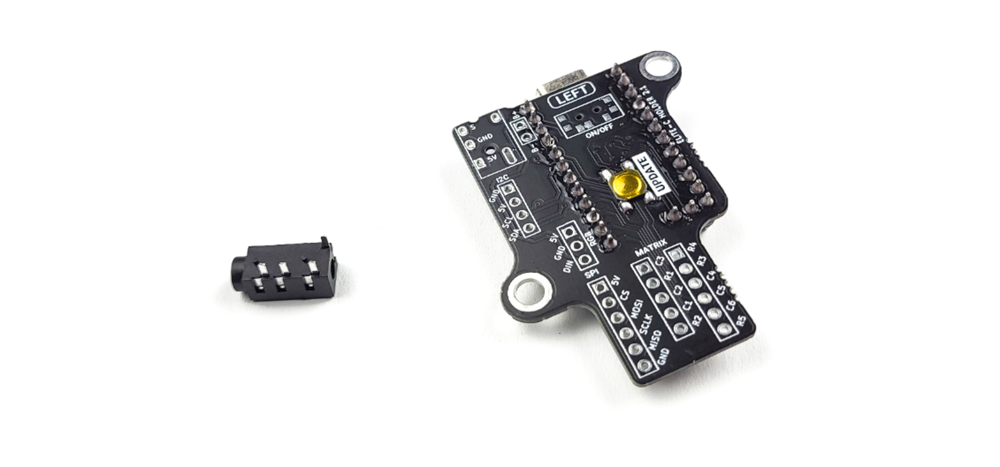

**For the following step, please prepare:**

- shield assembly (left)
- audio jack

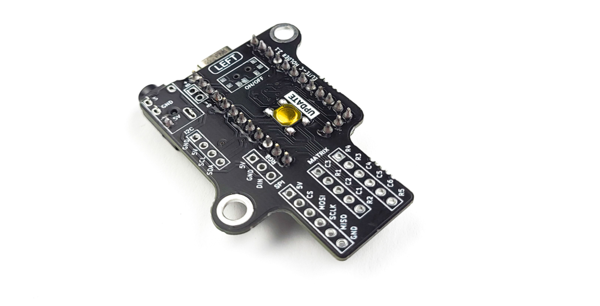

- Install the audio jack
- **Solder only the bottom left "5V" pin . We will align the audio jack in the case and solder the other pins later**

# Right side
## Right side - Required parts

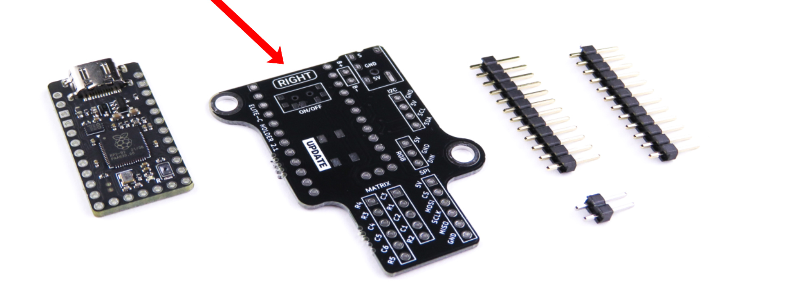

**For the following step, please prepare:**

- 12-pin header (x2)
- 2-pin header
- shield PCB (right)
- splinky 

{: .warning }
Make sure to use the "right" shield PCB. Those are not reversible !

{: .warning }
In the next section, we will install the Splinky onto the shield PCB using the headers. It is very important to install it on the correct side, otherwise it will not work. Make sure to look at the pictures carefully !

## Right side - Installing the components
- Just like previously, install the splinky, reset button, and audio jack onto the shield
- **The text "install elite-c ... on this side" should be covered by the splinky**

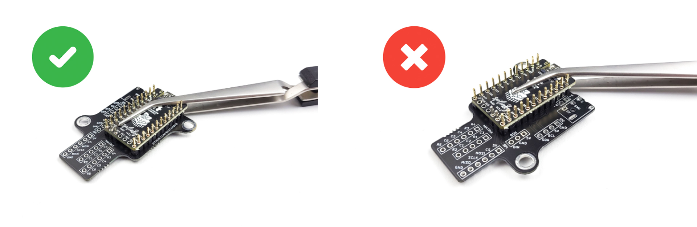