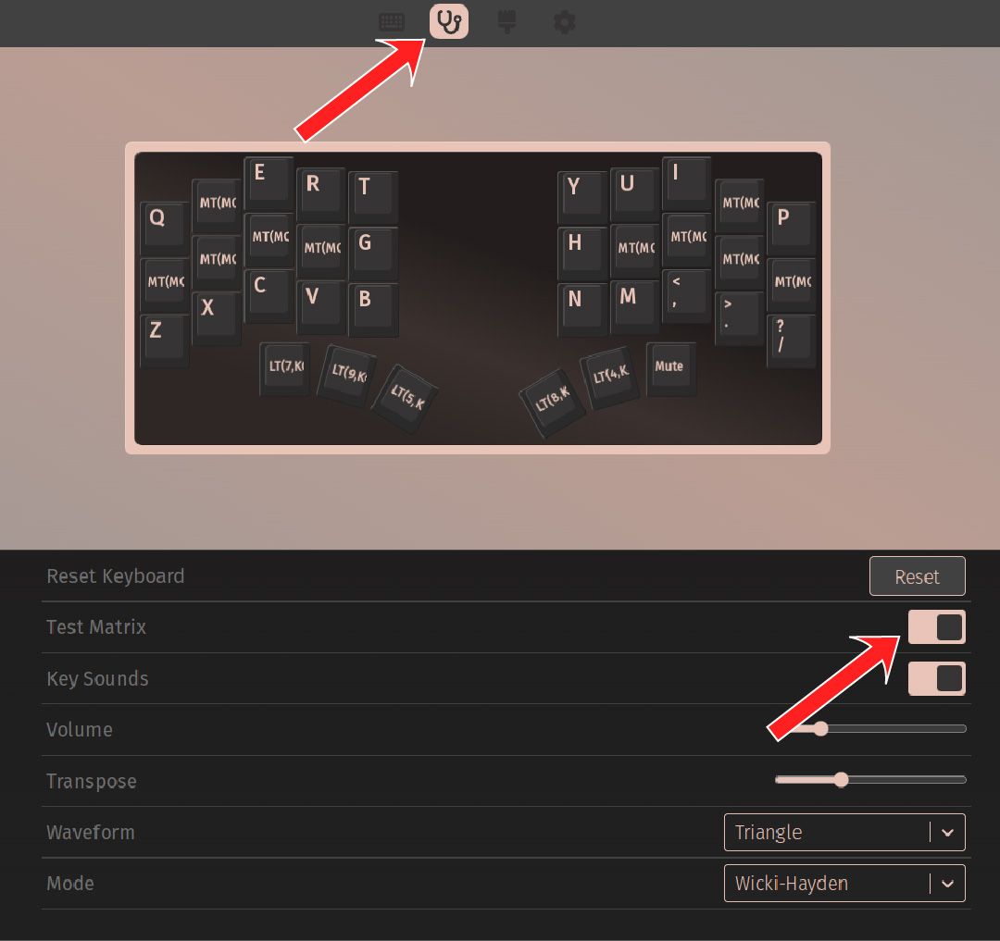
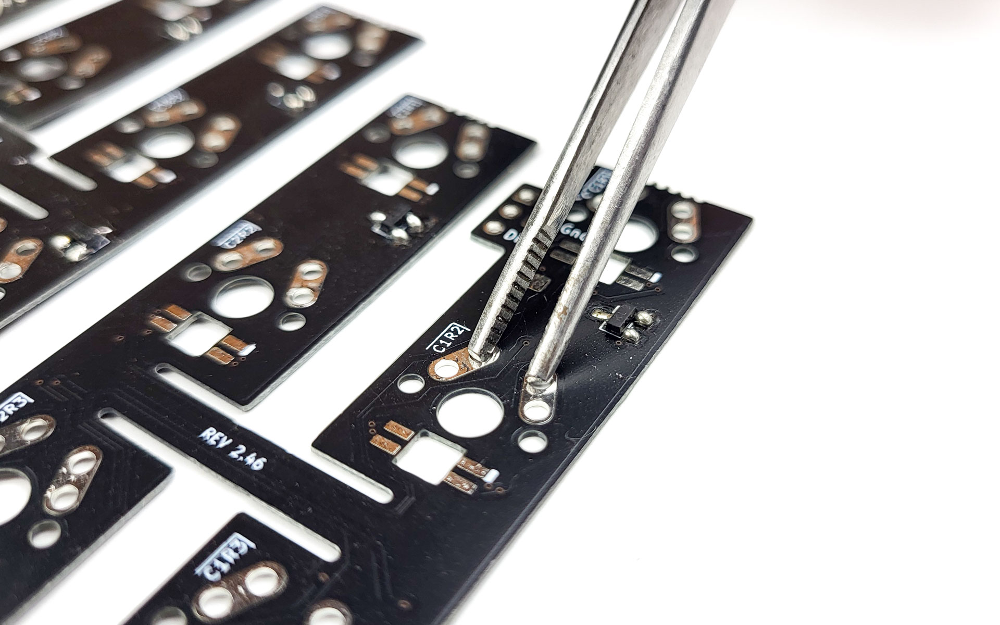

# Testing the PCBs

Now is a great time to function test the assembled PCBs, as any troubleshooting steps you might need to complete will be much easier to do while the plates are still outside of the case.

{: .note }
The TRRS connection will not work yet, as only ony one leg of the jack is connected. You can test this part later.

**For the following step, please prepare** a pair of tweezers that are conductive. If you don't have any, you can also use a piece of wire, or a single switch.

## Testing the LEDs

If you have installed per-key LEDs, let's start with testing those.
If you don't have any per-key RGB installed, you can skip to the next section.

- connect one half to your PC via USB, and observe the LEDs:
- do they all light up? 
- are the colors correct?
- can you see a rainbow animation play?

Does everything look fine? Great, go ahead with testing the switches. 

If not, reflowing the pads of the LEDs not working should do the trick. Please see [Troubleshooting]({{site.baseurl}}/help/troubleshooting.html#one-or-more-leds-dont-work) for details.

## Testing the switches

To test the switches, we are going to use the VIA interface. All Bastard Keyboards come pre-flashed with VIA, so you don't have to flash anything.

{: .warning }
The default firmware requires the USB cable be connected to the right side of the keyboard. This means that when testing the left side, the keys will be reversed and 1 key (Charybdis Nano) or 2 keys (Charybdis) of the thumb cluster will not work.

Open [VIA](https://usevia.app/) - please note this only works on chromium-based browsers like chromium, edge, chrome.

After connecting to your device, switch to the key tester page using the stethoscope pictogram, then activate the "Test Matrix" option. Now, you can connect each pair of switch pads in turn, using your tweezers, a wire, or a switch inclined enough.

Did all the keys light up in VIA? Great, proceed to case installation! Not quite perfect yet? Don't worry, proceed to the [Troubleshooting]({{site.baseurl}}/help/troubleshooting.html) section!
