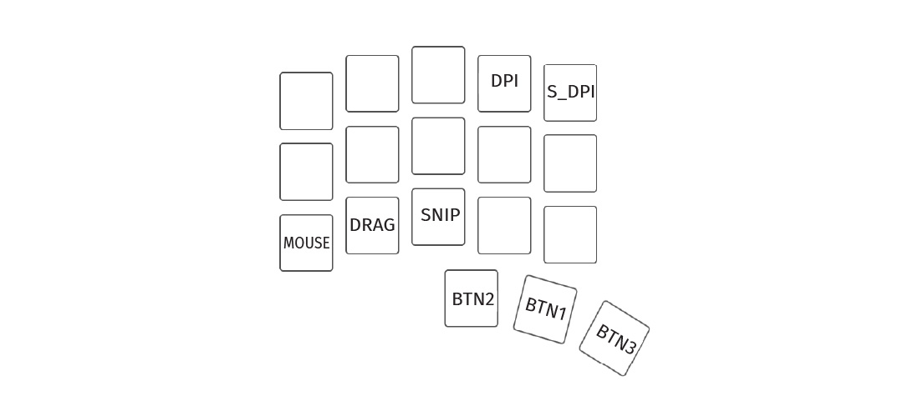
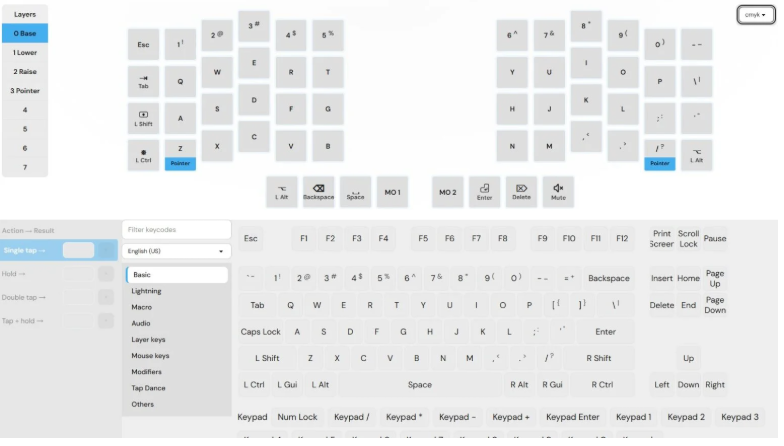

# Table of contents

1. TOC
{:toc}

# Introduction

The hard part is done, congratulations!

This page covers daily use, then where to customize if you want to change anything later.

{: .note }
The default firmware requires the USB cable be connected to the right side of the keyboard.

# Daily use

## Default keymap

You can find pictures of the default keymaps on the [default keymaps page][keymaps].

Alternatively, you can also plug in your keyboard and visualize the keymap using Argos (see Argos section).

## Using the trackball / trackpad

If you prefer a video, how to use your trackball/trackpad keyboard is detailed here: [video](https://www.youtube.com/watch?v=XjFAvW-78bE).

Holding down the `MOUSE` key (lower left, see picture) activates the mouse layer. The features you will use most often live there.

The most important ones are on the thumb cluster - it transforms into mouse buttons!

- `mouse + BTN1`: Left click
- `mouse + BTN2`: Right click
- `mouse + BNT3`: Middle click

On the mouse layer, motion can also:



Hold a mode key together with `MOUSE` to use it. For what each mode does, see [Charybdis features][customize-chary]. To change DPI, auto mouse layer, auto precision, or per-mode settings, use [Argos][argosdocs].

# Customization

To customize your keyboard, you can use either Argos or QMK.

## Using Argos

All Bastard Keyboards come flashed with Argos. Argos is an additional layer that comes on top of QMK, and comes with a handy graphical interface. It enables customization without having to compile any code. 

It supports:
- macros
- combos
- pointing device configuration
- multiple languages
- pointer modes configuration
- tap dances
- per-key and per-layer RGB configuration

You can open the [Argos Web Interface through argos.bastardkb.com](https://argos.bastardkb.com). At the moment, only WebHID-enabled browsers work (eg. Chrome and Chromium-based).

[You can read more about Argos here][argosdocs].

## Using QMK

QMK is for advanced users, if you want to compile your own firmware. 

- how to compile a custom hardware for your keyboard: [how to compile your own firmware][compile-firmware].
- advanced customization of the Charybdis (and smaller variants): [customize your Charybdis][customize-chary].
- advanced customization of the Dilemma (and smaller variants): [customize your Dilemma][customize-dilemma].

---

[customize-chary]: {{site.baseurl}}/fw/charybdis-features.html
[customize-dilemma]: {{site.baseurl}}/fw/dilemma-features.html
[keymaps]: {{site.baseurl}}/fw/default-keymaps.html
[flashing]: {{site.baseurl}}/fw/flashing.html
[compile-firmware]: {{site.baseurl}}/fw/compile-firmware.html
[argosdocs]: {{site.baseurl}}/fw/argos.html