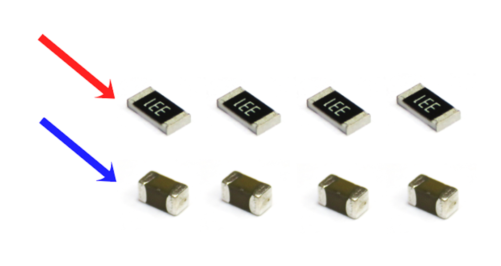
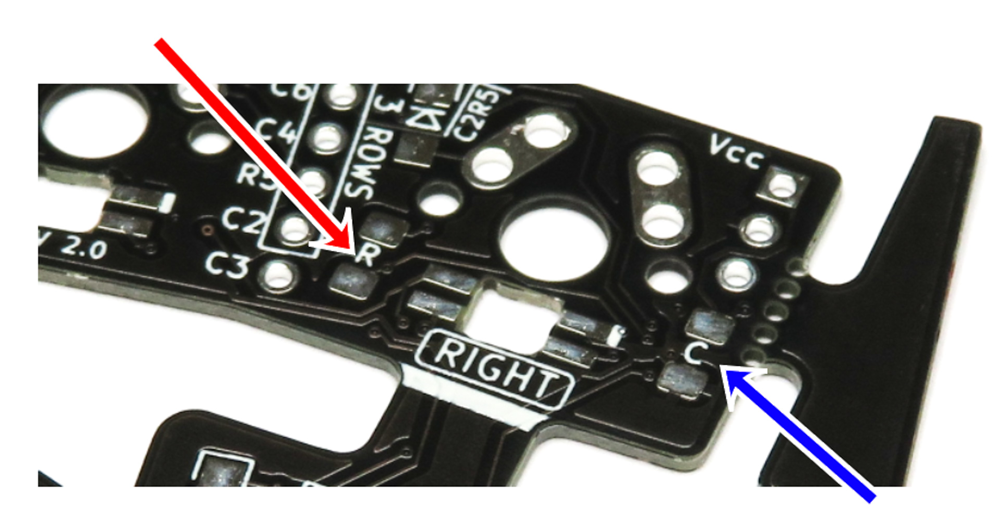
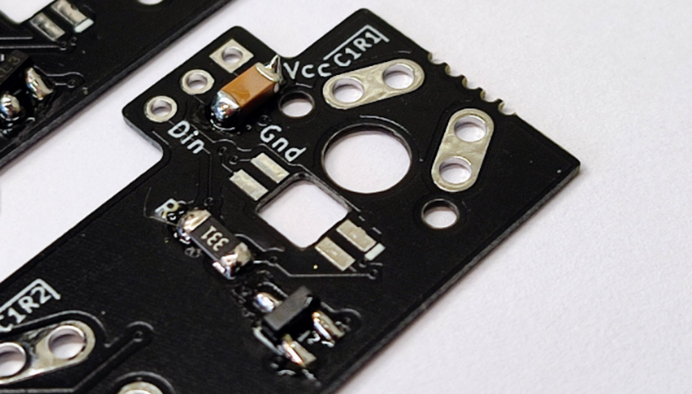
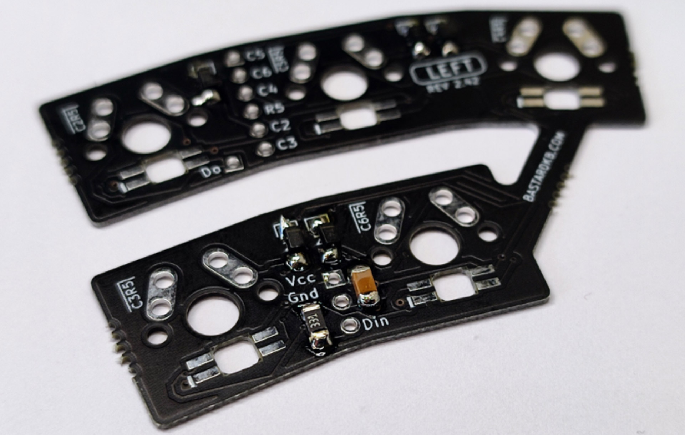
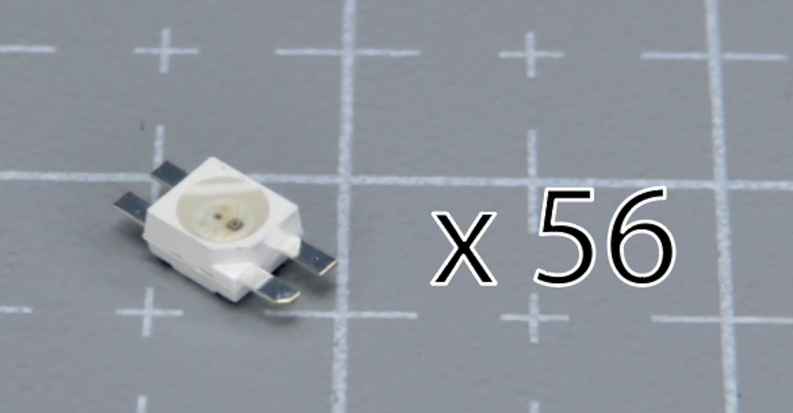
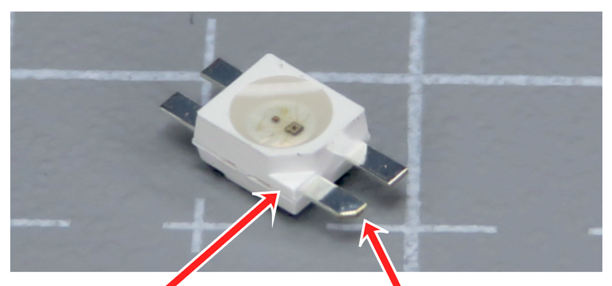
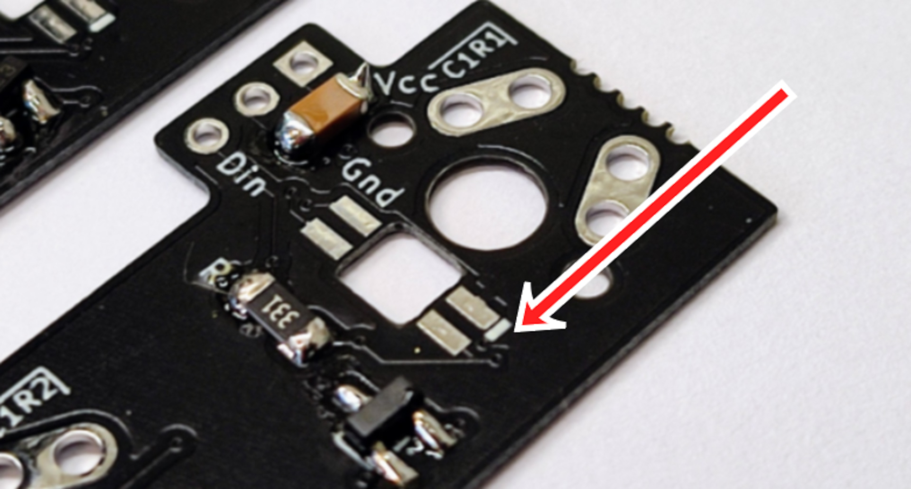
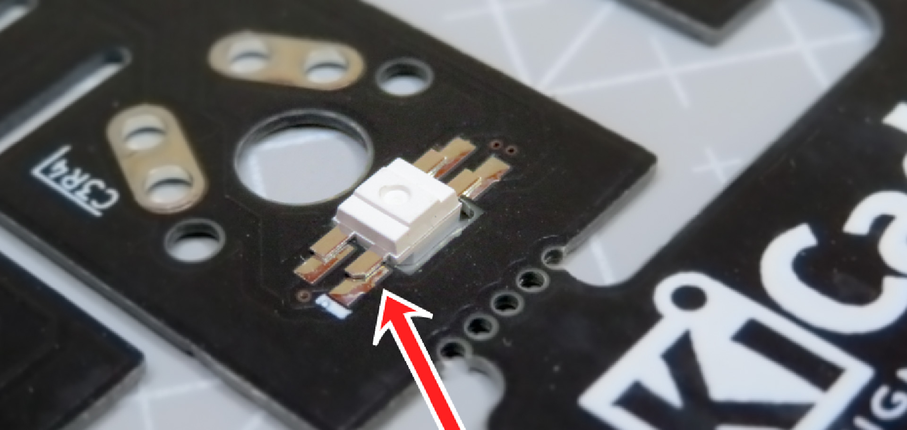

# Table of contents

1. TOC
{:toc}

# Introduction

In this section, we will install the per-key RGB components. If you don't have any in your kit, skip this section.

# RGB Components - capacitors and resistors

**For the following step, please prepare:**

-   **Resistor** (x4) (red arrow, top)
-   **Capacitor** (x4) (blue arrow, bottom)
-   Flexible PCBs (x4)

The resistors and capacitors need to be installed on the 4 PCBs in the same way as we did the diodes previously.

{: .tip }
The resistors and capacitors can be installed in any orientation.

On each PCB, there is:
- one **Resistor** (red arrow, left on the picture) - marked R
- one **Capacitor** (blue arrow, right on the picture) marked C

On each PCB, install the resistor and capacitor, **on the same side as the diodes.**

{: .tip }
You can use the same soldering technique as we used for the diodes earlier.

Use the below pictures for guidance - note **the resistors and capacitors are installed on the same side as the diodes.**

# RGB Components - LEDs

**For the following step, please prepare:**

-   LED (x56)
-   Flexible PCBs (x4)

{: .warning }
LEDs only work if the ground pin matches the marked pad. Match the chamfered pin (and the indent in the plastic) with the white line on the PCB before you solder.

{: .warning }
The LEDs are heat-sensitive. Stay on each pad for at most 2 seconds. If a joint does not take, raise the iron temperature a little and try again.

-   Install the LEDs on the same side as the other SMD components
-   Solder them pad by pad
-   Go through the LEDs one by one
