# Table of contents

1. TOC
{:toc}

# Introduction

In this section, we will connect the PCB plates to the Splinky shields using the flexible ribbon cables. This connects the switches to the "brain" of the keyboard, which can then read what you type.

There is the right side and left side, with plate and thumb cluster PCBs. It can get a bit confusing, but not to worry! We detailed everything, so just read the instructions carefully.

{: .tip }
If you are building with per-key RGB, there are some additional cables that came with your build. They are longer (100mm instead of 75mm). You can set them aside for now, we will install them later in this build guide.

# Cutting the cables

Before we can connect everything together, we need to cut the cables to the right length. 

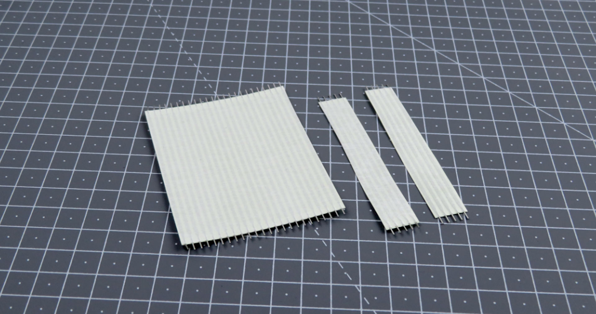

**For the following step, please prepare:**

- 24-wire Ribbon cables (x1)
- 5-wire Ribbon cables (x2)

{: .tip }
If your kit came with a 10-wire ribbon cable instead of 2 pieces of 5-wire, cut the 10-wire into 2 pieces of 5-wire

- Cut the 24-wires ribbon cable into 4 pieces of 6-wire ribbon cables
- Use the picture below for reference

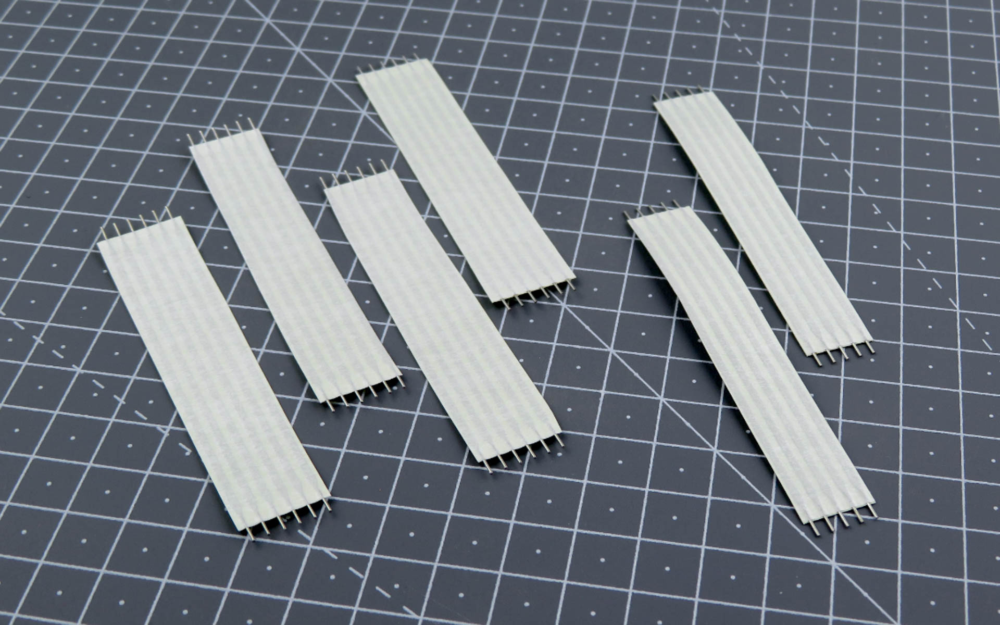

# Left side - plate PCB

We will start by installing the left side.

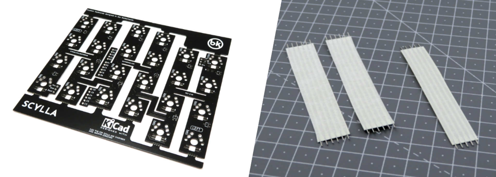

**For the following step, please prepare:**

- Left Plate PCB (x1)
- 6-wires ribbon cable (x2)
- 5-wires ribbon cable (x1)

{: .tip }
Remember: by "left plate", we mean the one with the diodes visible when the "left" label is visible.

- Install the cables on the main ribbon cable cluster
- Use the pictures below for reference: **notice both the "LEFT" label and the SMD components are visible when the cables are installed from the top**
- Flip the PCB, and solder on the other side

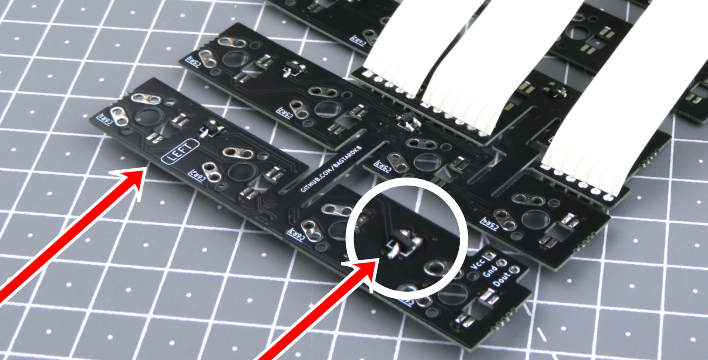

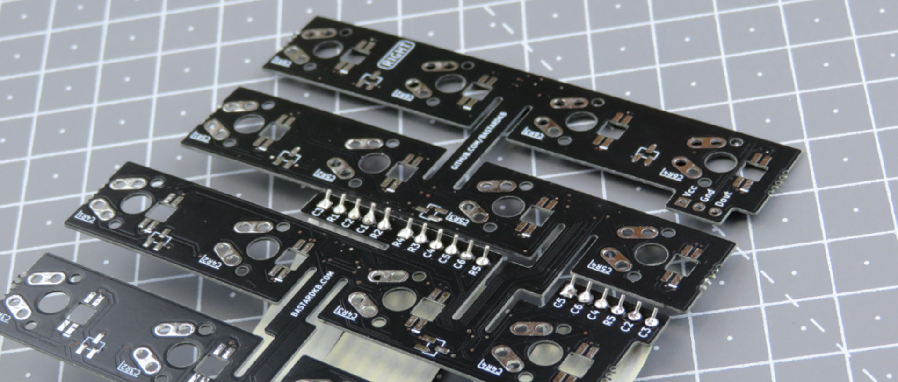

# Left side - thumb cluster PCB

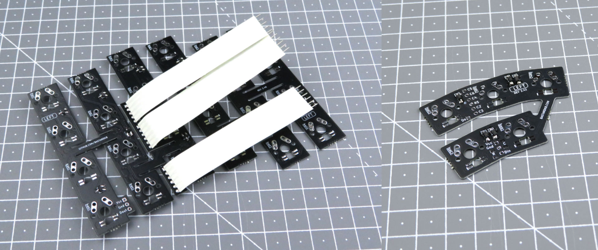

**For the following step, please prepare:**

- Left Plate PCB with ribbon cables (x1)
- 5-key thumb PCB (x1)

Identify the bottom ribbon cable: it has 6 cables, that's the one we will connect to the thumb cluster.

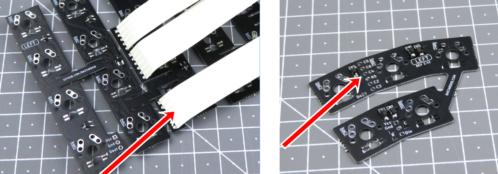

- Solder the bottom ribbon cable to the thumb cluster PCB just like previously
- Use the pictures below for reference: **notice both the "LEFT" label and the SMD components are visible on both PCBs when the cables are installed from the top**
  
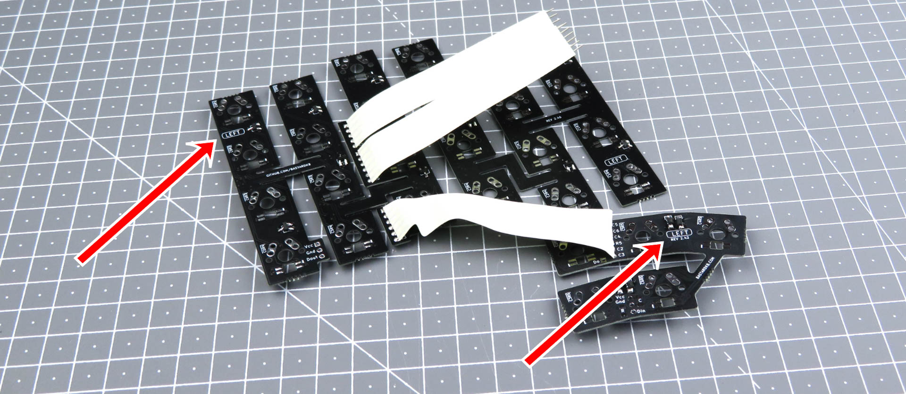

# Right side - plate PCB

Now that the left side is done, we'll go ahead and prepare the right side in the same way.

It's mostly the same - except this time we are using the 3-key PCB for the thumb cluster, since the Charybdis has 3 keys only on the right side.

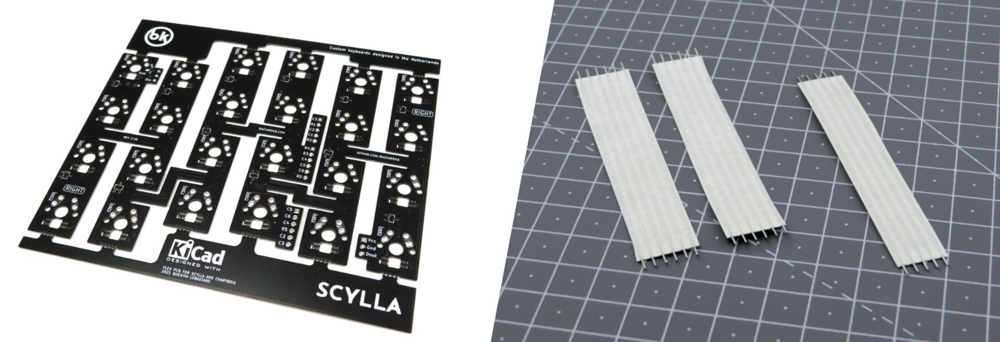

**For the following step, please prepare:**

- Right Plate PCB (x1)
- 6-wires ribbon cable (x2)
- 5-wires ribbon cable (x1)

{: .tip }
Remember: by "right plate", we mean the one with the diodes visible when the "right" label is visible.

- Install the cables on the main ribbon cable cluster
- Use the pictures below for reference: **notice both the "RIGHT" label and the SMD components are visible when the cables are installed from the top**
- Flip the PCB, and solder on the other side

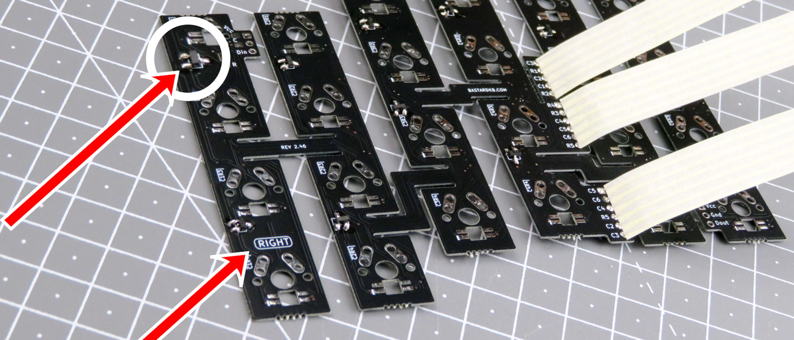

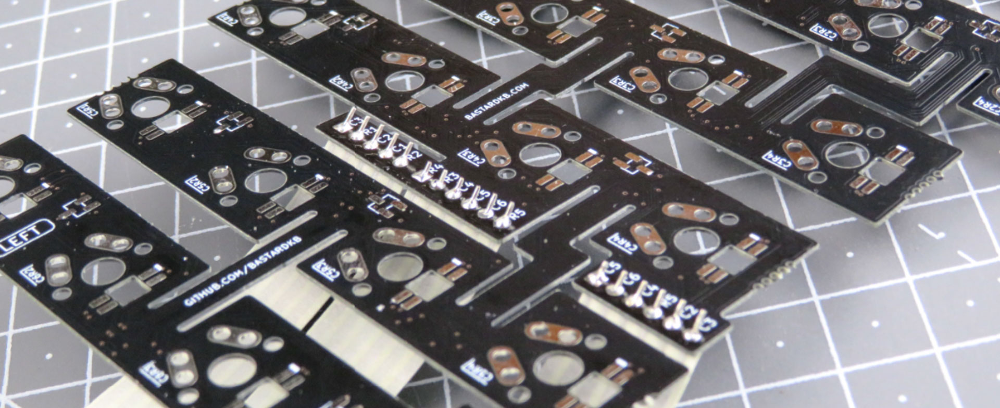

# Right side - thumb cluster PCB

**For the following step, please prepare:**

- Right Plate PCB with ribbon cables (x1)
- 3-key thumb PCB (x1)

Identify the bottom ribbon cable: it has 6 cables, that's the one we will connect to the thumb cluster.

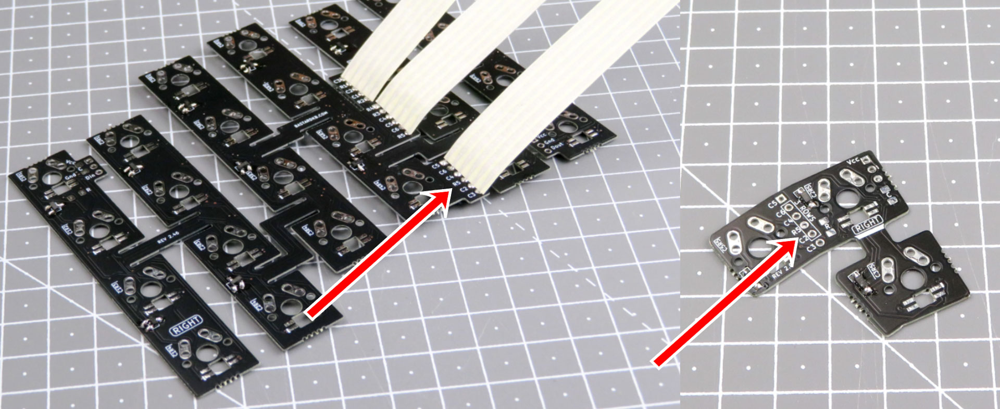

- Solder the bottom ribbon cable to the thumb cluster PCB just like previously
- Use the pictures below for reference: **notice both the "RIGHT" label and the SMD components are visible on both PCBs when the cables are installed from the top**

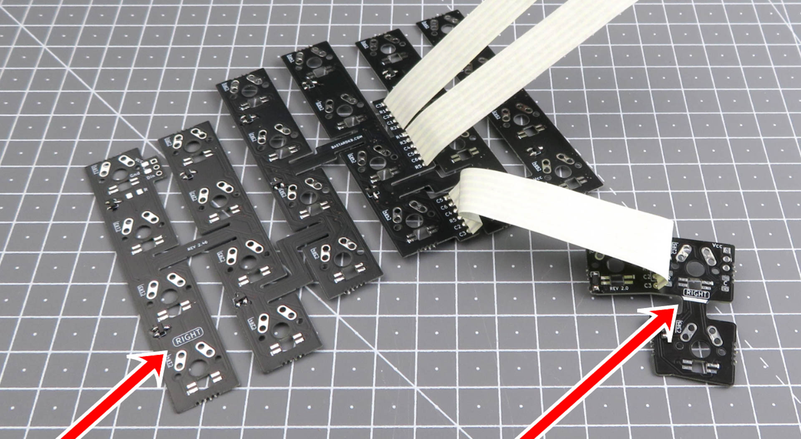

# Installing the RGB cables

This step is optional, if you have per-key RGB.

{: .tip }
In this section, we will use pictures without the LEDs, **for illustration purposes**. **Make sure you installed the LEDs before going forward !**

## Preparing the cables

**For the following step, please prepare:**

- 6-wires ribbon cable (x1)
- 6-wires long ribbon cable (x1)

Cut the ribbon cables into pieces of 3-wires:
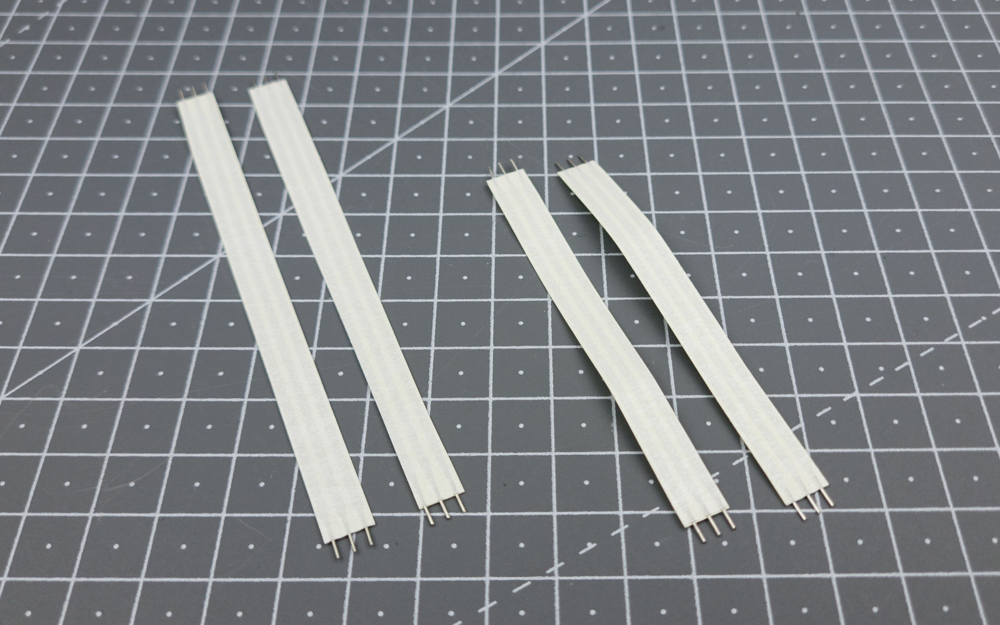

## Soldering the thumb cluster cables - Left side

**For the following step, please prepare:**

- 3-wires short ribbon cable (x1)
- Left-side PCB assembly

{: .warning }
Use the **short** cable for this step.

On the left side PCB assembly, identify the 3-pin connectors, there are:
- one at the bottom of the plate
- one on the thumb cluster PCB
- they are labeled VCC, GND, and Din/Dout
- use the picture below for reference

Solder the **short** ribbon cable to those 2 connectors, just like we did with the previous ones.

## Soldering the plate cables - Left side

**For the following step, please prepare:**

- 3-wires long ribbon cable (x1)
- Left-side PCB assembly

{: .warning }
Use the **long** cable for this step.

On the left side PCB assembly, 
- identify the 3-pin connector at the top
- use the picture below for reference

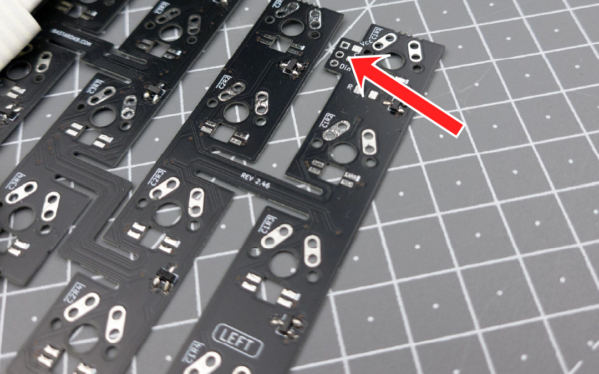

Solder the **long** ribbon cable to this connectors, just like we did with the previous ones.

## Soldering the thumb cluster cables - Right side

**For the following step, please prepare:**

- 3-wires **short** ribbon cable (x1)
- Right-side PCB assembly

{: .warning }
Use the **short** cables for this step.

On the left side PCB assembly, identify the 3-pin connectors, there are:
- one at the bottom of the plate
- one on the thumb cluster PCB
- they are labeled VCC, GND, and Din/Dout
- use the picture below for reference

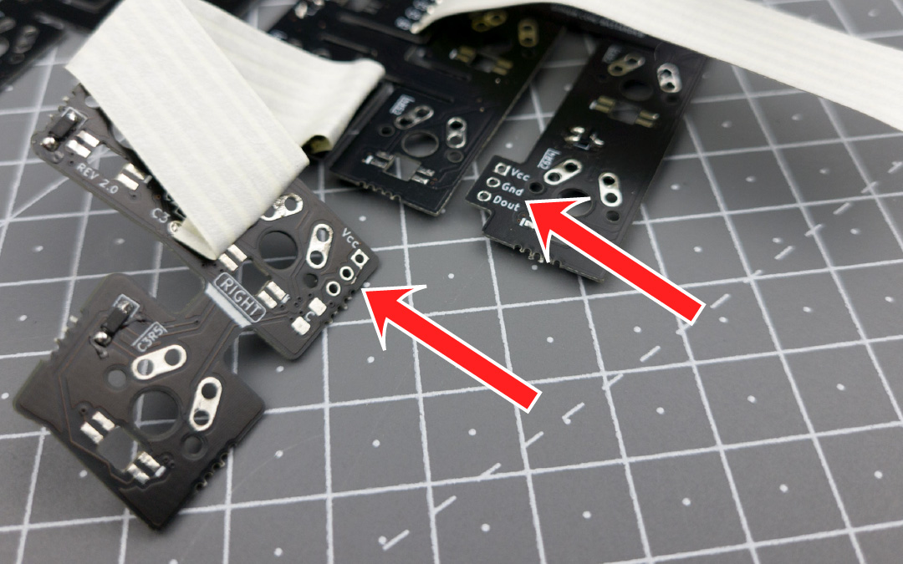

Solder the **short** ribbon cable to those 2 connectors, just like we did with the previous ones.

{: .note }
Depending on your version of the PCB, some labels might be missing. Just make sure to align Vcc.

## Soldering the plate cables - Right side

**For the following step, please prepare:**

- 3-wires long ribbon cable (x1)
- Right-side PCB assembly

{: .warning }
Use the **long** cable for this step.

On the left side PCB assembly, 
- identify the 3-pin connector at the top
- use the picture below for reference

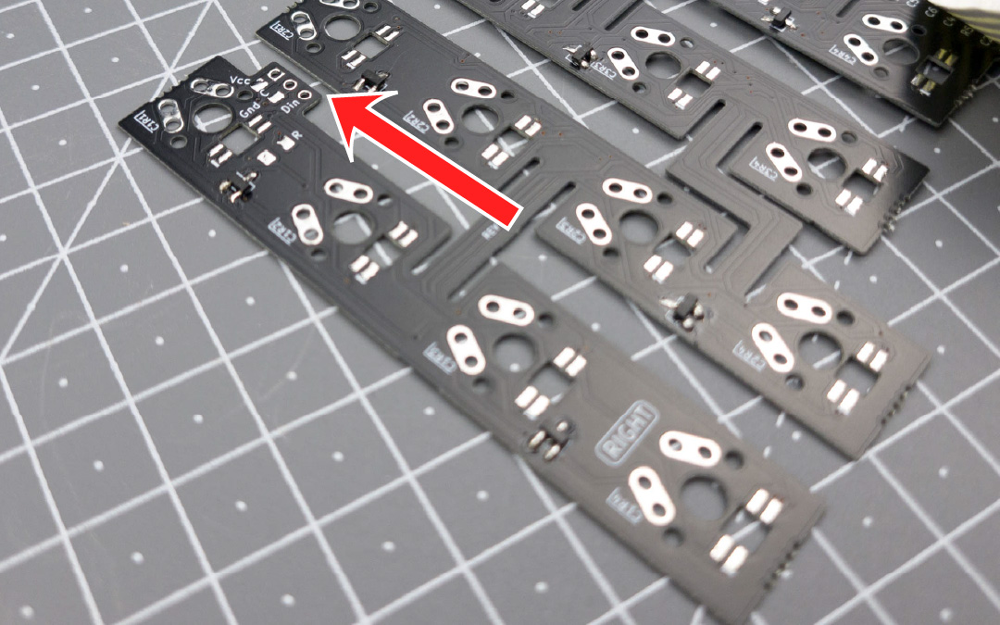

Solder the **long** ribbon cable to this connectors, just like we did with the previous ones.

# Trim the cables

- Locate the other side of the PCB (the one opposite of the components)
- Locate the ribbon cables going out, they are protruding a bit
- Trim them to make sure they're as flush as possible with the surface of the PCB
