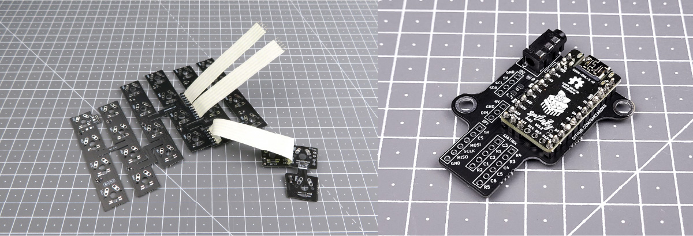

# Table of contents

1. TOC
{:toc}

# Introduction

Now that we finished preparing the Splinky and the flexible PCBs, it's time to connect all of them together. 

Be careful, because the Splinky shield assemblies are not reversible ! We will start with the left side, and then proceed to the right side.

# Left side

**For the following step, please prepare:**
- Splinky shield assembly (left)
- flexible plates assembly (left, with 5 keys on the thumb cluster)

Inspect the shield assembly: there is a `MATRIX` label, with a 5-pin and a 6-pin connector. We will connect it to the cables of the flexible PCB assembly.

Install the cables coming out of the flexible PCB assembly into those connectors, and solder them:

// TODO picture

# Right side

**For the following step, please prepare:**
- Splinky shield assembly (right)
- flexible plates assembly (right, with 3 keys on the thumb cluster)

Inspect the shield assembly: there is a `MATRIX` label, with a 5-pin and a 6-pin connector. We will connect it to the cables of the flexible PCB assembly.

Install the cables coming out of the flexible PCB assembly into those connectors, and solder them:

// TODO picture