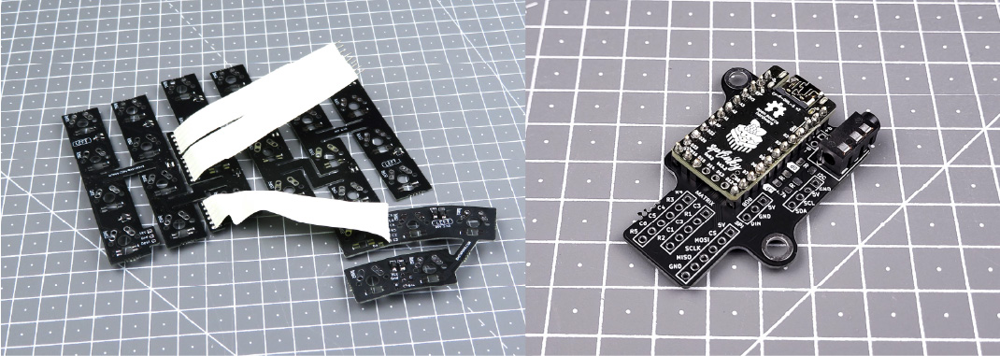
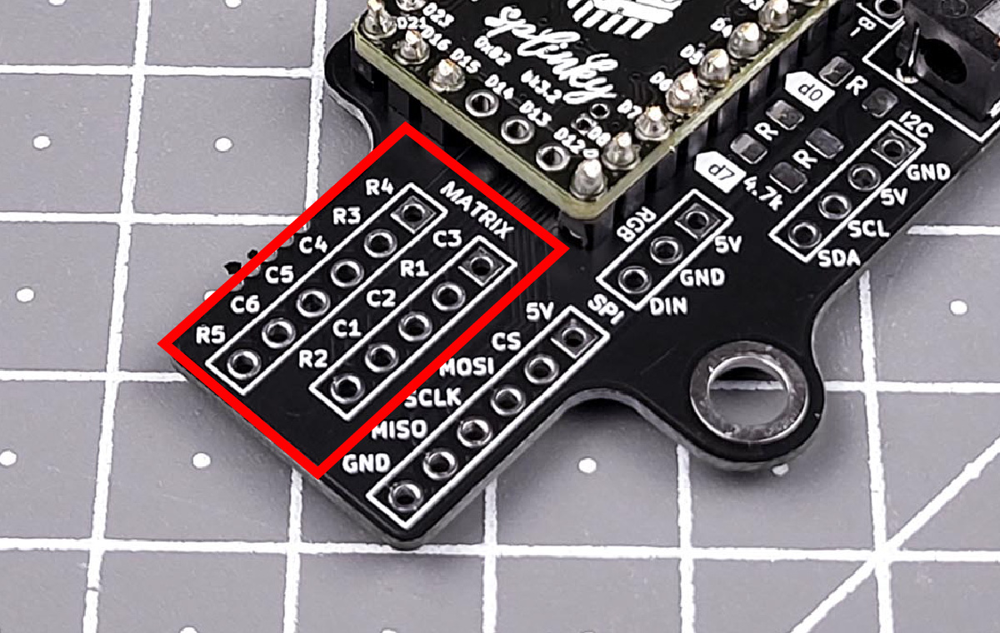
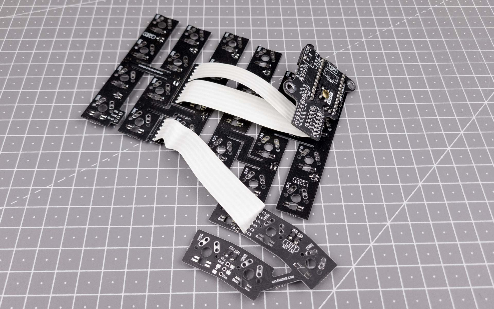
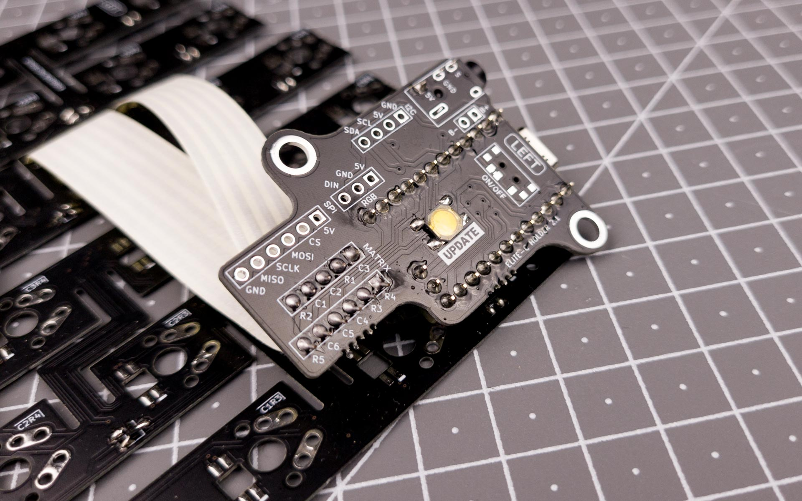
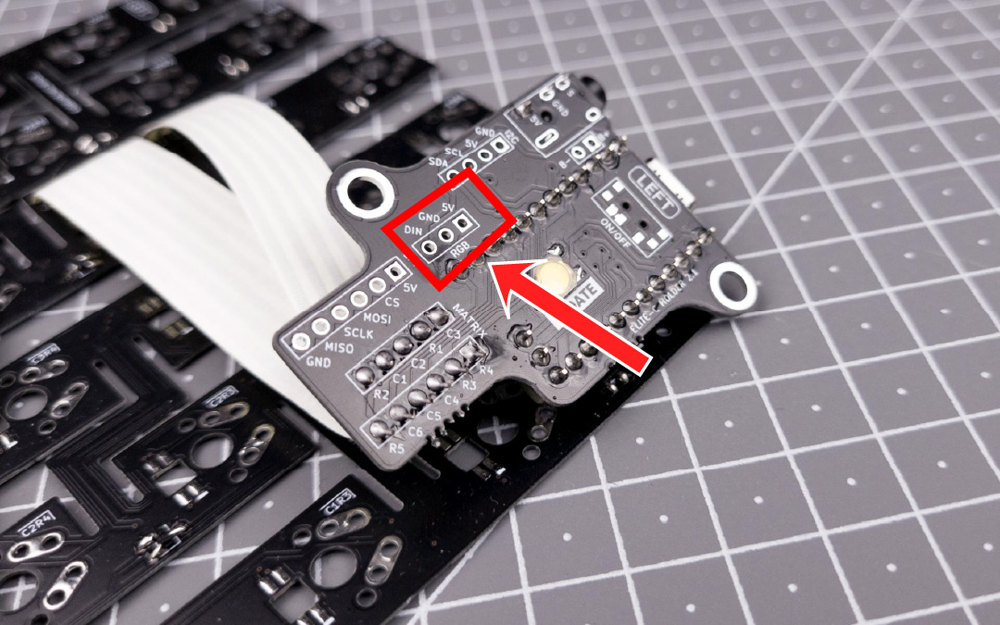
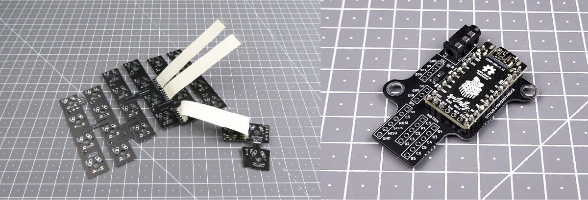
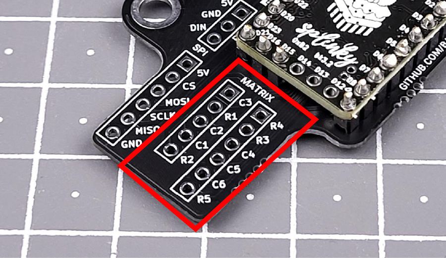
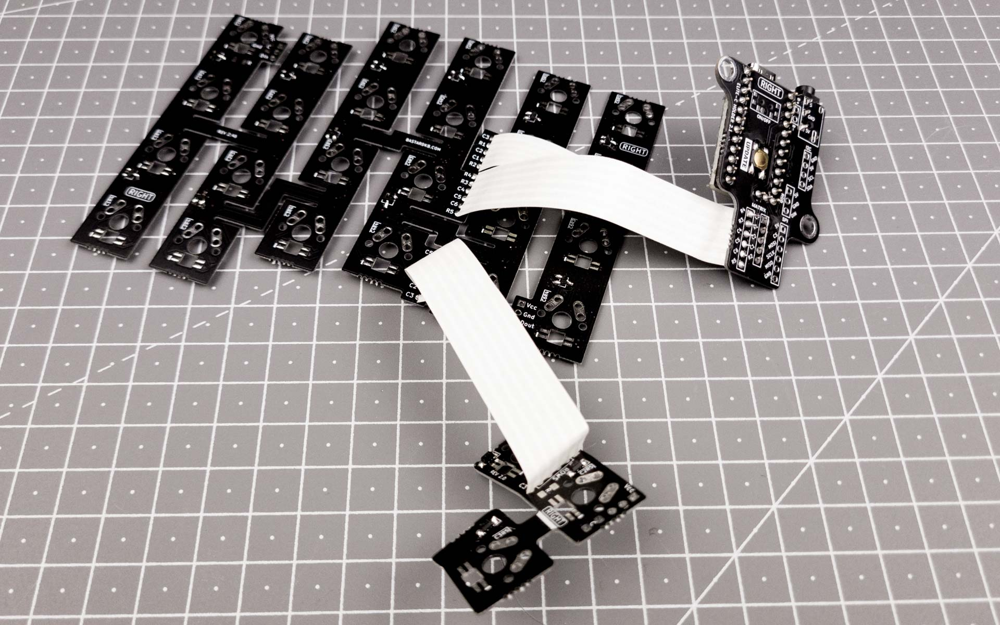
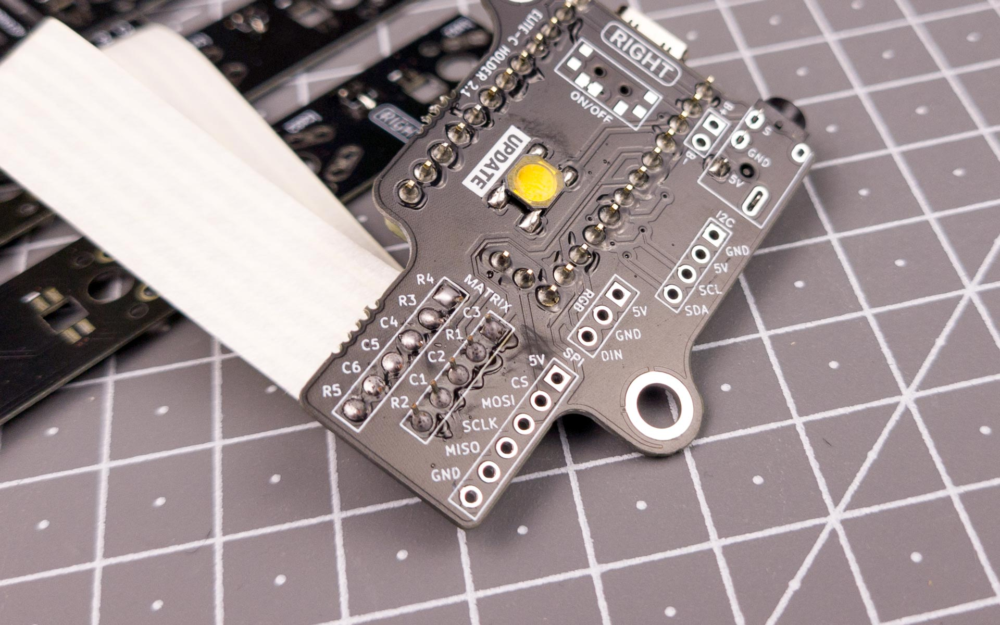
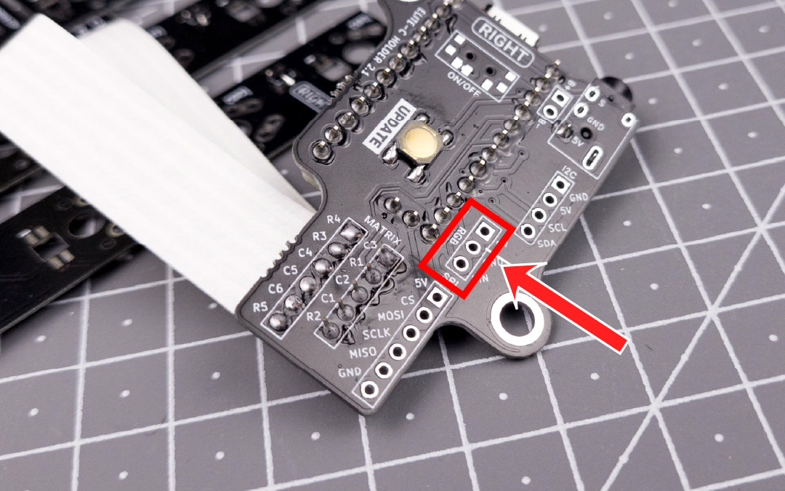

# Table of contents

1. TOC
{:toc}

# Introduction

The Splinky and the flexible PCBs are ready. Next we join them.

The shield assemblies are not reversible. We will do the left side first, then the right.

# Left side

**For the following step, please prepare:**
- Splinky shield assembly (left)
- flexible plates assembly (left, with 5 keys on the thumb cluster)

Inspect the shield assembly: there is a `MATRIX` label, with a 5-pin and a 6-pin connector. We will connect it to the cables of the flexible PCB assembly.

{: .warning }
Solder the cables on the side shown in the pictures - the other side is much harder to route into the case. The ribbon cables are fragile; once they are soldered, avoid bending them.

Install the cables coming out of the flexible PCB assembly into those connectors, and solder them.

{: .warning }
Once installed, avoid bending the cables. They're fragile and can break.

## Left side - RGB

This step is optional, if you have per-key RGB.

Solder the long ribbon cable coming from the plate to the `RGB` header on the Shield PCB. Use the picture below for reference.

# Right side

**For the following step, please prepare:**
- Splinky shield assembly (right)
- flexible plates assembly (right, with 3 keys on the thumb cluster)

Inspect the shield assembly: there is a `MATRIX` label, with a 5-pin and a 6-pin connector. We will connect it to the cables of the flexible PCB assembly.

{: .warning }
Solder the cables on the side shown in the pictures - the other side is much harder to route into the case. The ribbon cables are fragile; once they are soldered, avoid bending them.

Install the cables coming out of the flexible PCB assembly into those connectors, and solder them.

{: .warning }
Once installed, avoid bending the cables. They're fragile and can break.

## Right side - RGB

This step is optional, if you have per-key RGB.

Solder the long ribbon cable coming from the plate to the `RGB` header on the Shield PCB. Use the picture below for reference.

