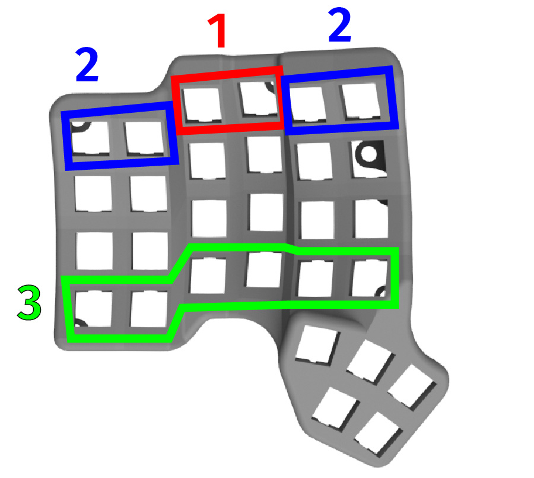

# Table of contents

1. TOC
{:toc}



# Introduction

Now that everything is connected, we will install the switches and seat the PCBs in the case. The process is the same on both sides, so we show the side without the trackball.

{: .note }
We have not touched the sensor PCB yet. That is on purpose: it is easier to solder the switches without it in the way. We will connect it in the next section.

You can install the switches in any order. The sequence below is what we found works best.

{: .warning }
The case is plastic. It will melt if the iron touches it.

# Installing the switches

We will describe the technique first, then the order. Read this section once before you start - it is easier that way.

When installing the switches, use the following technique:
- press the PCB against the case, and try to align it as much as possible
- from the other side, push the switch into the case hole
- make sure the pins align into the PCB's holes
- make sure the PCB is flush against the switch. If your switch has side pins, you may have to push it a bit harder
- solder the two pins of the switch

{: .warning }
Left assembly (5 thumb keys) goes in the left case. Right assembly (3 thumb keys) goes in the right case.

- start with the top two switches (labeled 1, in red on the picture)
- continue with the outer four switches (labeled 2, in blue on the picture)
- continue with the bottom six switches (labeled 3, in green on the picture)
- finally, install the rest of the switches
