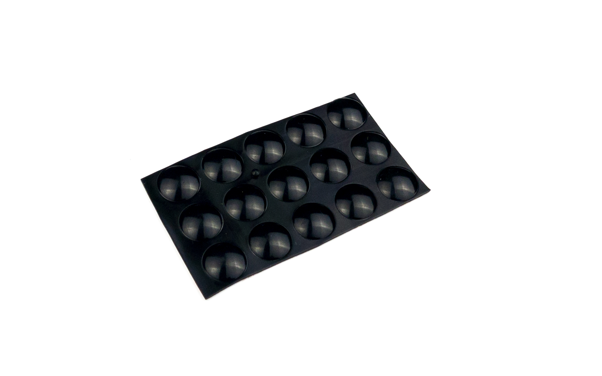

# Table of contents

1. TOC
{:toc}

# Installing the splinky shield

{: .note }
The two sides are the same, just mirrored. We will show one.

**For the following step, please prepare:**
- keyboard assembly (x2)
- M4 screw (x2)

Seat the controller in the case and fasten it with two screws. Then solder the remaining pins of the audio jack - you already tacked the 5V pin so you could align it in the case.

Do the same on the other side.

# Installing the plates

{: .note }
If you have tents, skip to the next section, "Installing the tents".

## Screws

**For the following step, please prepare:**
- keyboard assembly (x2)
- M4 screw (x8)
- plates (x2)

Screw the plates on until they sit flat. Snug is enough - don't use too much force.

## Anti-slip pads

**For the following step, please prepare:**
- anti-slip pads (x10)

Stick the anti-slip pads onto the plates.

# Installing the tents

{: .note }
This step is optional, if you have tents.

## Screws

**For the following step, please prepare:**
- keyboard assembly (x2)
- M4 screw (x8)
- plates (x2)
- tents (x2)

Fasten the plates with two screws, at the bottom and the top.

Install the tents with the remaining screws.

## Anti-slip pads

**For the following step, please prepare:**
- anti-slip pads (x10)

Stick the anti-slip pads onto the tents.

The case is closed. The next page covers daily use and how to customize the keyboard.