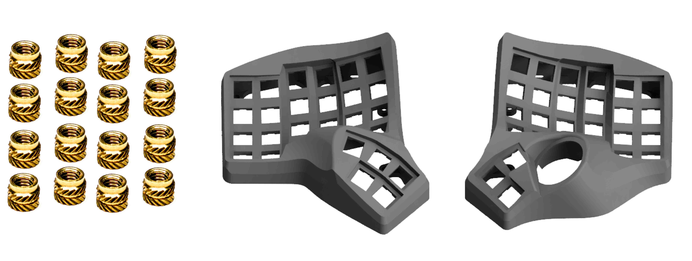
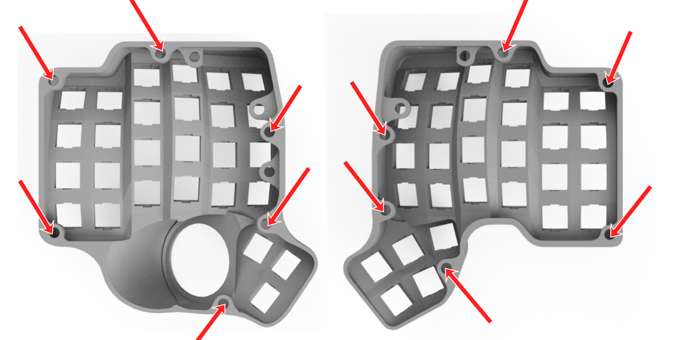
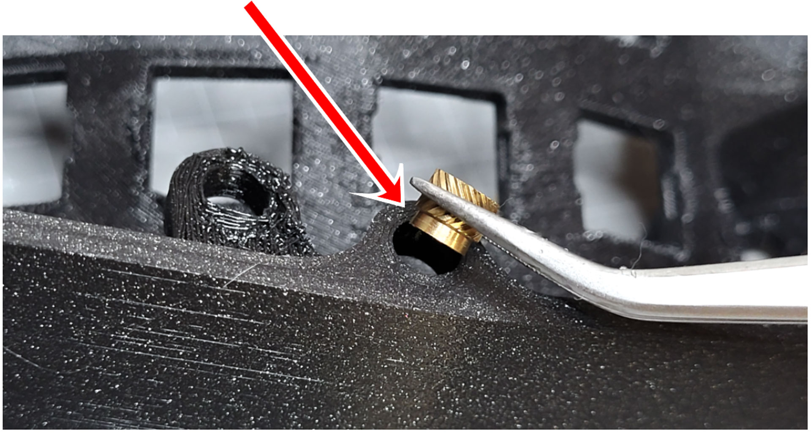
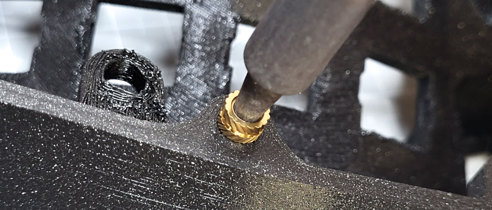
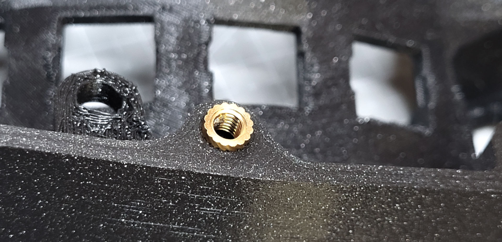
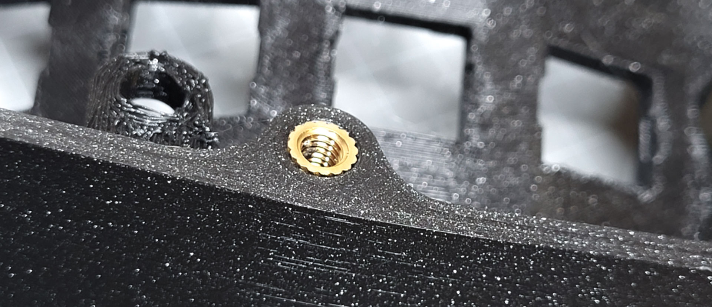
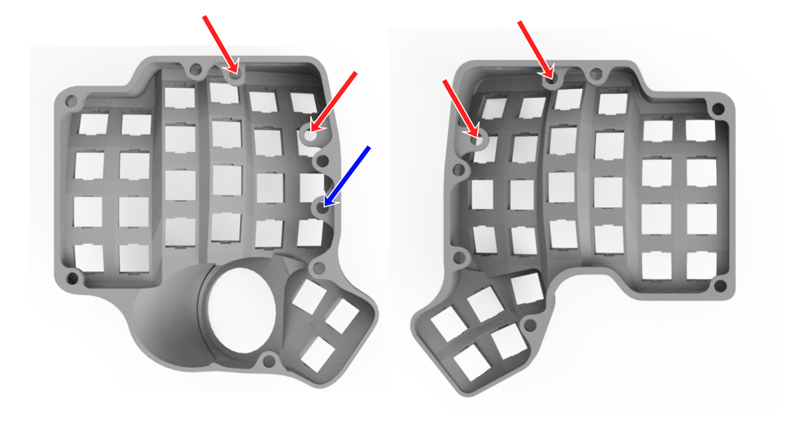
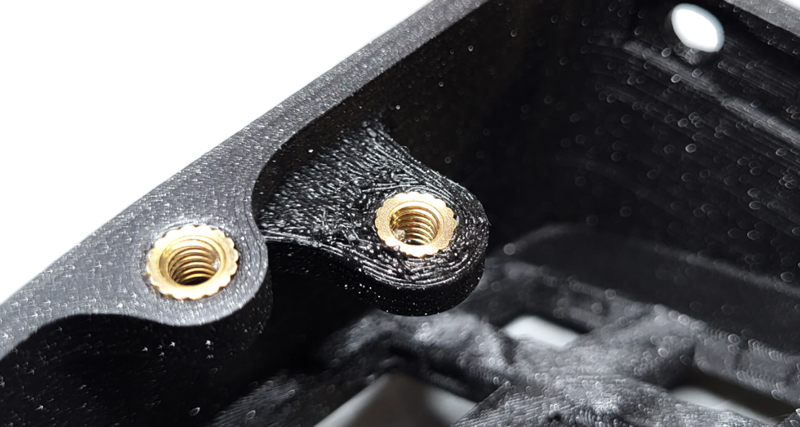

# Table of contents

1. TOC
{:toc}

# Required parts

**For the following step, please prepare:**

-   M4 screw insert (x16)
-   3d printed case (left)
-   3d printed case (right)

{: .tip }
There are smaller screws and screw inserts (M3) in your kit. You can set those aside, we will use them later.

{: .tip }
There are other 3d parts in your kit like plates, tents, 3d holders. You can set those aside, we will use them later.

# Screw inserts - outer

First, we will install the screw inserts on the outer edges of the case. There are 6 on each side. Use the below pictures to identify them.

{: .warning }
Be careful when installing the screw inserts, you can damage the case. Read all the instructions first, then proceed to the installation.

-   Set your soldering iron temperature to 250 degrees Celsius
-   Using the soldering iron, place the heated insert inside the hole
-   Place the smaller side of the insert towards the case. This helps guide the insert in

-   *Apply little to no pressure, let the gravity do the work*. Otherwise, you might push them too far
-   If the insert doesn't fall into place, you can slowly increase the temperature, but don't go over 350 degrees

-   Once the insert is 2/3 of the way in, stop

-   Flip over the case and gradually push it against a flat surface, to make the insert flush with the case

# Screw inserts - inner

We will now install the screw inserts that will later hold the controller. There are **2 on each side.** Use the below pictures to identify them (in red).

{: .tip }
There is **a third inner hole at the bottom** (in blue). If you are building a **left-handed Charybdis**, install a screw insert there. Otherwise, you can ignore it.

Follow the same procedure as previously, except:

-   with the soldering iron, push the insert all the way in-
-   **be careful not to push the insert too far !**-   this time, you don't need to flip the case.

