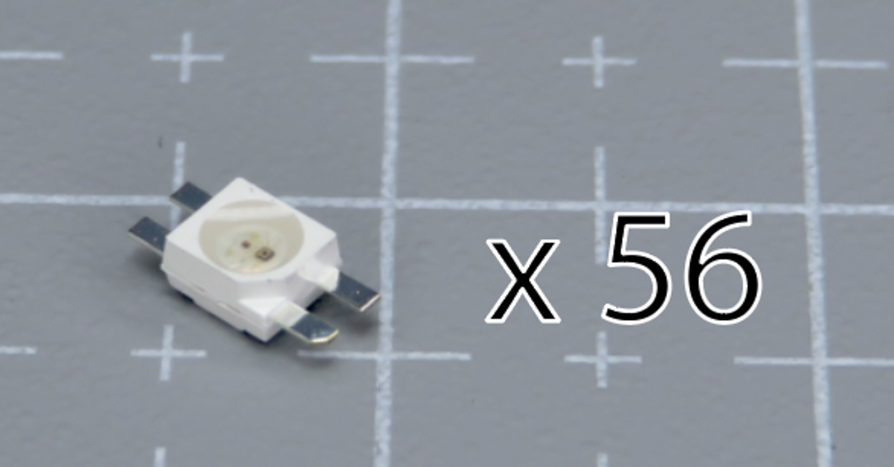

# Table of contents

1. TOC
{:toc}

# Introduction

For the keyboard to work, we need to install some components on the PCBs.

In this section, we will install them on the 4 flexible PCBs that are in the kit. 

There are 2 sides of the keyboard: left, and right. **All the PCBs are reversible, so make sure to follow the steps carefully** to make sure you're installing the components correctly.

{: .tip }
We will start by installing the diodes, and at the end of this section install the RGB components if you have any.

# Right side - Plate - required parts

**For the following step, please prepare:**

-   Plate PCB (x1)
-   3-leg diode (x12)

{: .tip }
If you have RGB with your kit, you can set the capacitors, resistors and LEDs aside. We will use them later.

# Right side - Plate - placing the PCB

-   All the PCBs are reversible, so first let's make sure we install the components on the correct side
-   Place the plate PCB on your working surface, and make sure the "RIGHT" label is visible.
-   Use the picture below for reference.

{: .tip }
From now on, we will refer to this plate as the "Right PCB".

# Right side - Plate - installing the diodes

On the plate PCB, we need to install a total of 12 diodes. They go on the footprints with 3 pads (see pictures below).

{: .tip }
In the following section, we detail some tips on how to install diodes. You can also use this technique to install capacitors and resistors. If you are familiar with it, feel free to install the diodes and skip ahead to the next section. 

-   Using a soldering iron, put some soldering tin on one pad

-   Using tweezers, install the diode, with one of its pins on top of the pad you just tinned
-   Melt the soldering tin, while still holding the diode in place. The soldering tin will "melt around" the diode's pin

-   Once the solder melted, remove the soldering iron
-   **Do not let go of the diode until the soldering tin is solid again**
-   After the soldering tin has solidified, you can let go of the diode
-   The diode should now not move at all-   Solder the two other pads

Do the same for the 12 diodes.

# Right side - thumb cluster - required parts

**For the following step, please prepare:**

-   3-key thumb PCB (x1)
-   2-leg diode (x3)

{: .warning }
If you are preparing a left-handed Charybdis, use the 5-key thumb cluster PCB in this step instead.

# Right side - thumb cluster - placing the PCB

-   Place the plate PCB on your working surface, and make sure the "RIGHT" label is visible
-   Use the picture below for reference.

# Right side - thumb cluster - installing the diodes

On the thumb cluster PCB, we need to install a total of 3 diodes. They go on the footprints with 2 pads (see pictures below).

{: .warning }
These diodes need to be installed in a specific way, or they will not work ! **Read the following carefully.**

-   Inspect the 2-legged diodes: there is a horizontal line on them
-   This line needs to be aligned with the white markers on the PCBs
-   **If you do not align them, the keys will not work**

-   Use the same method as previously to install the diodes
-   Take care to align the line with the marks on the PCB

# Left side - Plate - required parts

Now that we finished preparing the right side, we will continue and prepare the **left side**.

**For the following step, please prepare:**

-   Plate PCB (x1)
-   3-leg diode (x12)

# Left side - Plate - placing the PCB

-   Place the plate PCB on your working surface, and make sure the "LEFT" label is visible
-   Use the picture below for reference.

From now on, we will refer to this plate as the "Left PCB".

# Left side - Plate - installing the diodes

Just like previously, install the 3-legged diodes.

# Left side - thumb cluster - required parts

**For the following step, please prepare:**

-   5-key thumb PCB (x1)
-   2-leg diode (x5)

{: .warning }
If you are preparing a left-handed Charybdis, use the 3-key thumb cluster PCB in this step instead.

# Left side - thumb cluster - placing the PCB

-   Place the plate PCB on your working surface, and make sure the "LEFT" label is visible
-   Use the picture below for reference.

# Left side - thumb cluster - installing the diodes

Just like previously, install the 2-legged diodes.

# RGB Components - capacitors and resistors (optional)

{: .tip }
In this step, we will install the per-key RGB components. If you don't have any in your kit, skip this step.

**For the following step, please prepare:**

-   **Resistor** (x4) (red arrow, top)
-   **Capacitor** (x4) (blue arrow, bottom)
-   Flexible PCBs (x4)

The resistors and capacitors need to be installed on the 4 PCBs in the same way as we did the diodes previously.

On each PCB, there is one **Resistor** (red arrow, left on the picture) and one **Capacitor** (blue arrow, right on the picture) footprint. You can identify them with the R and C letters.

On each PCB, install the resistor and capacitor, **on the same side as the diodes.**

{: .tip }
You can use the same soldering technique as we used for the diodes earlier.

Use the below pictures for guidance - note **the resistors and capacitors are installed on the same side as the diodes.**

# RGB Components - LEDs (optional)

**For the following step, please prepare:**

-   LED (x56)
-   Flexible PCBs (x4)

{: .warning }
The LEDs need to be installed in a very specific way. Read the following instructions carefully **first**, and then install them. **If you don't, they will not work !** 

Inspect the LED: there is one of the pins that has a slight chamfer in it. The plastic casing also has an indent. This is the GROUND pin. 

Inspect the PCBs: for each LED footprint, there is one pin that has a white line next to it.

**We need to match the chamfered pin of the LED, with the marked pin on the PCB.**

{: .warning }
The LEDs are sensitive to heat. Stay at most 2 seconds on each pad. If that doesn't work, try slowly increasing the temperature of your soldering iron.

-   Install the LEDs on the same side as the other SMD components
-   Solder them pad by pad
-   Go through the LEDs one by one
