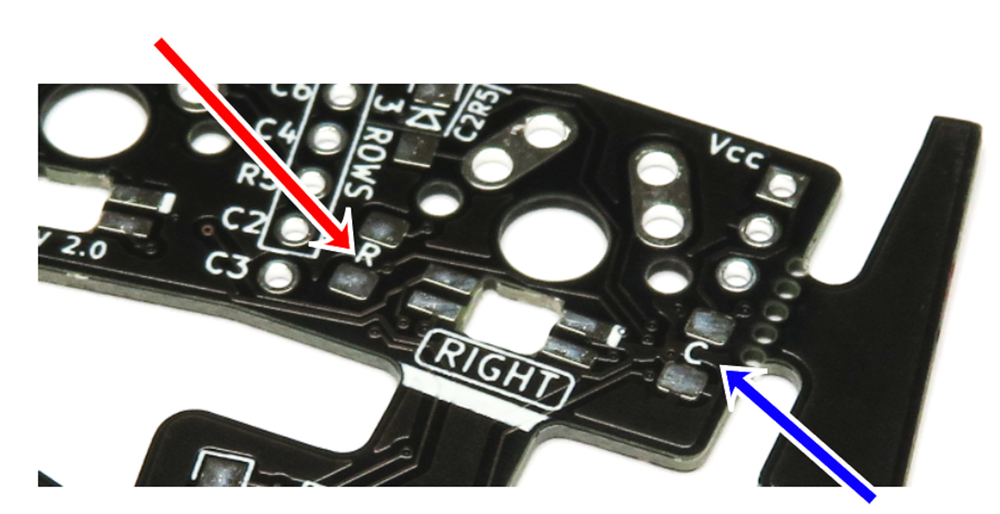
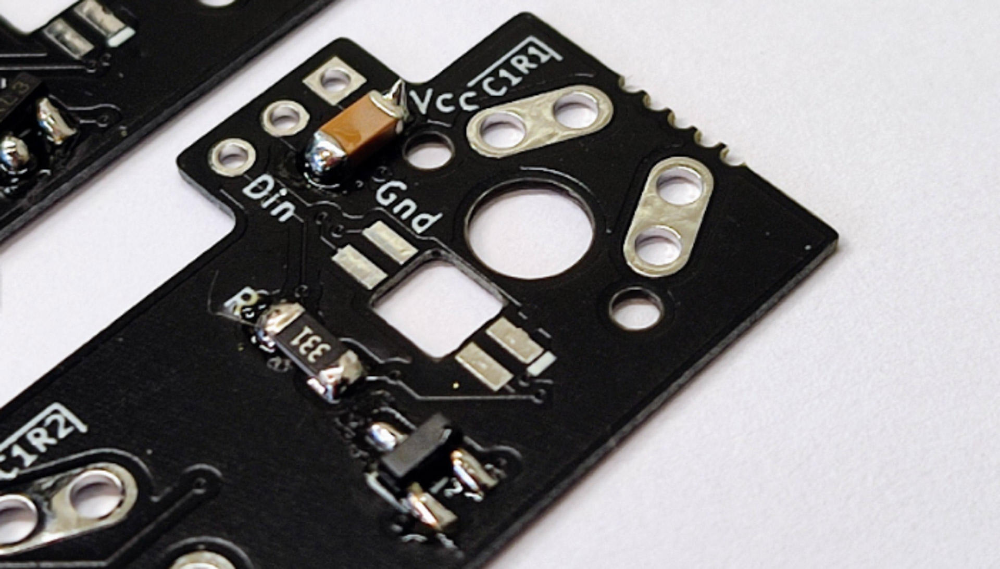
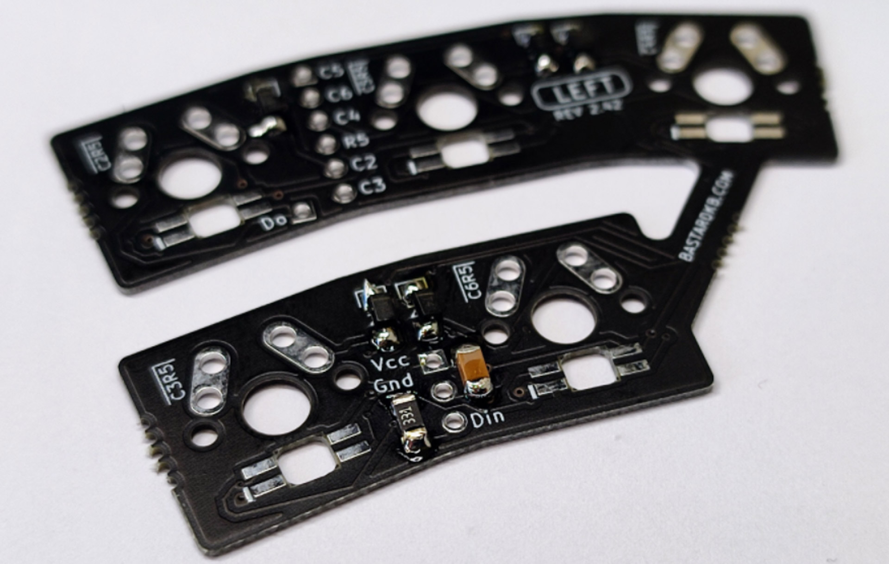
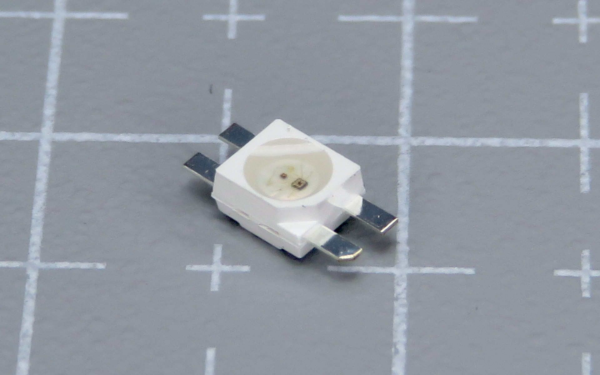
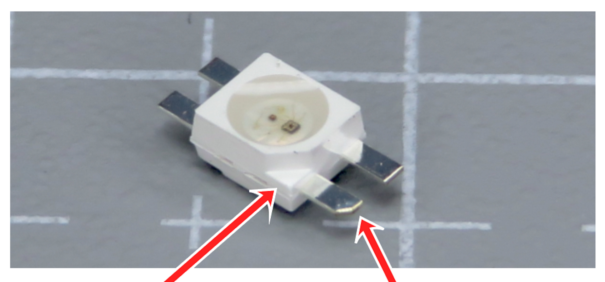
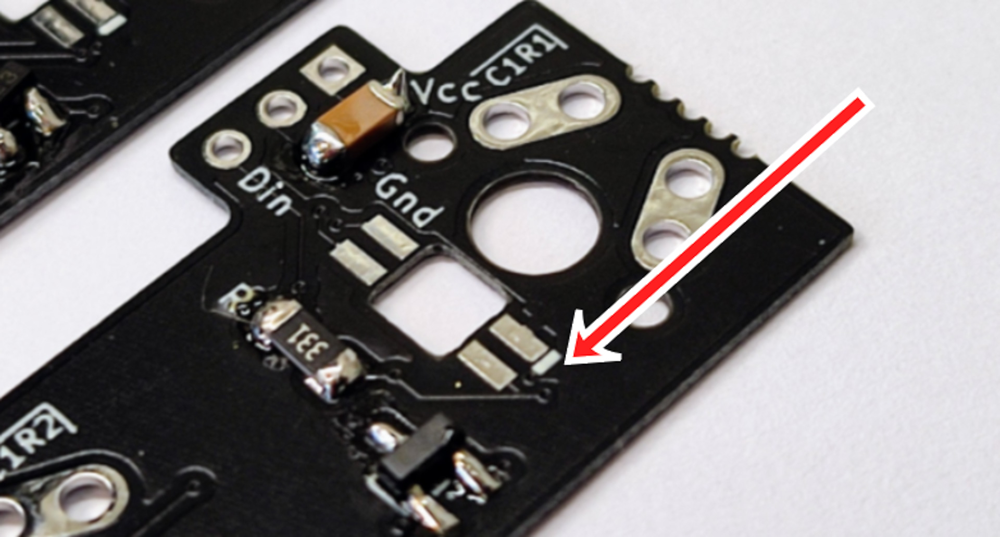
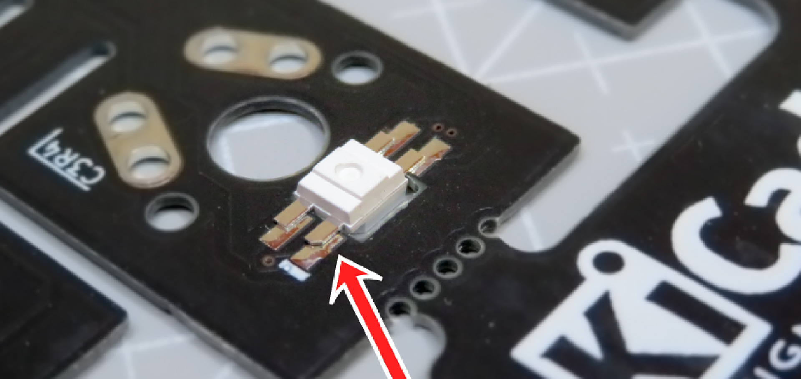

# Table of contents

1. TOC
{:toc}

# Introduction

In this section, we will install the per-key RGB components. If you don't have any in your kit, skip this section.

{: .tip }
The pictures in this section are for illustration, and may not match your PCB entirely. Read the instructions carefully.

# RGB Components - capacitors and resistors

**For the following step, please prepare:**

-   **Resistor** (x4) (red arrow, top)
-   **Capacitor** (x4) (blue arrow, bottom)
-   Flexible PCBs (x4)

The resistors and capacitors need to be installed on the 4 PCBs in the same way as we did the diodes previously.

On each PCB, there is:
- one **Resistor** (red arrow, left on the picture) - marked R
- one **Capacitor** (blue arrow, right on the picture) marked C

On each PCB, install the resistor and capacitor, **on the same side as the diodes.**

{: .tip }
You can use the same soldering technique as we used for the diodes earlier.

Use the below pictures for guidance - note **the resistors and capacitors are installed on the same side as the diodes.**

# RGB Components - LEDs

**For the following step, please prepare:**

-   LED (x35)
-   Flexible PCBs (x4)

{: .warning }
The LEDs need to be installed in a very specific way. Read the following instructions carefully **first**, and then install them. **If you don't, they will not work!** 

Inspect the LED: there is one of the pins that has a slight chamfer in it. The plastic casing also has an indent. This is the GROUND pin. 

Inspect the PCBs: for each LED footprint, there is one pin that has a white line next to it.

**We need to match the chamfered pin of the LED, with the marked pin on the PCB.**

{: .warning }
The LEDs are sensitive to heat. Stay at most 2 seconds on each pad. If that doesn't work, try slowly increasing the temperature of your soldering iron.

-   Install the LEDs on the same side as the other SMD components
-   Solder them pad by pad
-   Go through the LEDs one by one
