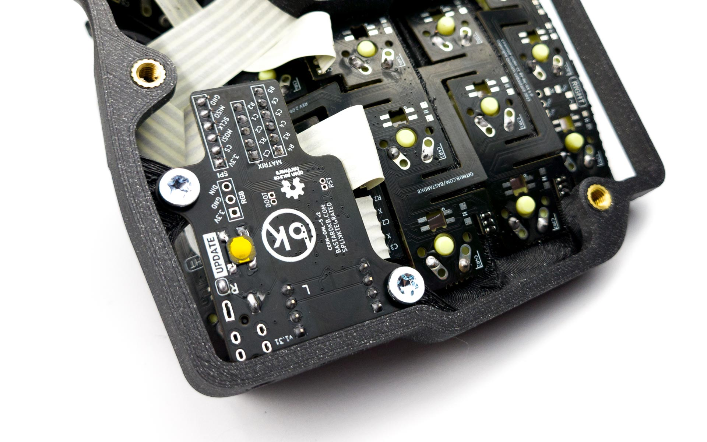
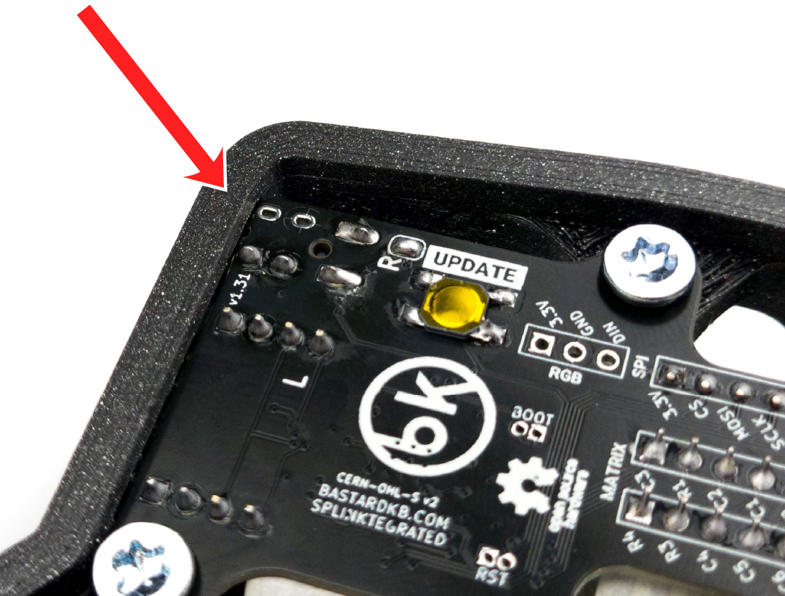
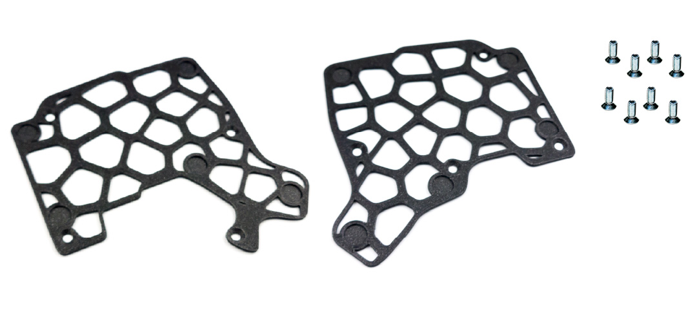
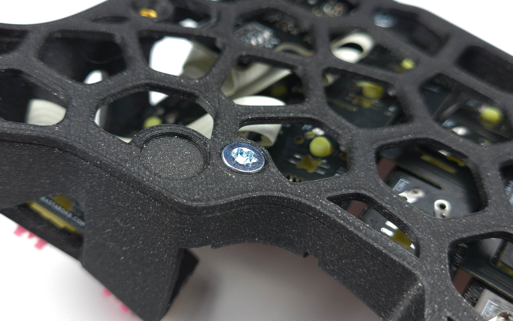
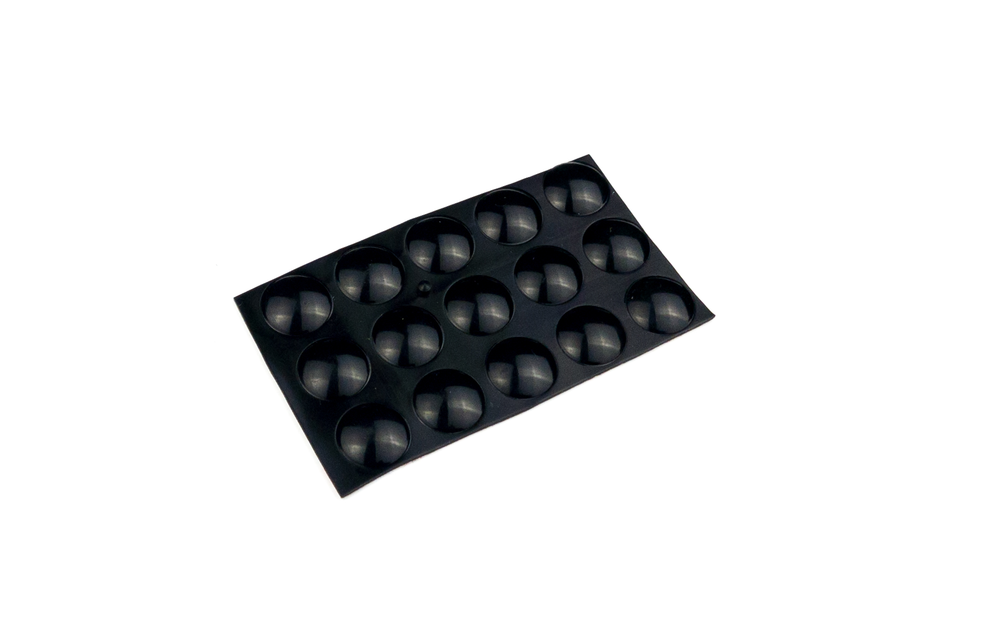
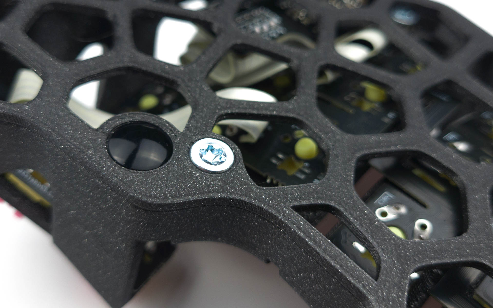
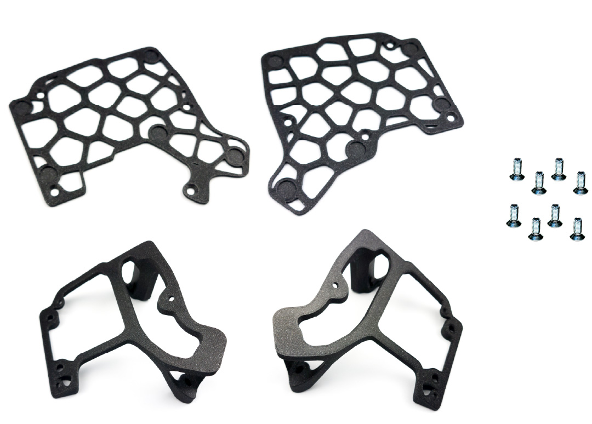
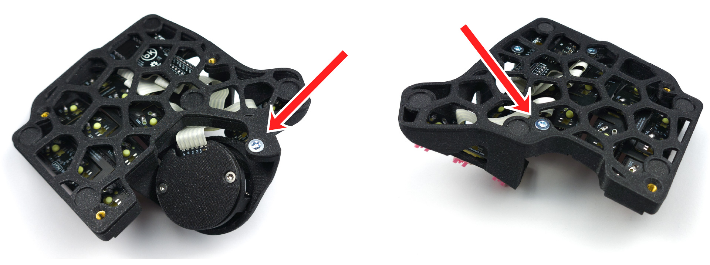
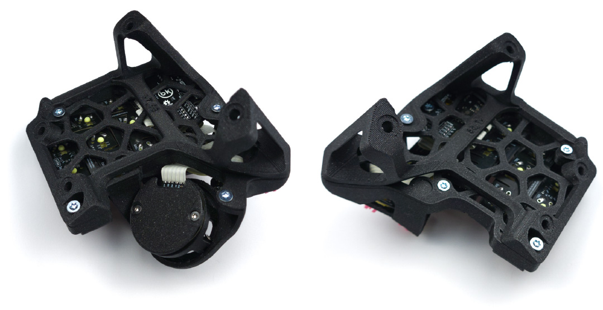
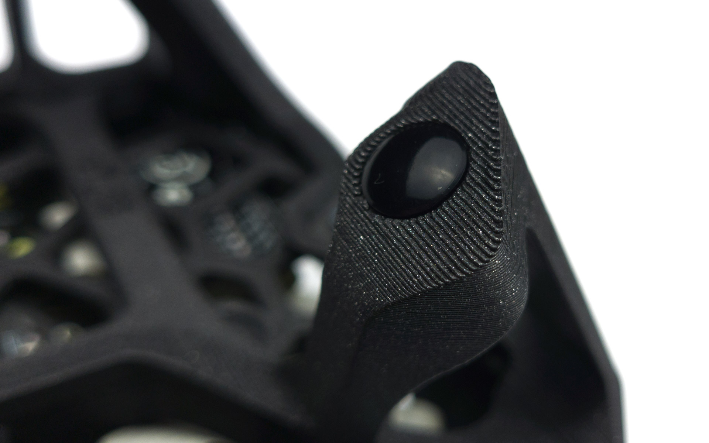

# Table of contents

1. TOC
{:toc}

# Installing the splinky shield

**For the following step, please prepare:**
- keyboard assembly (x2)
- M4 screw (x2)

{: .note }
On the pictures, we use a Splinktegrated - those come with premium kits. The Splinky + Shield works exactly the same, so inspect the pictures carefully.

Screw in the splinky shield assembly:

Solder the audio jack:

Do this for both sides.

# Installing the plates

{: .note }
If you have tents, skip to the next section "Installing the tents".

## Screws

**For the following step, please prepare:**
- keyboard assembly (x2)
- M4 screw (x8)
- plates (x2)

Secure the plates on the keyboard using the screws:

## Anti-slip pads

**For the following step, please prepare:**
- anti-slip pads (x10)

Install the anti-slip pads:

# Installing the tents

{: .note }
This step is optional, if you have tents.

## Screws

**For the following step, please prepare:**
- keyboard assembly (x2)
- M4 screw (x8)
- plates (x2)
- tents (x2)

Secure the plates on the keyboard using one screw at the bottom:

Install the tents with the rest of the screws:

## Anti-slip pads

**For the following step, please prepare:**
- anti-slip pads (x10)

Install the anti-slip pads:

