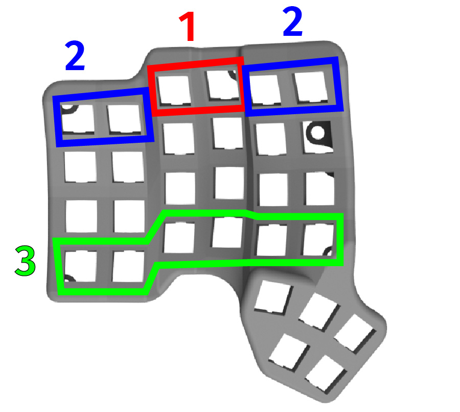

# Table of contents

1. TOC
{:toc}



# Introduction

Now that everything is connected together, the next step is to install the switches and the PCBs into the case. The process is exactly the same for both sides, so we will detail only the Scylla side (without trackball).

While in theory you can install the switches in any order you like, we outline below what we found out works best.

{: .warning }
The case is made of plastic, and will melt if you touch it with your soldering iron. Be careful!

{: .note }
We will detail only the left side, as the right side is the same, but symmetric.

# Installing the switches

We will start by detailing a technique to install the switches, and then in which order they should be installed. **Please read this whole section first to familiarize yourself, and then proceed to the installation.** Otherwise, the process might be more complicated.

When installing the switches, use the following technique:
- press the PCB against the case, and try to align it as much as possible
- from the other side, push the switch into the case hole
- make sure the pins align into the PCB's holes
- make sure the PCB is flush against the switch. If your switch has side pins, you may have to push it a bit harder
- solder the two pins of the switch

- start with the top two switches (labeled 1, in red on the picture)
- continue with the outer four switches (labeled 2, in blue on the picture)
- continue with the bottom six switches (labeled 3, in green on the picture)
- finally, install the rest of the switches
