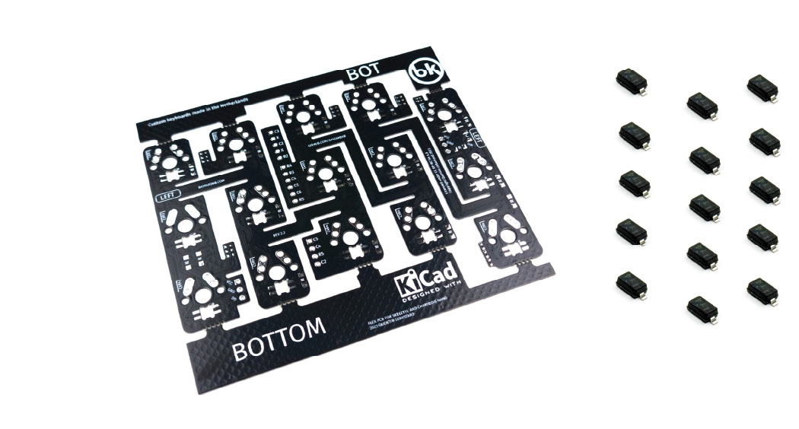
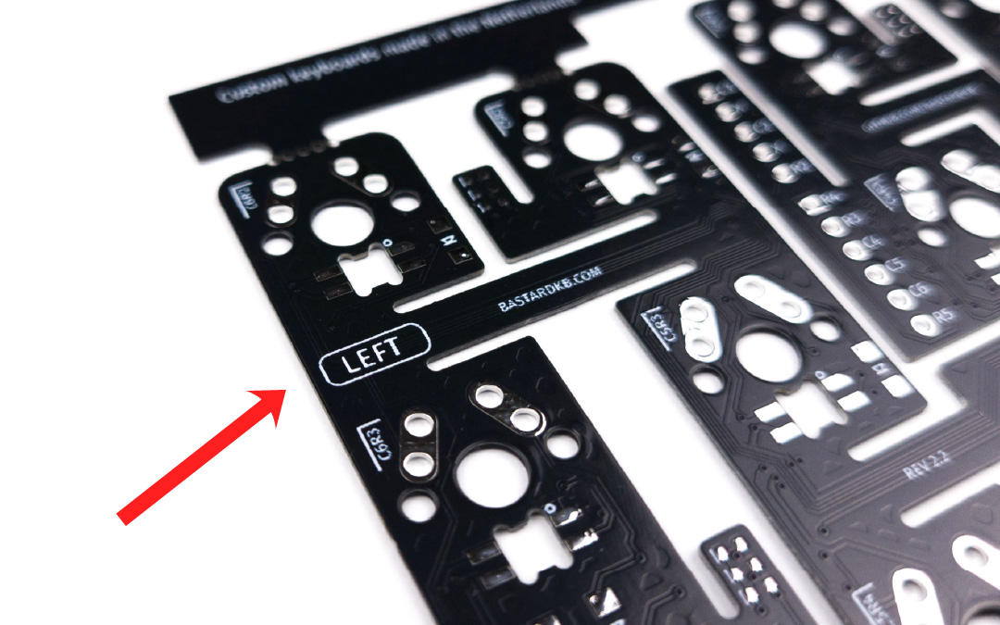
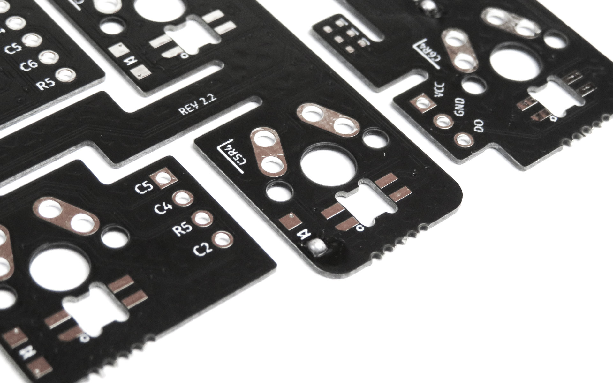
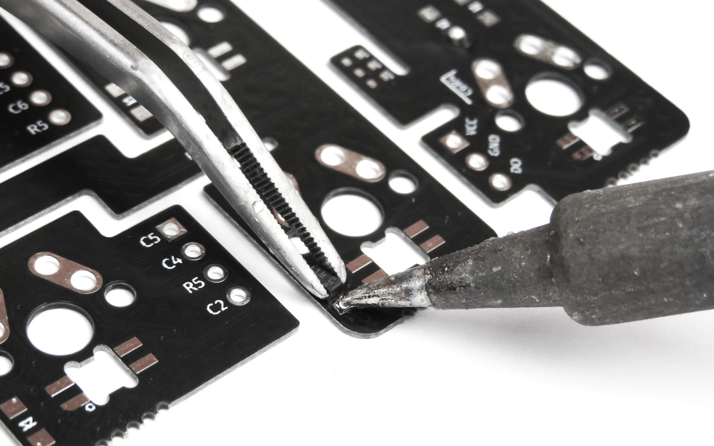
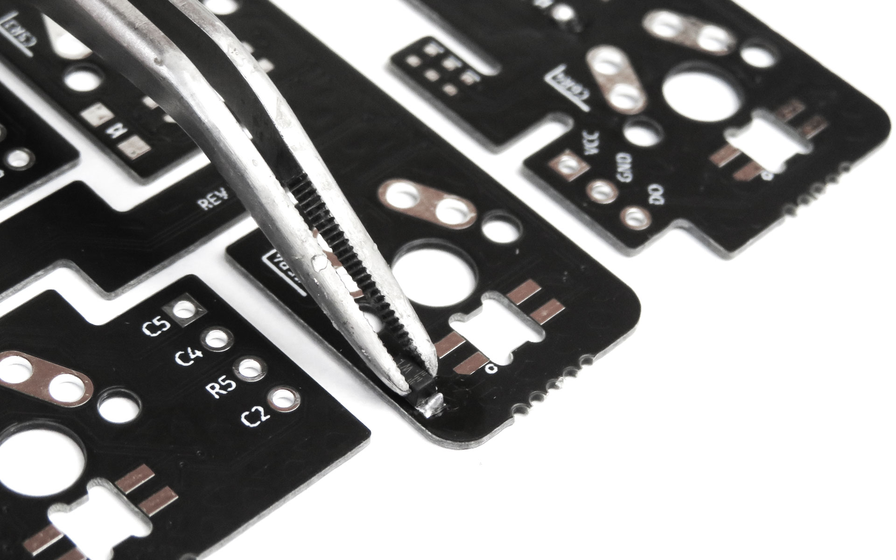
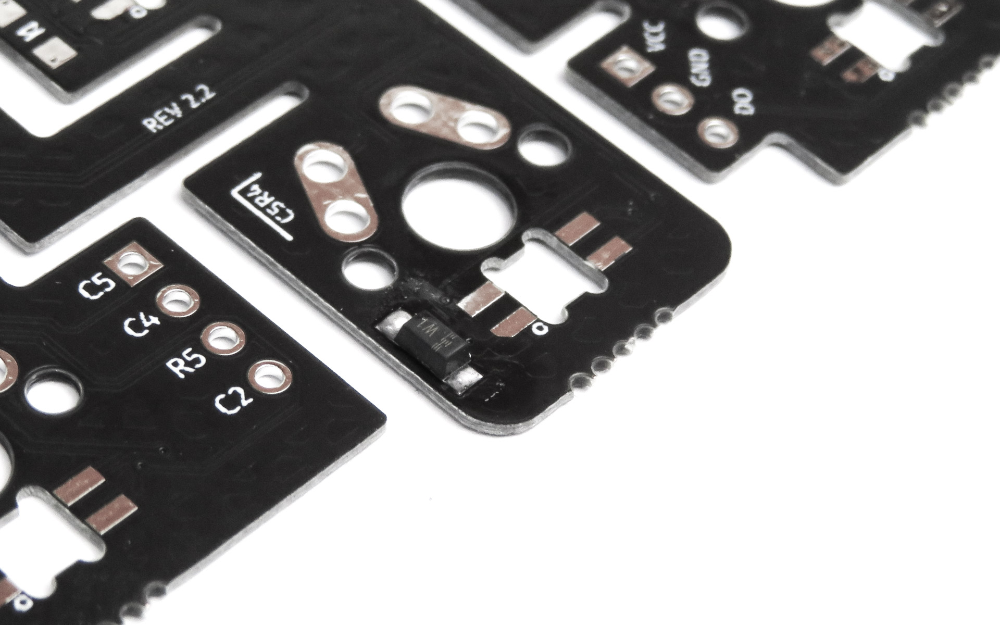
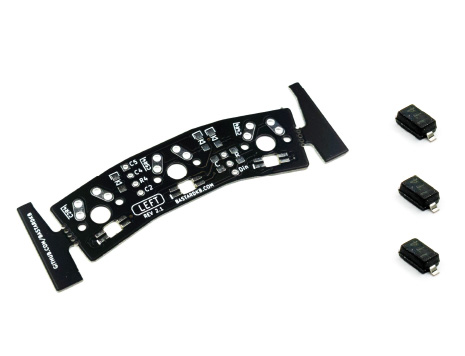
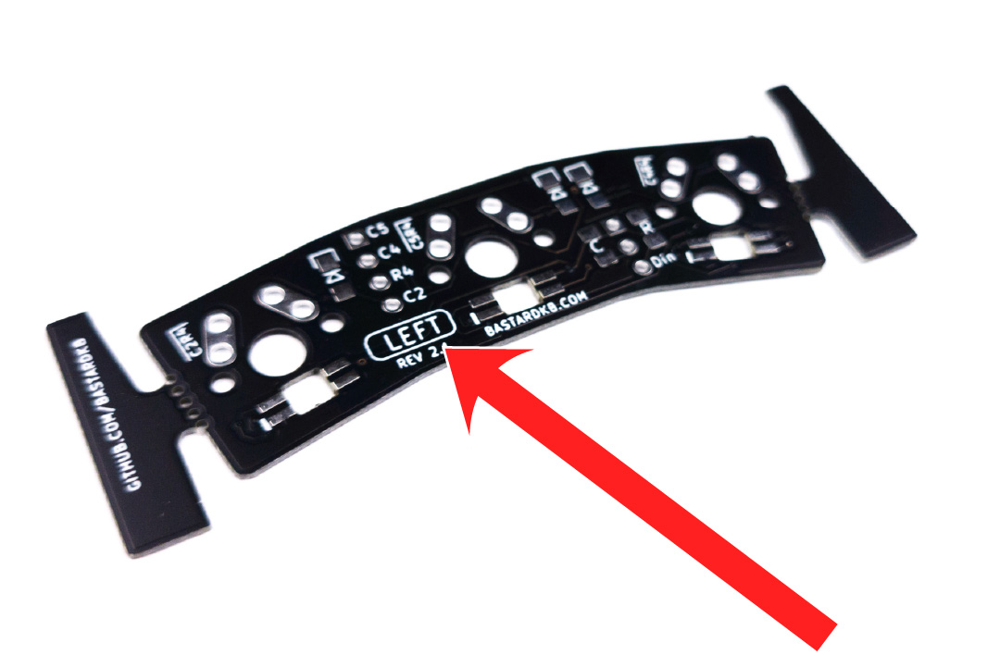

# Table of contents

1. TOC
{:toc}

# Introduction

For the keyboard to work, we need to install some components on the PCBs.

{: .tip }
We will start by installing the diodes. If you have per-key RGB the components for that came in a separate bag - you can set them aside, we will install them in the next section.

There are 2 sides of the keyboard: left, and right. **All the PCBs are reversible, so make sure to follow the steps carefully** to make sure you're installing the components correctly.

{: .note }
We will detail only the left side, as the right side is the same, but symmetric.

# Left side - Plate
## Left side - Plate - Required parts

**For the following step, please prepare:**

-   Plate PCB (x1)
-   diode (x15)

{: .note }
Your PCBs might look slightly different than the pictures, depending on when you ordered your kit. The installation procedure is the same.

## Left side - Plate - placing the PCB

-   All the PCBs are reversible, so first let's make sure we install the components on the correct side
-   Place the plate PCB on your working surface, and make sure the "LEFT" label is visible.
-   Use the picture below for reference.

{: .tip }
From now on, we will refer to this plate as the "Left PCB".

## Left side - Plate - installing the diodes

On the plate PCB, we need to install a total of 15 diodes. They go on the footprints with 2 pads (see pictures below).

{: .warning }
These diodes need to be installed in a specific way, or they will not work! **Read the following carefully.**

-   Inspect the 2-legged diodes: there is a horizontal line on them
-   This line needs to be aligned with the white markers on the PCBs
-   **If you do not align them, the keys will not work**

{: .tip }
In the following section, we detail some tips on how to install diodes. You can also use this technique to install capacitors and resistors. If you are familiar with it, feel free to install the diodes and skip ahead to the next section. 

-   Using a soldering iron, put some soldering tin on one pad

-   Using tweezers, install the diode, with one of its pins on top of the pad you just tinned
-   Melt the soldering tin, while still holding the diode in place. The soldering tin will "melt around" the diode's pin

-   Once the solder melted, remove the soldering iron
-   **Do not let go of the diode until the soldering tin is solid again**
-   After the soldering tin has solidified, you can let go of the diode
-   The diode should now not move at all

-   Solder the other pad

Do the same for the 15 diodes.

# Left side - thumb cluster
## Left side - thumb cluster - required parts

**For the following step, please prepare:**

-   3-key thumb PCB (x1)
-   2-leg diode (x3)

## Left side - thumb cluster - placing the PCB

-   Place the plate PCB on your working surface, and make sure the "LEFT" label is visible
-   Use the picture below for reference

## Left side - thumb cluster - installing the diodes

On the thumb cluster PCB, we need to install a total of 2 diodes. They go on the footprints with 2 pads (see pictures below).

-   Use the same method as previously to install the diodes
-   Take care to align the line with the marks on the PCB

# Right side PCBs

Apply the same technique, but for the right side.

