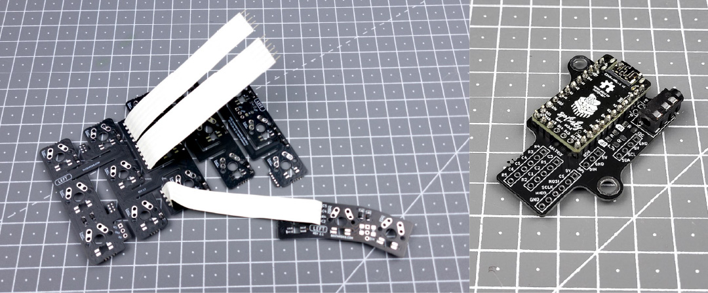
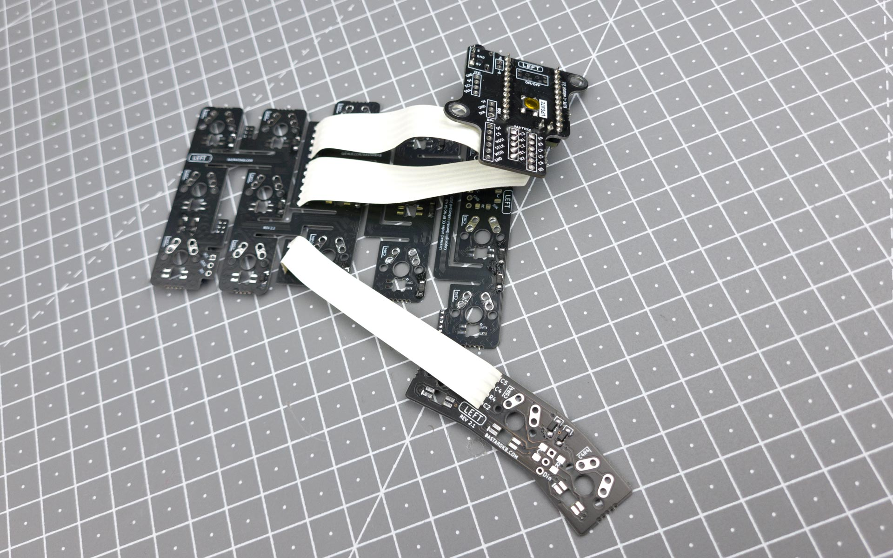
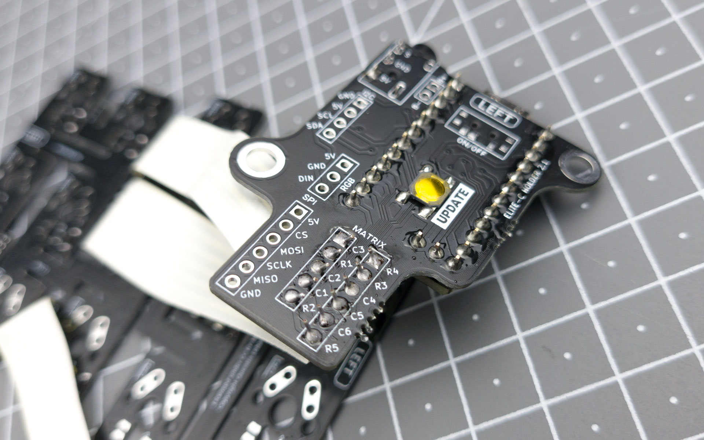

# Table of contents

1. TOC
{:toc}

# Introduction

Now that we finished preparing the Splinky and the flexible PCBs, it's time to connect all of them together. 

Be careful, because the Splinky shield assemblies are not reversible! We will start with the left side, and then proceed to the right side.

{: .note }
We will detail only the left side, as the right side is the same, but symmetric.

# Left side

**For the following step, please prepare:**
- Splinky shield assembly (left)
- flexible plates assembly (left)

Inspect the shield assembly: there is a `MATRIX` label, with a 5-pin and a 6-pin connector. We will connect it to the cables of the flexible PCB assembly.

{: .warning }
The cables need to be soldered on a specific side of the shield - otherwise, they will be difficult to route properly. Make sure to inspect the pictures carefully before soldering !

Install the cables coming out of the flexible PCB assembly into those connectors, and solder them:

# Right side

Proceed to do the same thing for the right side.