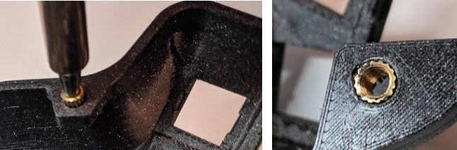
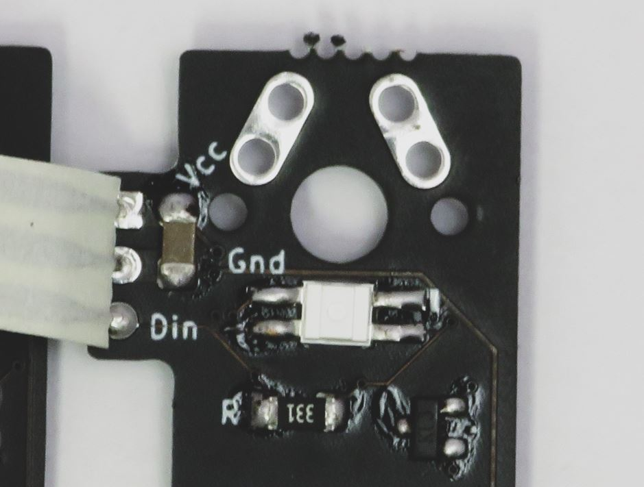
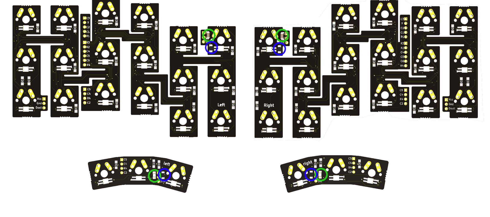
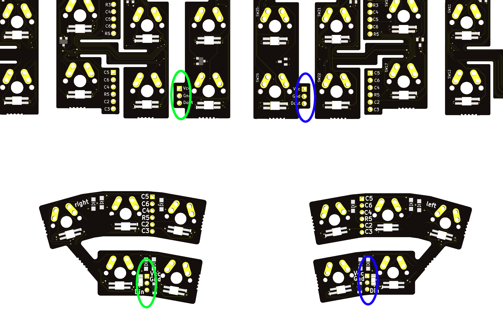
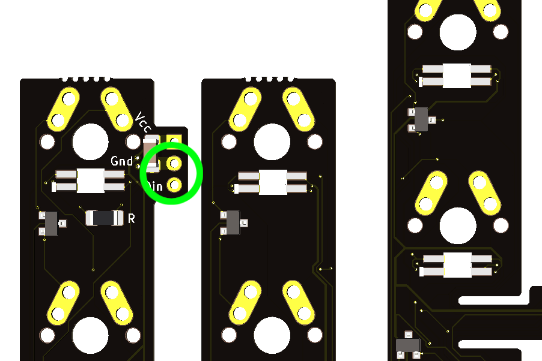
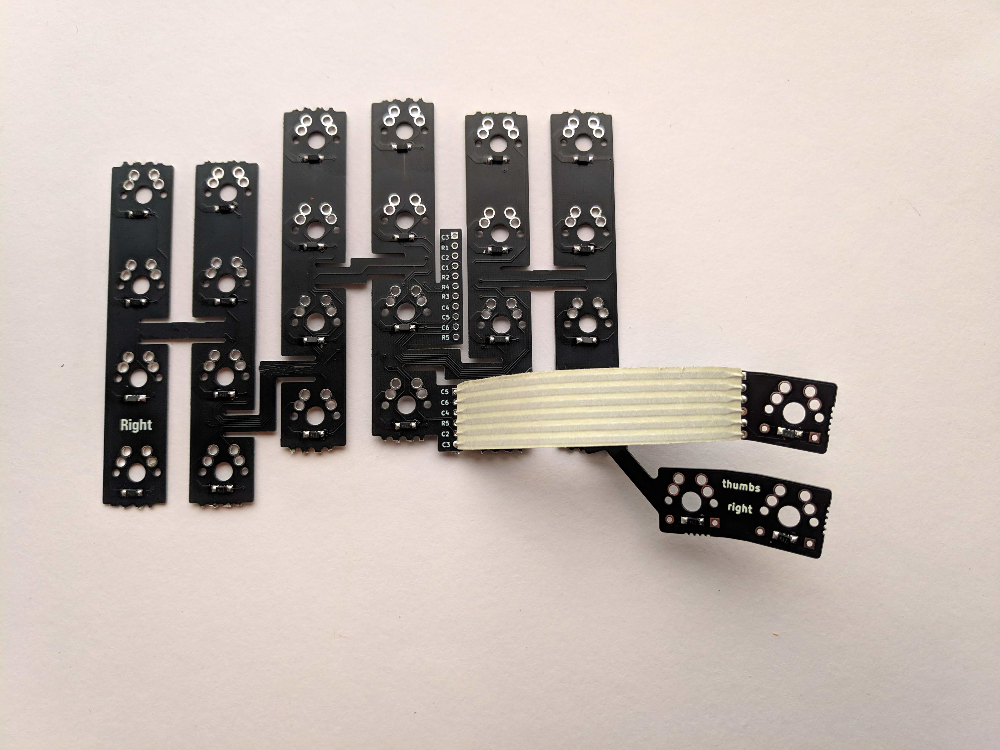
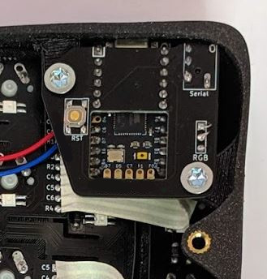
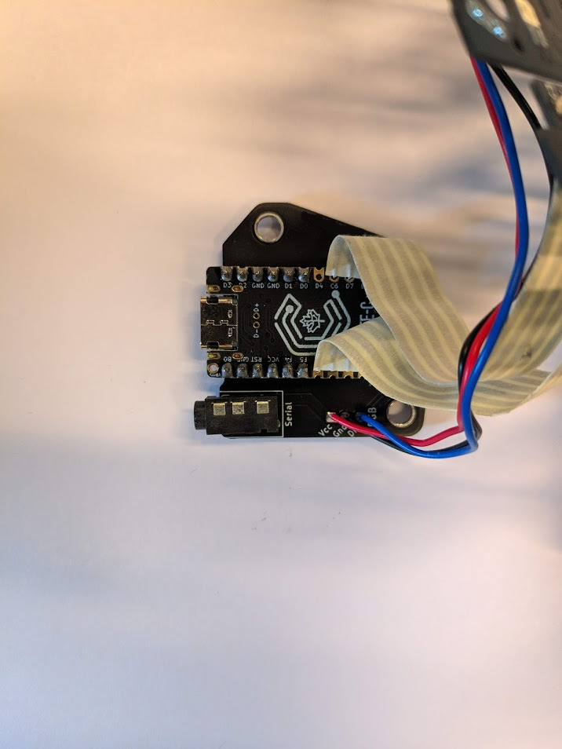
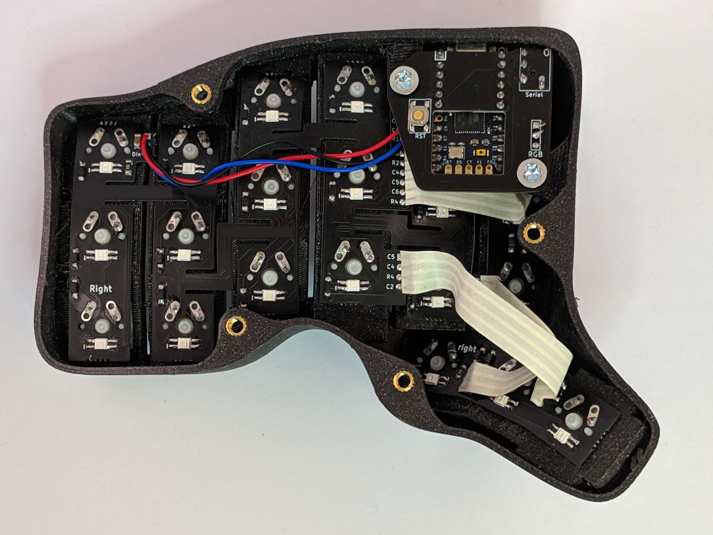

## TBK Mini DIY Kit Build guide

This guide is meant to help you go
through a quick and easy build of the Bastard Keyboard Mini. Feel free to give us feedback.

## Kit contents

Before beginning, please check that your kit has all the elements you will need. Should something be missing, please contact us immediately. 

Use the kit paper you got with your order.

## Required tools and material

You will need to buy yourself :

- 1 Usb-C cable
- 1 Standard audio cable

To build this keyboard, you will need:

- Soldering iron
- M4 torx or flathead screwdriver
- Soldering tin
- (Optional) Wire stripper
- (Optional) Hot glue gun
- (Optional) Heat gun

## Screw inserts

There are 12 screw inserts to install.
On each side, there are 4 for the plate (the ones flush with the bottom of the case), and 2 a little bit inside of the case, for the MCU holder.

- Set your soldering iron temperature to 200 degrees 
- Using the soldering iron, place the heated insert inside the hole
- *Apply little to no pressure, let the gravity do the work*. Otherwise, you might push them too far
- If the insert doesn't fall into place, you can slowly increase the temperature, but don't go over 300 degrees
- Once the insert is 2/3 of the way in, stop 
- Flip over the case and gradually push it against a flat surface, to make the insert flush with the case. Do this for the 4 inserts that are flush against the bottom of the case
- For the 2 inserts that are inside the case, very gently let gravity do the work untill they are fully inserted. **Do not push on them, or they might go too far**

## Soldering the components on the boards

- Make sure you prepare one "left", and one "right of each PCB
- All components and cables should be soldered on the same side

## Diodes

**Pay attention to the orientation of the PCBs: you need two "right", and two "left"**

- Solder all the diodes on the four PCBs (flexyls and thumb clusters)
- Check the orientation of the diodes: use the indications on the PCB

## RGB Components

If you have selected the per-key RGB option, follow this section.

First you need to install all the SMD components on the PCBs. Make sure you have one "`left` and one `right` of each one.
Cut away the supports using the mousebites.

Start by installing the 4 [Resistors](){: .btn .btn-blue} resistors and 4 [Capacitors](){: .btn .btn-green} :

- Install and solder all the leds
- Make sure they are face down, and pushed in the hole up until the end
- Make sure they are aligned properly - the shortest pin should align with the white dot indicator (Gnd)
- Make sure they're soldered on the same side as the resistors and capacitors

- Install and solder all the diodes (SOD123)
- Make sure they're soldered on the same side as the leds

Here's a few tips to install the diodes:

- Using a soldering iron, put some soldering tin on one pad
- Using pliers, install the diode, with one of its pins on top of the pad
- Melt the soldering tin, while still holding the diode in place. The soldering tin will "melt around" the diode's pin
- Once the solder melted, remove the soldering iron. Do not let go of the diode until the soldering tin is solid again
- After the soldering tin has solidified, you can let go of the diode
- The diode should now not move at all
- Solder the other pad

## Ribbon cables

Cut the ribbon cables using scissors or a cutter:

- 2 * ribbons of 6 cables
- 2 * ribbons of 5 cables
- 2 * ribbons of 4 cables
- 2 * ribbons of 3 cables
 
Connect the plates' RGB:

- Solder a 3-cable ribbon cable on the thumb cluster PCB's bottom RGB pins (with Dout)
- Solder the other end on the main plate's bottom RGB pins
- **The cables should come out on the same side as all the other components**
- Make sure you connect the Flexyl "Right" with the thumb cluster "Right", and the "Left" with the "Left"

Prepare the main plate's cables:

- Solder a black cable to the plate's Gnd
- Solder a colored cable to the plate's Din
- Solder a red cable to the plate's Vcc

Install the Thumb cluster:

- Solder a 4-cable ribbon cable on the thumb cluster PCB
- Solder the other end on the flexyl PCB, at the bottom - **make sure the legends align !** C5 should be connected to C5, C6 to C6, and so on
- Make sure you install the cables on the same side as the components - check the picture
- Make sure you connect the Flexyl "Right" with the thumb cluster "Right", and the "Left" with the "Left" - check the picture

## Solder the Elite-C to the MCU Holder PCB

**Please read carefully:**

- Do not install the audio jack yet !!
- Do not install the reset button yet !!
- Read all the instructions first, and then follow them carefully using the pictures
- **It is very important you follow those instructions, otherwise the ports will not align with the case**

Instructions for the top:

- Prepare 2 * 6 header pins
- Insert the Elite-C into the MCU PCB using the header pins
- Make sure the long part of the header pins is on top (Elite-C side). Use the pictures below for reference
- **Make sure the legends align**
- **Do not solder the audio jack or the reset button yet !!**
- Starting with the top part of the Elite-C, solder the four outmost header pins
- **Make sure the elite-C is pressed against the PCB** - there should be no gap between the Elite-C, the header pins, and the holder PCB
- **Do not solder the other pins yet !**
- Use the picture below for reference

Instructions for the bottom:

- Switch the PCB and Elite-C assembly, making sure the pins stay in
- Follow the same procedure for the bottom: solder the four outmost pins
- **Make sure the PCB is pressed against the Elite-C** - there should be no gap between the Elite-C, the header pins, and the holder PCB

Finish the installation:

- Solder the rest of the header pins

## Reset button

Solder the reset button to the PCB

## Prepare the Audio jack

First, prepare the hole:

- Take the audio jack and gently push it in the case's audio jack hole
- Apply gentle pressure until the audio jack is flush with the outside part of the case. **Do not** press on the pins
- Once inserted, gently remove it

Then, solder in part of the jack:

- Install the audio jack into the MCU Holder PCB
- Solder the bottom left pin
- Solder only this pin. **Do not solder the other pins at the moment**

## Install the audio jack

- Slide in the MCU assembly (Holder, elite-C, audio jack) into the case's 2 holes
- **Be gentle !** If the audio jack won't go in, carefully take the assembly out and try again
- Screw in the PCB using 2 * M4 8mm screws
- Make sure the USB-C and audio jack are aligned into the case
- Finish soldering the audio jack
- Unscrew the assembly

## Solder the ribbon cables to the MCU

Install the Flexyl:

- Solder the 5-cable ribbon cable to the top part of the top connector of the Flexyl (C3 ... R2)
- Solder the other end to the right part of the Elite-C, using the hole in the holder PCB. **Use the table under** to double-check the correct orientation
- **Make sure the cable is coming out of the top part of the MCU** (with the components). Look at the picture to double-check

| MCU  | Flexyl PCB |
| ------------- | ------------- |
| C6 | C3  |
| D7  | X  |
| E6  |  C2 |
| B4  | C1  |
| B5  | R1  |

- Solder a 6-cable ribbon cable to the bottom part of the top connector of the Flexyl (R4 ... R5)
- Solder the other end to the left part of the MCU. **Use the table under** to double-check the correct orientation
- **Make sure the cable is coming out of the top part of the MCU** (with the components). Look at the picture to double-check

| MCU  | Flexyl PCB |
| ------------- | ------------- |
| F6 | R3  |
| F7  | R2  |
| B1  |  C4 |
| B3  | C5  |
| B2  | C6  |
| B6  | R4  |

## Connect the RGB cables

Take the cables coming out of the plate, and solder them to the MCU holder PCB.

- Red cable to Vcc
- Black cable to Gnd
- Colored cable to Din

## Test the RGB

Connect your keyboard to the computer, and check that all the LEDs light up. If some of them don't, they might need resoldering.

## Install the switches

**Carefully install the switches in the specified order, using the pictures for help**

**At all times, be careful not to touch the case or the ribbons with the soldering iron.**

**If you touch the case, THE CASE WILL MELT and be damaged irreparably.**

- Insert the assembled PCBs into the case
- Starting with the top row, install the two switches in the middle columns and solder them
- Then, install the two switches around it. You will have to push the PCB so it aligns, and then insert the switches. This is by design, and once the switches inserted the PCB won't move. Solder these switches
- Finish the top row
- Do the bottom row in the same way. The PCB won't hold on the switches, you can hold it with the soldering iron and then add the tin
- Finish the top part of the keyboard
- Install the switches on the thumb cluster, and solder them. **Be careful not to damage the ribbon cables or the case**

## Test the keyboard

Now is a good time to test the keyboard. 
The Elite-Cs/Blinkys come pre-flashed with QMK, so you simply have to connect both halves with an audio cable, then the right side to your computer with a USB-C cable. Use a website like [http://keyboardchecker.com/](http://keyboardchecker.com/) to ensure that every switch works.

If you're going to flash your own version of QMK, make sure that there's a RESET key on your layout.

## Install the MCU Adapter

- Using two screws, secure the Elite-C and PCB to the case
- Make sure the USB port and audio jack align. If you followed instructions carefully, they will
- If they do not, desolder a few pins of the audio jack and move it around

## Install the plates

- Align the plate and install the 4 screws

## Get your serial number

You're all set, congratulations ! Head over to [old.reddit.com/r/bastardkb/](old.reddit.com/r/bastardkb/) and post a picture of your build to get a serial number !