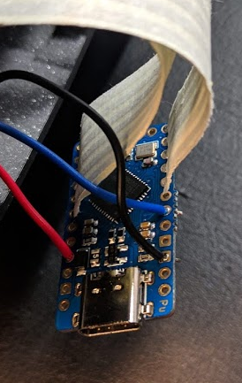
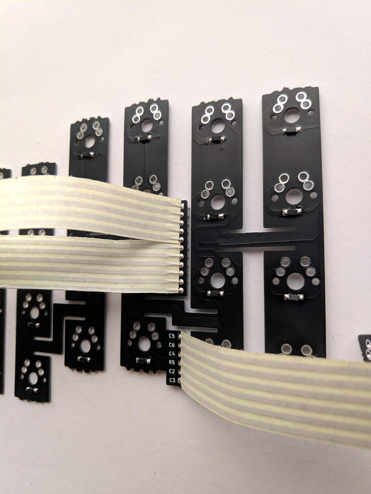
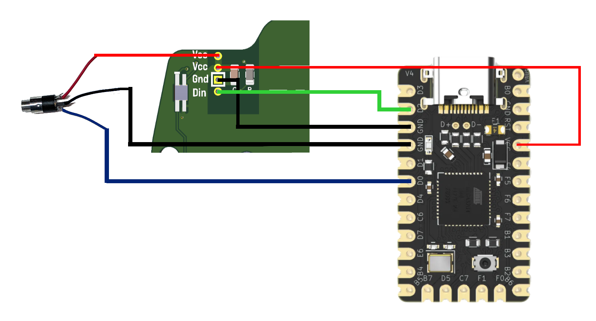
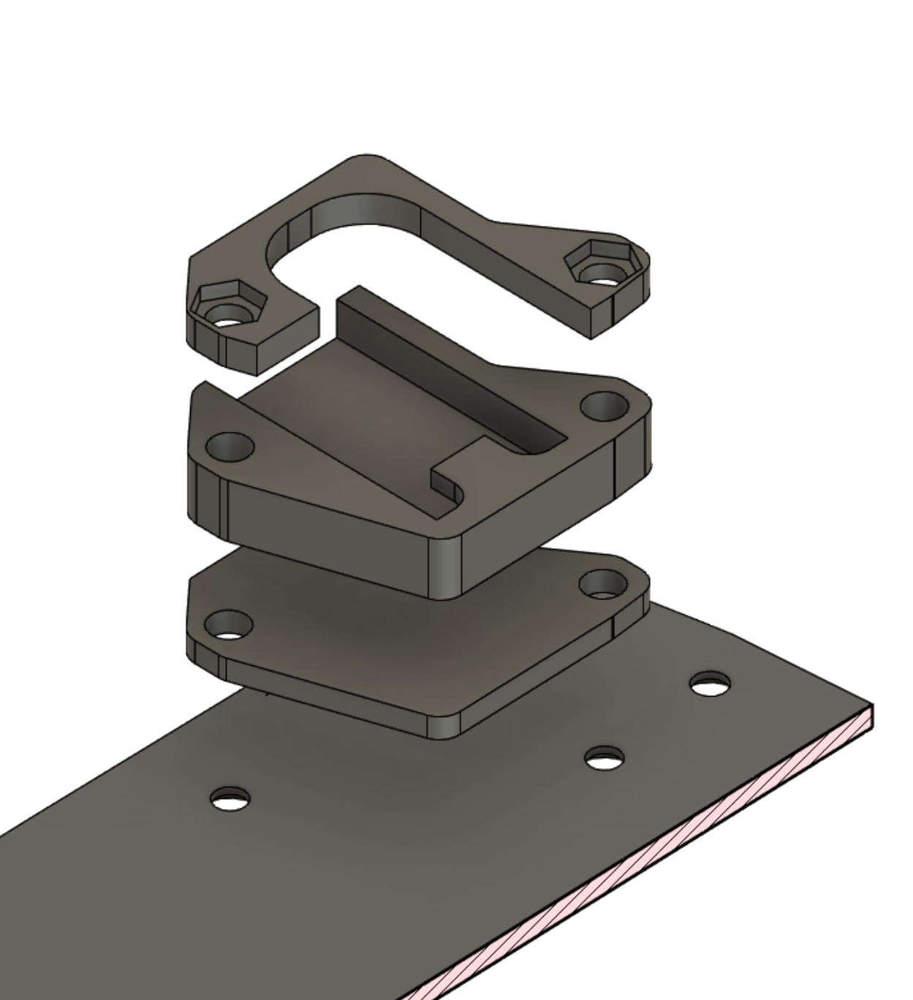
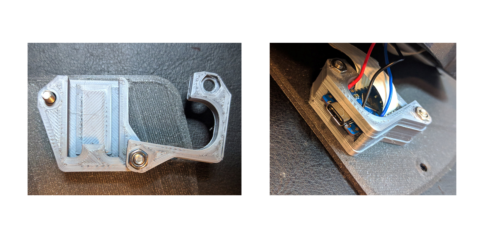

## Bastard Keyboard DIY Kit Build guide

This guide is meant to help you go
through a quick and easy build of the Bastard Keyboard. Feel free to give us feedback.

## Kit contents

Before beginning, please check that your kit has all the elements you will need. Should something be missing, please contact us immediately. 

Use the kit paper you got with your order.

## Required tools and material

You will need to buy yourself :

- 1 Usb-C cable
- 1 Standard audio cable

To build this keyboard, you will need:

- Soldering iron
- M4 torx or flathead screwdriver
- Soldering tin
- (Optional) Wire stripper
- (Optional) Hot glue gun
- (Optional) Heat gun

## Screw inserts

There are 12 screw inserts to install, 6 on each side of the keyboard

- Set your soldering iron temperature to 200 degrees 
- Using the soldering iron, place the heated insert inside the hole
- *Apply little to no pressure, let the gravity do the work*. Otherwise, you might push them too far
- If the insert doesn't fall into place, you can slowly increase the temperature, but don't go over 300 degrees
- Once the insert is 2/3 of the way in, stop 
- Flip over the case and gradually push it against a flat surface, to make the insert flush with the case

## Diodes

**Pay attention to the orientation of the PCBs: you need two "right", and two "left"**

- Solder all the diodes on the four PCBs (flexyls and thumb clusters)
- Check the orientation of the diodes: use the indications on the PCB

## Ribbon cables

Cut the ribbon cables using scissors or a cutter:

- 4 * ribbons of 6 cables
- 2 * ribbons of 5 cables

Install the Thumb cluster:

- Solder a 6-cable ribbon cable on the thumb cluster PCB
- Solder the other end on the flexyl PCB, at the bottom - **make sure the legends align !** C5 should be connected to C5, C6 to C6, and so on
- Make sure you install the cables on the same side as the components - check the picture
- Make sure you connect the Flexyl "Right" with the thumb cluster "Right", and the "Left" with the "Left" - check the picture

Install the Flexyl:

- Solder the 5-cable ribbon cable to the top part of the top connector of the Flexyl (C3 ... R2)
- Solder the other end to the right part of the MCU. **Use the table under** to double-check the correct orientation
- **Make sure the cable is coming out of the top part of the MCU** (with the components). Look at the picture to double-check

| MCU  | Flexyl PCB |
| ------------- | ------------- |
| C6 | C3  |
| D7  | R1  |
| E6  |  C2 |
| B4  | C1  |
| B5  | R2  |

- Solder a 6-cable ribbon cable to the bottom part of the top connector of the Flexyl (R4 ... R5)
- Solder the other end to the left part of the MCU. **Use the table under** to double-check the correct orientation
- **Make sure the cable is coming out of the top part of the MCU** (with the components). Look at the picture to double-check

| MCU  | Flexyl PCB |
| ------------- | ------------- |
| F6 | R4  |
| F7  | R3  |
| B1  |  C4 |
| B3  | C5  |
| B2  | C6  |
| B6  | R5  |

## Install the switches

**Carefully install the switches in the specified order, using the pictures for help**

**At all times, be careful not to touch the case or the ribbons with the soldering iron.**

**If you touch the case, THE CASE WILL MELT and be damaged irreparably.**

- Insert the assembled PCBs into the case
- At all times, make sure it doesn't get stuck outside of the case, make sure it's under the screw inserts
- Starting with the top row, install the two switches in the middle columns and solder them
- Then, install the two switches around it. You will have to push the PCB so it aligns, and then insert the switches. This is by design, and once the switches inserted the PCB won't move. Solder these switches
- Finish the top row
- Do the bottom row in the same way. The PCB won't hold on the switches, you can hold it with the soldering iron and then add the tin
- Finish the top part of the keyboard
- Install the switches on the thumb cluster, and solder them. **Be careful not to damage the ribbon cables or the case**

## Install the RGB Plate

If you have a midplate RGB PCB, follow those instructions. Otherwise, skip to [Install the audio jack](#install-the-audio-jack).

### Preparing the RGB Plate

- Be careful about orientation: there's one left, and one right PCB
- Solder the resistor (R), and the capacitor (C)
- On the same side, solder the leds, facing down towards the table. **The white indicators are for the Gnd, and should be aligned with the shorter pin of the leds**
- Solder 3 cables to each plate: red to Vcc, black to Gnd, green to Din. The cables should come out on the same side that the components are soldered

### Prepare and install the audio jack

The cables need to be soldered in a very specific way. Use the diagram below for help.

- Solder cables to audio jack. Their position is not important, as long as it's the same on both sides. **Do not solder to the MCU yet.**
- Install the heat shrink wrap and shrink it with a heat gun or a lighter
- Screw audio jack into case
- (Optional) add a bit of hot glue to the jack so it holds better. **Only do so in the indicated position** (see picture in [Install the audio jack](#install-the-audio-jack)), so it won't interfere with installation of the MCU
- Solder cables from the audio jack to the RGB plate: red to Vcc
- Solder cables from the audio jack to the MCU: black to gnd, blue to D0
- Solder cables from the RGB plate to the MCU: black for Gnd, red for Vcc, green for Din/D2

You can now skip to [Test the keyboard](#test-the-keyboard)

## Install the audio jack

- Solder cables to audio jack. Their position is not important, as long as it's the same on both sides. **Do not solder to the MCU yet.**
- Install the heat shrink wrap and shrink it with a heat gun or a lighter
- Screw audio jack into case
- (Optional) add a bit of hot glue to the jack so it holds better. **Only do so in the indicated position**, so it won't interfere with installation of the MCU
- Solder cables to the MCU (Blinky or Elite-C): black to GND, red to Vcc, blue to D0

## Test the keyboard

Now is a good time to test the keyboard. 
The Elite-Cs/Blinkys come pre-flashed with QMK, so you simply have to connect both halves with an audio cable, then the right side to your computer with a USB-C cable. Use a website like [http://keyboardchecker.com/](http://keyboardchecker.com/) to ensure that every switch works.

If you're going to flash your own version of QMK, make sure that there's a RESET key on your layout.

## Install the MCU Adapter

- Using two 20mm screw and a nut, secure the MCU adapter and holder to the bottom plate. Use the 3 layers of the adapter. Use the picture below for reference
- If you have an RGB midplate, screw into the plate, then the midplate, then the PCB, then the mid and top adapter. Do not use the bottom adapter.
- Slide in the MCU in the adapter until you hit the end. **The MCU is supposed to be a bit outside of the adapter**, don't push too hard

- The end of the USB-C port should be just a little inside of the case (compare the alignment with the plate)
- The other end of the MCU should be flushed against the end of the middle adapter
- If not - check the inside of the middle adapter part, there might be some 3d printed material leftover 

- Slide the holder and install the other nut, finish screwing in
- **Do not overtighten**. Screw in until it feels secure

## Install the plates

- Carefully slide the USB-C into the hole
- Making sure the USB-C is aligned, start by inserting the top 2 screws
- If necessary, very gently push so the USB-C fits into the hole
- **Do not overtighten**. Screw in until it feels secure
- Insert the rest of the screws

If the adapter's USB port does not line up perfectly, try to:

- Unscrew the adapter's 2 screws by one turn
- Install the plates and align the usb port
- Screw in completely the adapter

