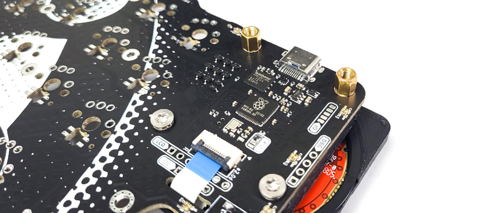
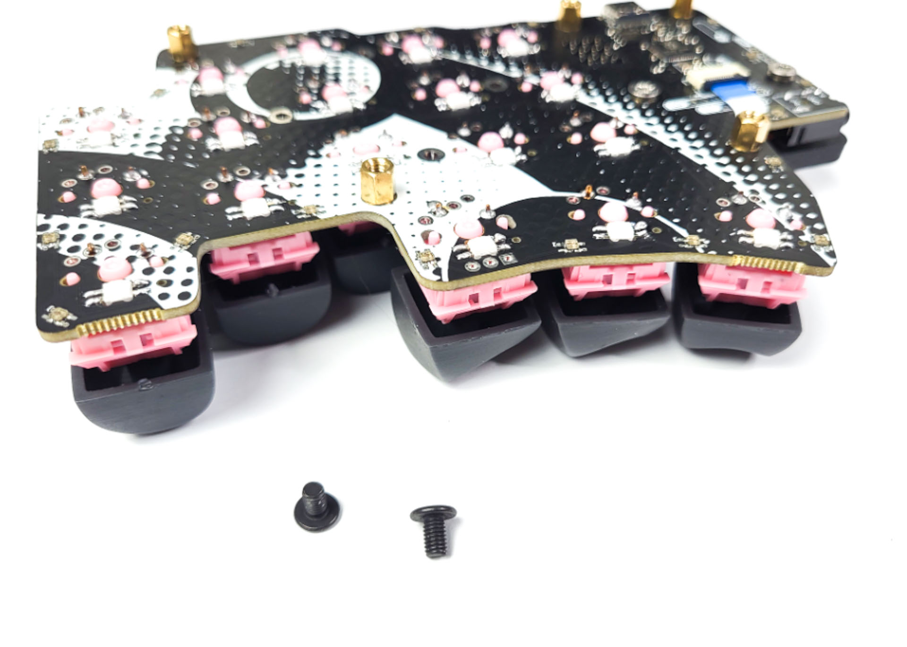
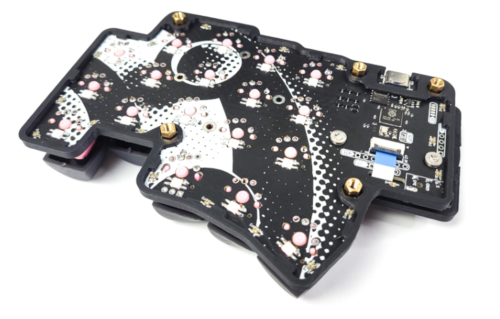
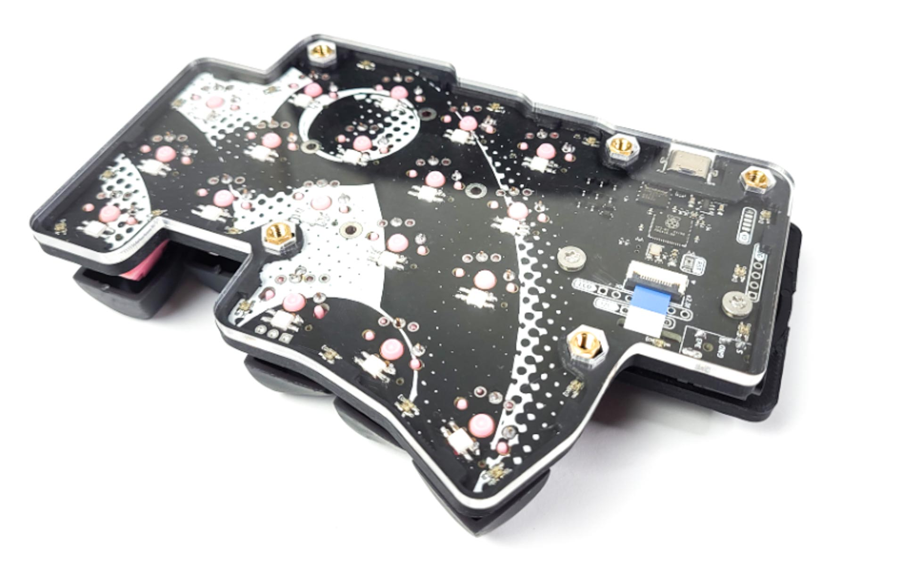
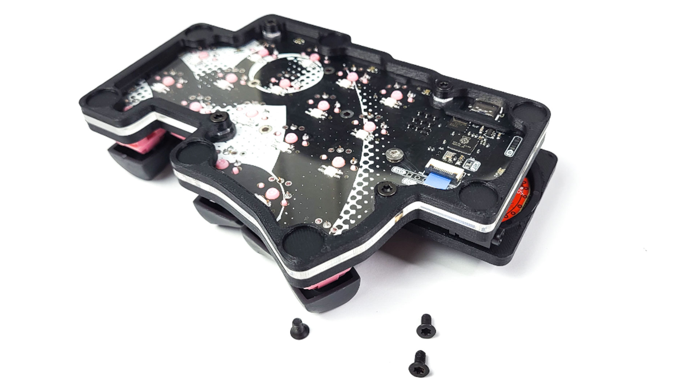

# Table of contents

1. TOC
{:toc}

# Introduction

If you have a case with your Dilemma or Dilemma MAX, on this page you will find instructions on how to install it.

# Installing the spacers

On the right side, for the trackpad assembly:

-   screw the bottom 2 screws
-   screw the top 2 Male/Female spacers

-   Screw in the Female/Female spacers
-   Use the flat-headed black screws

{: .tip }
Depending on your kit, you might get either yellow or grey spacers. They work exactly the same, in the pictures we used the yellow ones.

For the left side, the process is the same - just use Female/Female spacers instead of the Male/Female ones.

# Installing the case and acrylic

Install the 3d printed case. You might have to push a bit so it fits well in the spacers.

- Install the acrylic on top
- Make sure everything is flush

Install the bottom plate using the black chamfered screws.

Finally, install the anti-slip pads.