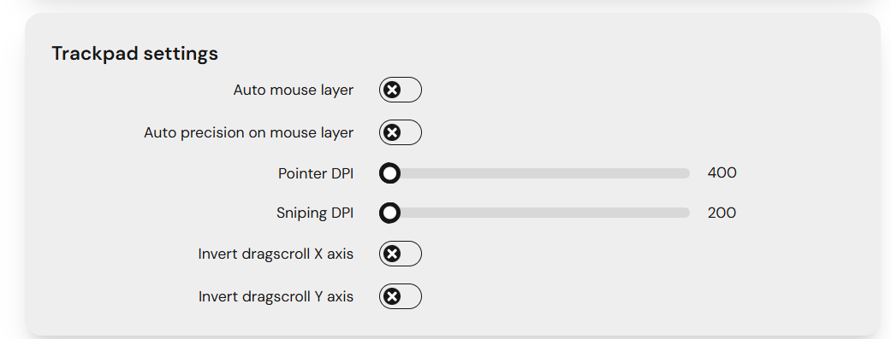
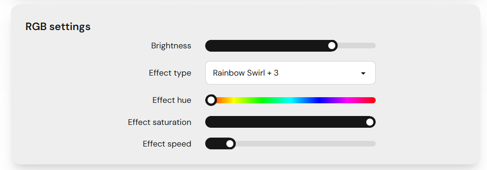
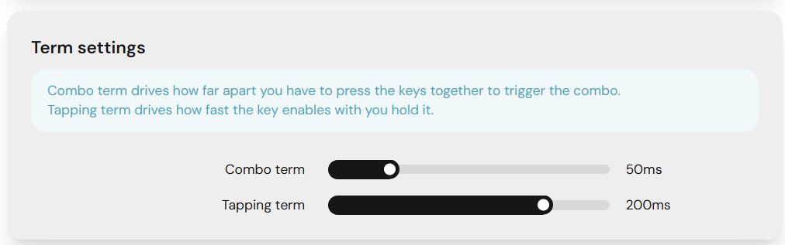
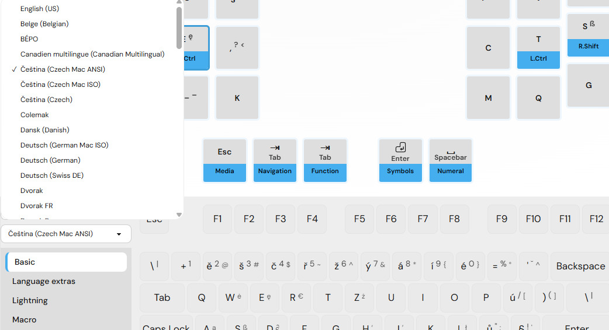
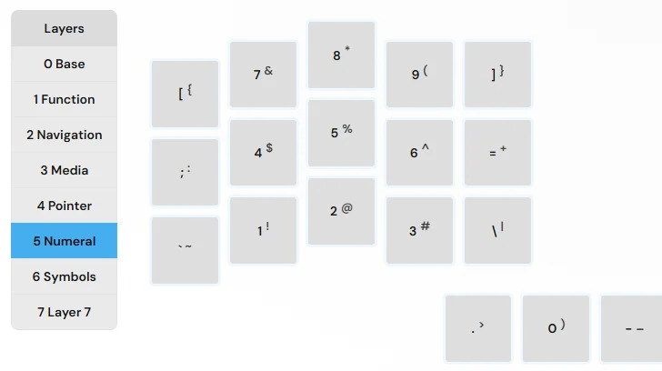
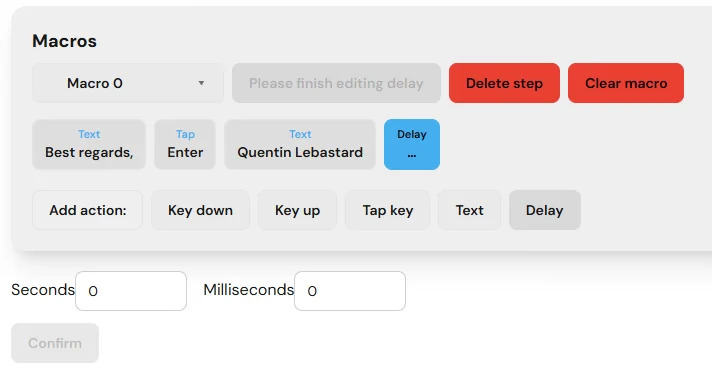
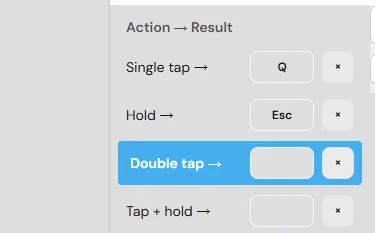
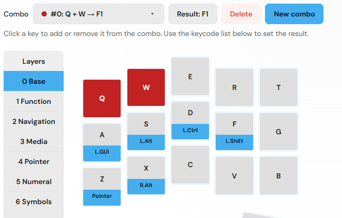
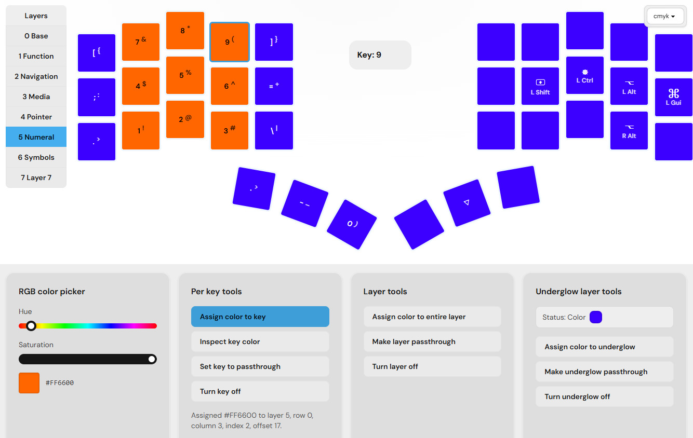
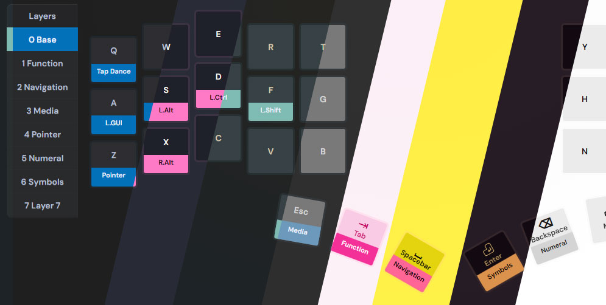

# Table of contents

1. TOC
{:toc}

# What is Argos?

Argos is our solution to easy keyboard customization.

You can change your keymap and mouse behavior, but also a lot of options to make you more productive: combos, tap dances, macros… 

The changes are instant and stored on your keyboard: will work anywhere, with no need for compilation.

## How does it compare to QMK and VIA?

When configuring your keyboard, you have different options: QMK, VIA, Argos.

- QMK is the firmware that always runs on your keyboard. You can modify its code, compile and flash it
- VIA is a widely used visual configuration interface for keyboards. It lacks options and is visually old
- Argos is Bastard Keyboards’ dedicated web configuration interface: it covers the same kind of keymap editing as VIA, plus combos, tap dances, pointing-device tuning, and backups

# Requirements

First, make sure your keyboard has the latest Argos image. You can download the image on the [release page](https://github.com/Bastardkb/qmk_userspace/releases/tag/latest) and flash it using the [bootmagic method][bootmagic].

You will need to use a chromium-based browser like Chrome or Edge.

# Getting started

- visit [argos.bastardkb.com][argos]
- click on `Connect` and select your keyboard
- take the tour and start configuring your keyboard

# Features

You can navigate the app through the menu on the left.

## Pointing settings

In the *Keyboard settings* view, you can modify different options about your trackball or trackpad.

**Trackpad / trackball settings**: Set normal DPI and a lower “precision mode” DPI for fine cursor control (on boards with a pointing device). 

You can also enable auto precision on mouse layer, and autotomatic mouse layer switch when you move your trackball / trackpad. 

## Keyboard settings

In the *Keyboard settings* view, you can modify different options about your keyboard behaviour.

**RGB settings**: Adjust brightness, pick an effect, and set hue, saturation, and speed for your keyboard’s lighting.

**Term settings**: Control how long you can hold keys apart for a combo, and how quickly a tap is recognized before a hold takes over.

**Export / import configuration**: Save your keymap, combos, tap dances, and related settings to a JSON file, or restore them later on the same or another compatible board.

## Multiple languages support

If you are from Germany, France, Sweden… or many other countries and use an alternative layout, you can change it directly in the interface.

Once you set the language in your OS as well, the keymap will work directly without any changes to it.

## Layers 

Your keyboard comes with multiple layers. When you press a “Layer key”, it will change the full keymap. It’s like the shift key, but turbo-charged. Argos supports up to 8 layers, and you can configure each one of them.

## Macros

With Macros, you can create any combination of text, keys, and delays.

## Tap dance

With the tap dance feature, you can:
- tap a key, get an output
- hold it, get a different output
- double tap
- tap + hold

You can configure this for each key, and configure the delay in the keyboard settings.

## Combos

Press two (or three, or four) keys at the same time, and you get a separate one. That’s the power of combos. 

Easily add shortcuts like function keys, escape, tab, etc.

## RGB configuration

Take full control with per-key, per-layer RGB control, as well as underglow for the keyboards that support it.

## Multiple themes

Extensive collection of themes, automatically synced to your keyboard.

----

[bootmagic]: {{site.baseurl}}/fw/flashing.html#bootmagic
[argos]: https://argos.bastardkb.com