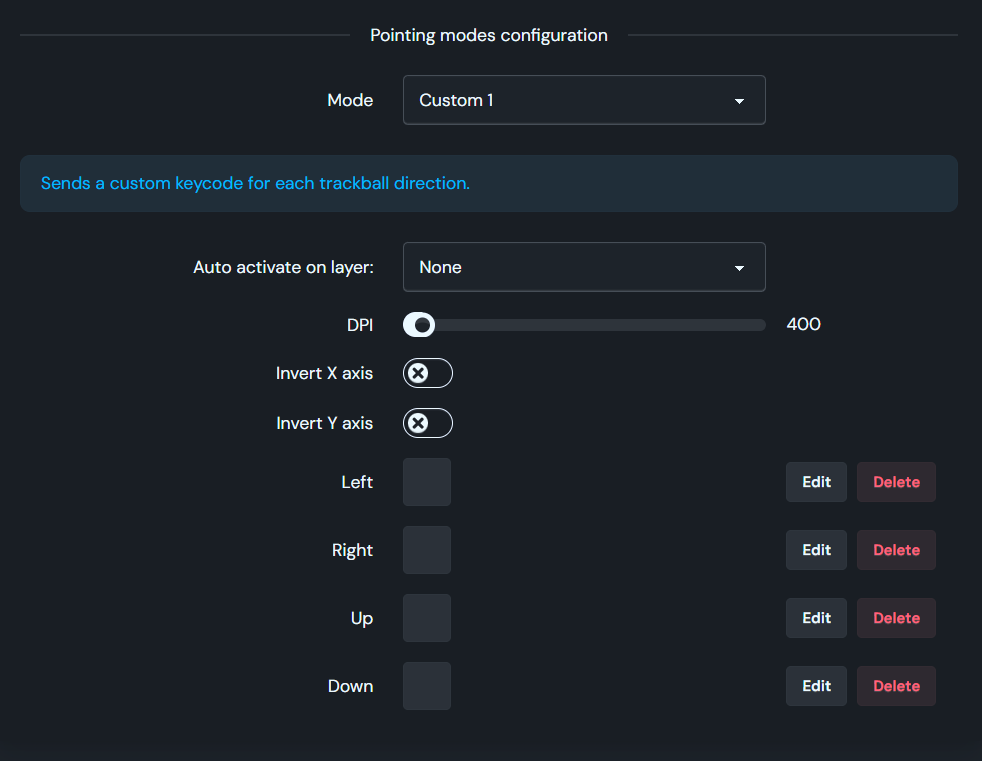

# Table of contents

1. TOC
{:toc}

# Introduction

All the features listed below are available in the Charybdis `vendor` keymaps.

The `vendor` keymap aims at providing a consistent experience out of the box. Because some features can be mutually exclusive (e.g. [Auto precision mode on layer](#auto-precision-mode-on-mouse-layer) and [Auto pointer layer](#auto-pointer-layer)), not all features are enabled by default. It may be necessary to rebuild the firmware to enable or disable some of the features listed below.

# Charybdis features

## Charybdis stock keymap

- the stock keymaps are built off the `vendor` keymaps, and come with [Argos][argos] enabled
- you can find a visual reference of those keymaps on the [default keymaps page][keymaps]
- you can find instructions on how to compile your own firmware on the [how to compile your firmware page][compile]

## DPI

DPI (i.e. dots per linear inch), a.k.a. mouse sensitivity, can be controlled by the firmware. The Charybdis keymap offers different DPI settings:

- **Default** DPI: the sensitivity of the pointer in normal mode.
- **Pointer modes** DPI: the sensitivity of the pointer in the different modes.

For each mode, the firmware allows cycling through multiple pre-defined values. The firmware _cycles_ through these values, which means that, for example, incrementing the Precision mode DPI of `500` by 1 step will loop back to `200`.

You can change the DPI of the precision mode directly through Argos, or QMK.

## Pointing module

The [Bastard Keyboards Pointing Module](https://github.com/Bastardkb/qmk_modules) provides a range of trackball-related features.

It houses the logic, and provides pointing modes that transform the behaviour of the trackball.

Each pointing mode can be customized through Argos and QMK:
- X/Y axis invert
- automatic activation on layer
- DPI



You can read more about the pointing modes below.

### Precision mode

**Precision mode** slows down the pointer for more precise gestures. It is useful when combined with a higher default DPI. Like the default pointer's DPI, the precision mode DPI can be changed at runtime

Custom Keycodes:

| Name   | Description                                                                  |
| ------ | ---------------------------------------------------------------------------- |
| `S_D_MOD` | increase the sensitivity of the pointer movement in precision mode by one step |
| `S_D_RMOD` | decrease the sensitivity of the pointer movement in precision mode by one step |
| `SNIPING`  | enable precision mode as long as the key is pressed                            |
| `SNP_TOG` | toggle precision mode on and off                                               |

### Auto Precision mode on mouse layer

You can trigger Precision mode automatically when on the mouse layer by adjusting through Argos, or with the custom code below:

```c
bkpd_set_auto_precision_on_mouse_layer_enabled(bool enable) // enable/disable precision mode on mouse layer

#undef AUTO_MOUSE_DEFAULT_LAYER // modify only if you use a custom mouse layer
#define AUTO_MOUSE_DEFAULT_LAYER 4 
```

### Auto pointer layer

You can trigger the pointer layer automatically upon moving the trackball by adjusting through Argos, or with the custom code below:

```c
bkpd_set_auto_mouse_layer_enabled(bool enabled) // enable/disable auto mouse layer on trackball move
#undef AUTO_MOUSE_DEFAULT_LAYER // modify only if you use a custom mouse layer
#define AUTO_MOUSE_DEFAULT_LAYER 4 
```

### Drag-scroll

**Drag-scroll** enables scrolling with the trackball. When drag-scroll is enabled, the trackball's `x` and `y` movements are converted into `h` (horizontal) and `v` (vertical) movement, effectively sending scroll instructions to the host system.

Custom keycodes:

| Name   | Description                                           |
| ------ | ----------------------------------------------------- |
| `DRGSCRL`  | enable drag-scroll mode as long as the key is pressed |
| `DRG_TOG` | toggle drag-scroll mode on and off                    |

Custom defines:

```c
#define BK_POINTING_DEVICE_DRAGSCROLL_REVERSE_X // inverts horizontal scrolling 
#define BK_POINTING_DEVICE_DRAGSCROLL_REVERSE_Y // inverts vertical scrolling 
```

Custom functions:   

```c
bkpd_set_pointer_dragscroll_enabled(bool enable) // enable/disable drag-scroll
bkpd_get_pointer_dragscroll_enabled() // returns whether drag-scroll mode is currently enabled
bkpd_set_dragscroll_axis_invert_x(bool invert) // inverts (or not) dragscroll on X axis
bkpd_set_dragscroll_axis_invert_y(bool invert) // inverts (or not) dragscroll on Y axis
```

### Cursor

When **Cursor mode** is enabled, your trackball transforms into a cursor.

- moving the trackball left will press the `left arrow` key
- moving the trackball left will press the `right arrow` key

Custom keycodes:

| Name      | Description                                           |
| --------- | ----------------------------------------------------- |
| `CURSOR` | enable cursor mode as long as the key is pressed |
| `CUR_TOG` | toggle cursor mode on and off                    |


### Brightness

When **Brightness mode** is enabled, your trackball controls the brightness of the keyboard. This only works if your keyboard has per-key and/or underglow RGB.

- moving the trackball up will increase brightness
- moving the trackball down will decrease brightness

| Name      | Description                                      |
| --------- | ------------------------------------------------ |
| `PBRIGHT`  | enable brightness mode as long as the key is pressed |
| `PBRIGHT_TOG` | toggle brightness mode on and off                    |

### Zoom

When **Zoom mode** is enabled, your trackball controls the level of zoom on your computer.

- moving the trackball up will press a `Control +` key combination
- moving the trackball down will press `Control -` key combination

| Name          | Description                                          |
| ------------- | ---------------------------------------------------- |
| `PZOOM`     | enable zoom mode as long as the key is pressed |
| `PZOOM_TOG` | toggle zoom mode on and off                    |

### Volume

When **Volume mode** is enabled, your trackball controls the sound volume of your computer.

- moving the trackball up will increase volume
- moving the trackball down will decrease volume

| Name          | Description                                          |
| ------------- | ---------------------------------------------------- |
| `PVOLUME`     | enable volume mode as long as the key is pressed |
| `PVOLUME_TOG` | toggle volume mode on and off                    |

### Tab switch

When **Tab Switch mode** is enabled, your trackball controls tab navigation. This works in any software that has tabs and supports tab browsing.

- moving the trackball left will press a `Control Shift Tab` key combination
- moving the trackball down will press `Control Tab` key combination

| Name          | Description                                          |
| ------------- | ---------------------------------------------------- |
| `PTABS`     | enable brightness mode as long as the key is pressed |
| `PTABS_TOG` | toggle brightness mode on and off                    |

### History

When **History mode** is enabled, your trackball controls the history. This works in any software that supports history mode.

- moving the trackball left will press a `Control Z` key combination
- moving the trackball down will press `Control Shift Z` key combination

| Name          | Description                                          |
| ------------- | ---------------------------------------------------- |
| `PHIST`     | enable history mode as long as the key is pressed |
| `PHIST_TOG` | toggle history mode on and off                    |

### Custom

When **Custom mode** is enabled, your trackball sends any keycode depending on the direction it's going. You can customize those keycodes through Argos or QMK.

| Name          | Description                                          |
| ------------- | ---------------------------------------------------- |
| `PCUSTOM1`     | enable custom mode 1 as long as the key is pressed |
| `PCUSTOM1_TOG` | toggle custom mode 1 on and off                    |

There is a total of 5 custom modes available.

### QMK reference

List and id of modes:

```c
 enum {
    MODE_NORMAL = 0,
    MODE_SNIPING = 1,
    MODE_DRAGSCROLL = 2,
    MODE_CURSOR = 3,
    MODE_BRIGHTNESS = 4,
    MODE_ZOOM = 5,
    MODE_VOLUME = 6,
    MODE_TAB_SWITCH = 7,
    MODE_HISTORY = 8,
    MODE_CUSTOM1 = 9,
    MODE_CUSTOM2 = 10,
    MODE_CUSTOM3 = 11,
    MODE_CUSTOM4 = 12,
    MODE_CUSTOM5 = 13,
    MODE_LAST = 14
};
```

Custom functions:

```c
void bkpd_mode_cycle_dpi(uint8_t mode_id, bool forward); // cycle DPI of mode
void bkpd_mode_toggle_active(uint8_t mode_id); // toggle mode
void bkpd_mode_set_active(uint8_t id); // set mode active and deactivate all other modes
void bkpd_mode_set_invert(uint8_t mode_id, uint8_t axis_index, bool invert); // inverts axis X (0) or Y (1) of mode 
```

All those functions also write the updated configuration in eeprom.

## Configuration Syncing

Configuration syncing is enabled by default on the newest firmwares. It enables syncing of the configuration, such as to read the Precision mode or drag scroll modes on the other half (e.g. for displaying the status via rgb matrix, or added on screens).

Please note that you will need to reflash both sides when enabling this. A the moment this can make dragscroll unusable if you connect the secondary side to your computer instead of primary.

----

[keymaps]: {{site.baseurl}}/fw/default-keymaps.html
[compile]: {{site.baseurl}}/fw/compile-firmware.html
[argos]: https://argos.bastardkb.com/