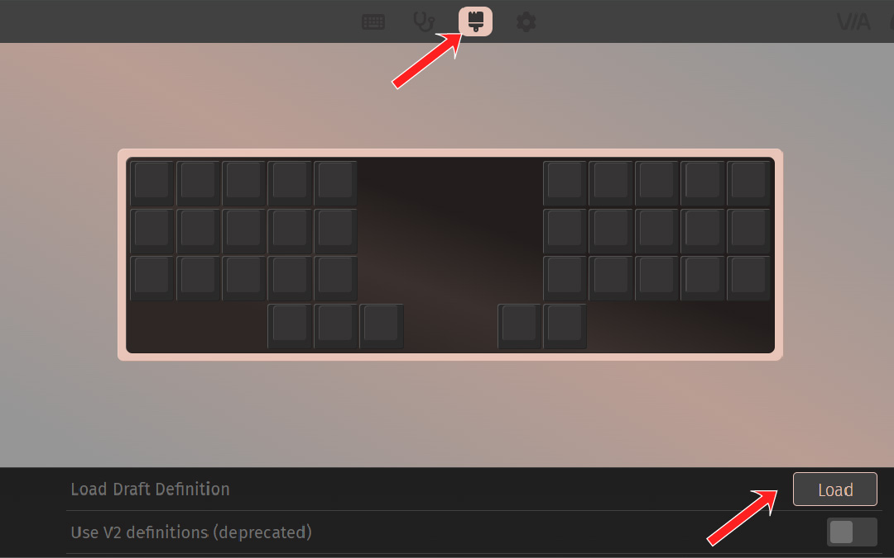
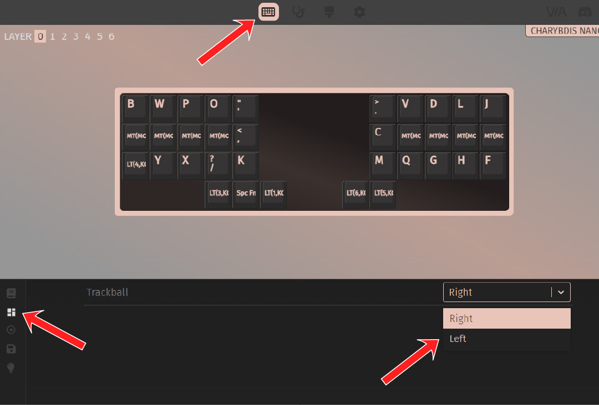

# Table of contents

1. TOC
{:toc}

While left-handed Charybdis are not supported directly through the official keymaps, it's possible to modify the firmware to enable a trackball on the left. We will be using a **Charybdis Nano** as example, but the process is the same for a Charybdis.

**Requirements:**
- Left-handed Charybdis or Charybdis Nano
- Working local QMK installation

# Modifying the QMK files

You will need to do the following modifications. **Old code is commented out**.


**charybdis/config.h:**

```c
// #define POINTING_DEVICE_RIGHT
// Pointing device is on the left split.
#undef POINTING_DEVICE_RIGHT
#define POINTING_DEVICE_LEFT

// #define POINTING_DEVICE_INVERT_X
#define POINTING_DEVICE_INVERT_Y
```


{: .note }
For the following modifications, modify the files in the **4x6** folder if you are building a Charybdis. 

**charybdis/3x5/config.h:**

```c
// #define ROTATIONAL_TRANSFORM_ANGLE -25
#define ROTATIONAL_TRANSFORM_ANGLE 40
```

**charybdis/3x5/config.h:**

```c
// #define MASTER_RIGHT
#undef MASTER_RIGHT
```

**charybdis/3x5/keyboard.json - old values:**
```json
                {"matrix": [3, 2], "x": 4, "y": 3},
                {"matrix": [3, 3], "x": 5, "y": 3},
                {"matrix": [3, 0], "x": 6, "y": 3},

                {"matrix": [7, 0], "x": 9, "y": 3},
                {"matrix": [7, 2], "x": 10, "y": 3}
```

**charybdis/3x5/keyboard.json - new values:**
```json

                {"matrix": [3, 2], "x": 4, "y": 3},
                {"matrix": [3, 0], "x": 5, "y": 3},
                {"matrix": [7, 0], "x": 6, "y": 3},

                {"matrix": [7, 3], "x": 9, "y": 3},
                {"matrix": [7, 2], "x": 10, "y": 3}

```

For a Charybdis 4x6, the change will be:

```json
                {"matrix": [4, 3], "x": 5, "y": 4},
                {"matrix": [4, 1], "x": 6, "y": 4},
                {"matrix": [9, 1], "x": 7, "y": 4},

                {"matrix": [9, 4], "x": 9, "y": 4},
                {"matrix": [9, 3], "x": 10, "y": 4},

                {"matrix": [4, 5], "x": 6, "y": 5},
                {"matrix": [9, 2], "x": 7, "y": 5},

                {"matrix": [9, 5], "x": 9, "y": 5}
```

Now that you've modified your firmware, you can compile and flash the `via` keymap.

# VIA definitions

{: .note }
This step is **optional**, and only required if you wish to use VIA to customize your keyboard.

With your firmware flashed, there are a number of things to do in the VIA interface for the virtual layout to reflect the physical one.

- In the `settings` tab, enable the `show design tab` option:


- Create a draft `3x5.json` file, and pasted the contents included at the bottom of this document

- In the `design` tab, load the draft file you just created:


- In the `configure` tab, go to `layout` and set the `trackball` option to `left`:


- **You're all set!**

# TODO list

- TODO 4x6 info.json
- TODO 4x6 draft definition
- RGB information

# Charybdis 3x5 Nano draft file

```json
{
  "name": "Charybdis Nano",
  "vendorId": "0xA8F8",
  "productId": "0x1832",
  "menus": [
    "qmk_rgb_matrix"
  ],
  "matrix": {
    "rows": 8,
    "cols": 5
  },
  "customKeycodes": [
    {
      "title": "Default DPI Increase",
      "name": "Default DPI Inc",
      "shortName": "DPI+"
    },
    {
      "title": "Default DPI Decrease",
      "name": "Default DPI Dec",
      "shortName": "DPI-"
    },
    {
      "title": "Sniping DPI Increase",
      "name": "Sniping DPI Inc",
      "shortName": "Snp+"
    },
    {
      "title": "Sniping DPI Decrease",
      "name": "Sniping DPI Dec",
      "shortName": "Snp-"
    },
    {
      "title": "Sniping Momentary",
      "name": "Sniping MO",
      "shortName": "Snp"
    },
    {
      "title": "Sniping Toggle",
      "name": "Sniping TO",
      "shortName": "SnpT"
    },
    {
      "title": "Drag-scroll Momentary",
      "name": "Drag-scroll MO",
      "shortName": "Drg"
    },
    {
      "title": "Drag-scroll Toggle",
      "name": "Drag-scroll TG",
      "shortName": "DrgT"
    }
  ],
  "layouts": {
    "labels": [
      [
        "Trackball",
        "Right",
        "Left"
      ]
    ],
    "keymap": [
      [
        "0,0",
        "0,1",
        "0,2",
        "0,3",
        "0,4",
        {
          "x": 4
        },
        "4,4",
        "4,3",
        "4,2",
        "4,1",
        "4,0"
      ],
      [
        "1,0",
        "1,1",
        "1,2",
        "1,3",
        "1,4",
        {
          "x": 4
        },
        "5,4",
        "5,3",
        "5,2",
        "5,1",
        "5,0"
      ],
      [
        "2,0",
        "2,1",
        "2,2",
        "2,3",
        "2,4",
        {
          "x": 4
        },
        "6,4",
        "6,3",
        "6,2",
        "6,1",
        "6,0"
      ],
      [
        {
          "x": 3
        },
        "3,2\n\n\n0,0",
        "3,3\n\n\n0,0",
        "3,0",
        {
          "x": 2
        },
        "7,0",
        "7,2\n\n\n0,0",
        {
          "d": true
        },
        "\n\n\n0,0"
      ],
      [
        {
          "y": 0.75,
          "x": 3,
          "d": true
        },
        "\n\n\n0,1",
        "3,2\n\n\n0,1",
        {
          "x": 4
        },
        "7,3\n\n\n0,1",
        "7,2\n\n\n0,1"
      ]
    ]
  }
}

```