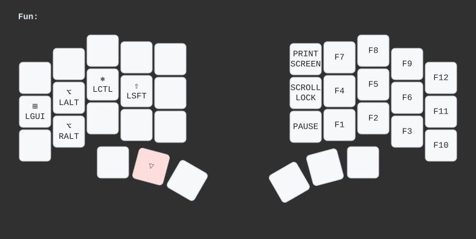

# Table of contents

1. TOC
{:toc}

This page contains reference pictures for all the default keymaps flashed onto the Bastard Keyboards.

Releases are available here:
https://github.com/Bastardkb/qmk_userspace/releases

For more information on the features from the Charybdis keymaps, see the [charybdis features][chary] page.

# Charybdis 

# Charybdis Mini

# Charybdis Nano

# Dilemma MAX

# Dilemma

# Scylla

# TBK Mini

# Skeletyl

----

[chary]: {{site.baseurl}}/fw/charybdis-features.html
