# Table of contents

1. TOC
{:toc}

# bk_led_matrix

QMK community module for the 12x16 WS2812 LED matrix on the left half of the Dilemma (bit-banged on `LED_MATRIX_MODULE_PIN`, RP2040 only).

Stored in [the modules repository](https://github.com/Bastardkb/qmk_modules).

The code for this module was heavily generated by AI.

## Animations

`LM_ANIM` (`0x7E21`; Shift: back) cycles through these and saves the choice. The reactive
ones follow the trackball; all keep running while the ball is still.

|        Sparks        |        Fireworks        |        Ocean        |
| :------------------: | :---------------------: | :-----------------: |
| 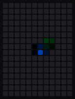 | 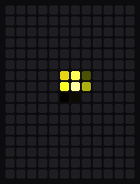 | 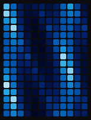 |

|        Asteroids        |        Matrix        |        Tetris        |
| :---------------------: | :------------------: | :------------------: |
| 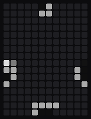 |  | 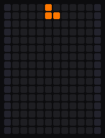 |

## Layer animations

Shown while a layer is held, also while the ball moves, except on the
auto-mouse layer. The keymap picks one per layer with `bklm_layer_anim_user()`;
layers without one show the layer stack.

|          Gear           |        Nav arrow        |         Equaliser         |          Hand           |          Digit          |          Math           |
| :---------------------: | :---------------------: | :-----------------------: | :---------------------: | :---------------------: | :---------------------: |
| 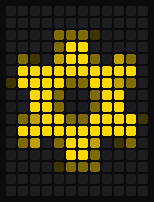 | 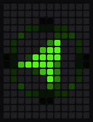 |  |  | 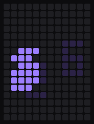 | 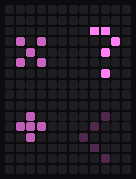 |

## Pointer modes

Drag-scroll and sniping are animated; cursor, brightness, zoom, volume, tab
switch, history and custom 1–5 show an icon.

|       Drag-scroll        |        Sniping        |
| :----------------------: | :-------------------: |
| 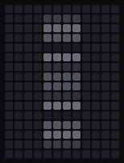 | 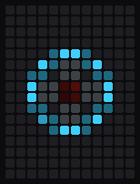 |

- Drag-scroll: a scroll wheel that turns a notch per scroll step; sideways
  scrolling lights a chevron on that side.
- Sniping: a scope that tracks a target the ball moves.

## Setup

```c
// config.h
#define LED_MATRIX_MODULE_PIN GP12
```
```json
// keymap.json
{ "modules": ["bastardkb/bk_pointing_device", "bastardkb/argos", "bastardkb/bk_led_matrix"] }
```

Argos is required: it stores the chosen animation. Settings are in
`post_config.h`. Pointer mode, activity and the chosen animation are synced from
the USB half, so it works with either half connected.

## Custom animations

1. Say how many animations the keymap adds, in `config.h`:

   ```c
   #define LED_MATRIX_MODULE_MOTION_USER_COUNT 1
   ```

2. Draw them in `keymap.c`. `index` is 0 to `LED_MATRIX_MODULE_MOTION_USER_COUNT - 1`:

   ```c
   #include "led_matrix_motion.h"

   // A dot the ball rolls around the panel.
   bool bklm_motion_user(uint8_t index, RGB *pixels, const bklm_motion_t *m) {
       static int32_t x, y; // 256 per cell
       if (m->fresh) {
           x = BKLM_COLS * 128;
           y = BKLM_ROWS * 128;
       }
       x = CONSTRAIN(x + bklm_motion_step(m->vx, m->dt, 200), 0, BKLM_COLS * 256 - 1);
       y = CONSTRAIN(y + bklm_motion_step(m->vy, m->dt, 200), 0, BKLM_ROWS * 256 - 1);
       bklm_splat(pixels, x, y, (RGB){255, 80, 0}, m->fade, false);
       return true;
   }
   ```

3. Flash. `LM_ANIM` reaches them after the built-in animations. To choose the
   order, list the animations yourself:

   ```c
   #define LED_MATRIX_MODULE_MOTION_CYCLE BKLM_MOTION_SPARKS, BKLM_MOTION_USER + 0
   ```

How it is called:

- About every 50 ms (`LED_MATRIX_MODULE_MOTION_REFRESH_MS`), on the panel half
  only, with `pixels` cleared. Set cells with `*bklm_px(pixels, x, y) = c` or
  `bklm_add()`. `x` runs 0 to `BKLM_COLS - 1` left to right, `y` runs 0 to
  `BKLM_ROWS - 1` bottom to top.
- `m` describes the ball (see `bklm_motion_t` in `led_matrix_motion.h`):
  - `vx`, `vy`: velocity.
  - `dir_x`, `dir_y`: the last direction.
  - `norm`: speed, 0 to 255.
  - `fade`: brightness to draw at while fading out.
  - `dt`: ms since the last frame.
  - `fresh`: reset your state.
  - `idle`: the ball is still.
- Keep state in `static` variables.
- Return `false` once there is nothing left to show; until then, the panel
  shows the animation and not the duck. `bklm_motion_linger()` keeps the
  animation up for a while after the ball stops.
- The built-in animations use the helpers in `led_matrix_motion.h`:
  `bklm_rand`, `bklm_sin8`, `bklm_cos8`, `bklm_atan2_8`, `bklm_isqrt`,
  `bklm_splat`. Their `led_matrix_motion_*.c` files are examples.


## Credits

Ying Kun Zhan <ying@zhan.co.nl>