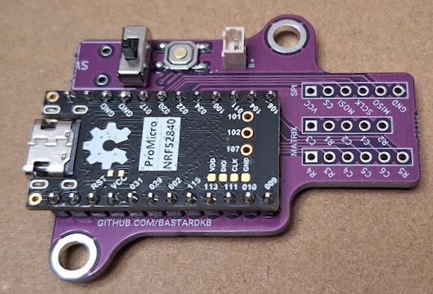
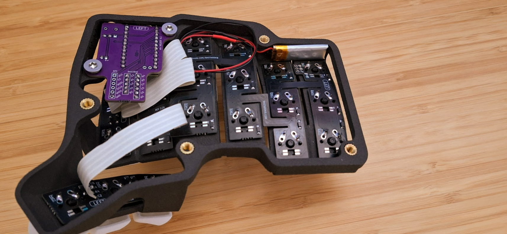

# Table of contents

1. TOC
{:toc}


# Introduction


Wireless bluetooth capabilities are not supported officially on Bastard Keyboards.

If you still wish to build one of the Charybdis or Dactyl keyboards, in this page is detailed a basic outline of the work needed.

Before beginning, make sure you have some **good understanding of electronics and firmware**. Read the whole page before committing.

There is a video overview here made by EIGA: [youtube link](https://www.youtube.com/watch?v=Mks7QDxFreY).


This guide is based on the [erenatas build guide](https://github.com/erenatas/charybdis-wireless-3x6) and the [280Zo build guide](https://github.com/280Zo/charybdis-wireless-mini-3x6-build-guide).

The purpose of it is to outline how to build a Wireless (Bluetooth) Charybdis. It is focused on how to build a 3x6 Charybdis Mini specifically.

**Important notes:**
- As of writing this setup does not support RGB LEDs

# Important disclaimer 
**Follow at your own risk**, Bastard Keyboards, erenatas and 280Zo are not liable for anything that does not work. 

Please note, as it's not an official supported build you will get limited help on the BK discord server.


# Caveats

There are a number of caveats involved.

Firmware:
- ZMK does not officially support input devices, so you will need to build from a fork
- There are some examples of Miryoku configurations for the Skeletyl and Charybdis Nano
- Out of the box, there might be connectivity or trackball connection issues, depending on your OS and hardware

Hardware:
- You will need custom PCBs (sensor, shield). Read more below
- At the moment, only the n!n and clones are supported. The XIAO BLE is not supported because it doesn't have enough pins, and there is no shield PCB for it
- There is no existing solution to secure the battery inside the case

Support:
- When building one of the officially supported Bastard Keyboards, you can get online support through email or discord
- When building this unsupported bluetooth keyboard, **you will only get very limited support**


# Required Parts
## Flexible PCBs

The exact PCBs you need will depend on which keyboard you are building, refer to the [official list for that](https://github.com/Bastardkb/Charybdis/blob/main/electronics_bom.md).

Make sure to follow the recommendations for PCB thickness.

## PMW3610 Breakout
[Link to Void's repo](https://github.com/victorlucachi/charybdis-pmw3610-breakout/tree/nicenano/production).

For this PCB you will need to order it pre-assembled, and solder the PMW3610 sensor manually. The bill of materials and position files are in the repository.

For the assembly, JLCPCB did not have `TCR2EF19` - but the part `TLV70018DDCR` is confirmed to work:
```
#(Old) TCR2EF19:
73dB@(1kHz) 200mA Fixed 1.9V Positive 5.5V SOT-23-5 Linear Voltage Regulators (LDO) ROHS


#(New) TLV70018DDCR:
68dB@(1kHz) 200mA Fixed 1.8V Positive 5.5V SOT-23-5 Linear Voltage Regulators (LDO) ROHS
```

An alternative is the [BastardKB PMW3610 sensor PCB fork](https://github.com/Bastardkb/charybdis-pmw3610-breakout).

## Nice!Nano Holder
[Link to olidacombe's repo](https://github.com/olidacombe/Elite-C-holder/tree/nicenano/adapter/production)

This PCB Design supports having a power switch that makes use of audio jack hole.

## 3D Prints

Depending on which model of Charybdis you are printing, refer to the [list of required 3d parts on the original repo](https://github.com/Bastardkb/Charybdis/tree/main?tab=readme-ov-file#3d-prints---cases).

For reverting the 3d files, you can do that directly in your slicer - or if you're using a print service, use Prusaslicer or Window's built-in 3d viewer app.

## Electronic components

In this section, we will go through each component that was used, and also give example links. Those are based on the original build from erenatas.

This list is based on the electronics BOM present on the Charybdis repo as of writing, so double-check there that you're not missing anything.

| Name                         | Count | Link                                                                                                                       |
| ---------------------------- | ----- | -------------------------------------------------------------------------------------------------------------------------- |
| Trackball                    | 1     | [Perixx Europe](https://eu.perixx.com/collections/accessory/products/18010)                                                |
| nice!nano microcontroller*    | 2     | [Splitkb.com](https://splitkb.com/collections/keyboard-parts/products/nice-nano)                                           |
| (optional) mill max sockets  | 2     | [Splitkb.com](https://splitkb.com/collections/keyboard-parts/products/mill-max-low-profile-sockets?variant=31945995845709) |
| SOD123 Diodes                | 41    | [Splitkb.com](https://splitkb.com/collections/keyboard-parts/products/smd-diodes)                                          |
| Button, 4x4x1.5              | 2     | [Aliexpress](https://www.aliexpress.com/item/4001046134819.html)                                                           |
| PMW3610 module               | 1     | [Aliexpress](https://www.aliexpress.com/item/1005006208592770.html)                                                        |
| Mini Toggle Switch TS-6 SPDT | 2     | [Aliexpress](https://www.aliexpress.com/item/1005003684819561.html)                                                        |
| Batteries                    | 2     | [Aliexpress](https://nl.aliexpress.com/item/1005005348368664.html)                                                         |
| Ceramic Bearing Balls 2.5mm  | 3     | [Aliexpress](https://www.aliexpress.com/item/1005004239319689.html)                                                        |
| Flexstrip Jumper Cables*     | 2     | [Aliexpress](https://www.aliexpress.com/item/1005003498734969.html)                                                        |
| Key Switches                 | 41    | [Aliexpress](https://www.aliexpress.com/item/1005003761194503.html)                                                        |
| M3 5mm Brass Melt Nuts       |       | [Aliexpress](https://www.aliexpress.com/item/1005003582355741.html)                                                        |
| M4 5mm Brass Melt Nuts       |       | [Aliexpress](https://www.aliexpress.com/item/1005003582355741.html)                                                        |
| M3 8mm Torx Screws           |       | [Aliexpress](https://www.aliexpress.com/item/1005006115217679.html)                                                        |
| M4 8mm Torx Screws           |       | [Aliexpress](https://www.aliexpress.com/item/1005006115217679.html)                                                        |
| JST plug 2-pin               | 2     | [Aliexpress](https://www.aliexpress.com/item/1005006115217679.html)                                                        |

*Alternatively, you can use one of the alternatives documented on [this MCU wiki](https://github.com/joric/nrfmicro/wiki/Alternatives), like the [SuperMini NRF52840 Microcontrollers](https://www.aliexpress.us/item/3256805848952479.html?gatewayAdapt=glo2usa).

### Notes

**Flexstrip Jumper Cables (Ribbon cables)**:

You will need:

- 72mm or more for the nice!nano holder
- 80mm or more for the thumb plate 
- 100mm or more for the sensor PCB

If the cables snap or are hard to desolder, you can use 28AWG single-core wire instead.

**Batteries**:

One important part here is the battery. If you order a battery from Aliexpress to Europe, the order will be shipped with freight, meaning it will take ~2 months to arrive. 

Due to this reason, if you reside within EU, you should try to source a battery of your choice within EU. 

What needs to be considered before ordering any battery is to ensure that it is:

- 3.7V
- more than 80mAh
- if you want to squeeze the battery between nice!nano and and the holder PCB, then you need to be careful of its size. At [42keebs.eu](https://42keebs.eu/shop/parts/lithium-polymer-battery/?attribute_size=301230%20(80%20mAh)), it states that you can fit `350926`, `301230`, `401030` underneath the nice!nano microcontroller
- again, if you would like to fit a battery underneath nice!nano, you may want to buy [Mill Max Low Profile Sockets with Headers](https://splitkb.com/collections/keyboard-parts/products/mill-max-low-profile-sockets?variant=47060695646555) in order to create the gap in between

For this build specifically, a JST plug was used to be able to take out the batteries without the need of desoldering.

## Helper Tools

Some tools will make it easier to build your keyboard:

- solder Iron: It's strongly recommended to get a good quality solder iron where you can change the temperature. From my research I have found that Hakko solder irons are overwhelmingly popular, however they are expensive. If you are not planning to build keyboards for a living, you can cut some costs by a cheaper alternative. I myself bought a [GALLUNOPTIMAL GOSprint150](https://www.amazon.nl/dp/B091J6TB43). Others have had success with the Pinecil.
- solder: There are two types of solder that can be used, leaded and lead-free. While leaded solder melts easier and its easier to desolder, lead itself is toxic, therefore its important not to inhale it. You can put a fan in front of you and have good ventilation and possibly wear a mask. Lead-free solder is a safer choice, but it melts harder and is harder to desolder. Make sure to wash your hands after you are done! Using solder with a rosin core also makes it much easier to use.
- solder wick: Its a type of solder remover, can be handy during incidents. Adding flux to board also helps a lot
- solder brass: If solder tin gets stuck on the tip of your iron, this is your go to
- pliers: You will need them to cut flexstrip ribbon cables
- torx screw drivers: You need M3 and M4 screw drivers. You already may have one at home.
- tweezers: You are going to need them to hold pieces together, and also deal with small parts such as SOD123 diodes
- desoldering Pump: Can be handy in case of accidents
- solder flux: Optional, solder tins usually have tin inside nowadays, however it may be handy to have one
- solder Station silicon: Optional, to make sure not to damage the surface you are working on

# Assembly

Most of the steps are similar to building a Charybdis Nano. Below is an outline, with details on what needs to be done differently.

## Solder the PMW3610 to the sensor board

There is a single orientation to solder it. You can take out the sensor cap while doing any soldering to prevent touching it with the soldering iron. Also make sure to remove the kapton tape.

## Solder the nice!nano holder components

Solder on the power switches, and reset buttons to the left and right nano holder PCBs. Then solder on the JST female connectors. 
Position this so the red wire on the male side would be the battery's positive connection, and the black wire the negative connection.

Solder the MCUs to the nano holders using the standard pin headers or the socketed pin headers, depending on what you chose to order to mount the MCU.

The MCUs should be face down (components facing towards the nano holder PCB), and the top through holes on either side of the USB connector will not have a spot on the nice!nano PCB.

Do not set your soldering iron any higher than 300°C, as it might damage the nice!nano.


You can use [this video from Joe Scotto](https://youtu.be/l5kAx08Iom4) to help.



Being careful to not short any connections, connect the JST battery connections, turn the switch to the on position, and confirm the MCU powers on.

If all goes well, unplug the battery and continue the assembly.

## Install the battery into the case

You can either mount the battery between the MCU and holder PCB, or tape it to the case.



# Firmware

The firmware can be downloaded from the [charybdis-wireless-mini-zmk-firmware repository](https://github.com/280Zo/charybdis-wireless-mini-zmk-firmware) by opening [the Actions tab](https://github.com/280Zo/charybdis-wireless-mini-zmk-firmware/actions), clicking on the latest successful run, then downloading the firmware file under Artifacts.

The main branch builds firmware for the colemak dh key layout. The layouts/qwerty branch builds firmware for the qwerty layout. Make sure you pick the correct branch for your needs.


Customizing the firmware is pretty straight forward. Common changes might include swapping the central and peripheral halves, changing the keyboard name, or modifying the key bindings. See the firmware repo for details on how to make changes.

Note that the official ZMK firmware doesn't support the PMW3610 or mouse movement keys, both of which are used in the firmware above. To get a working firmware I leveraged [the work of inorichi](https://github.com/inorichi) to get the PMW3610 driver, and [the work of petejohanson](https://github.com/petejohanson) for the driver to allow pointer movement and scrolling with keys.

Official ZMK support for mouse keys [is being worked on](https://github.com/zmkfirmware/zmk/pull/778), and when it's merged I'll switch back to the official ZMK firmware for the builds.

Additional links:

- erenata's ZMK config: [https://github.com/erenatas/zmk-config-charybdis-mini-wireless](https://github.com/erenatas/zmk-config-charybdis-mini-wireless)
- EIGA's config: [[EIGA's config repo](https://github.com/erenatas/zmk-config)](https://github.com/erenatas/zmk-config)

Erenata added scroll support via forking [@grassfedreeve](https://github.com/grassfedreeve)'s config and adapted it to 3x6 mini. 

## Flashing the firmware

To flash each side of the keyboard, follow the steps below:

- Unzip the firmware.zip file you downloaded
- Plug the right half info the computer through USB
- Double press the reset button you soldered onto the nano holder PCB
- The keyboard will mount as a removable storage device
- Copy the charybdis_right-nice_nano_v2-zmk.uf2 file into the NICENANO storage device.
- It will take a few seconds, then it will unmount and restart itself.
- Do the same with the left half, and copy the charybdis_left-nice_nano_v2-zmk.uf2 file.
- Both halves of the keyboard should now be flashed with the firmware.

## Examples

- [https://github.com/ykz89/zmk-config](https://github.com/ykz89/zmk-config)
- [https://github.com/0xcharly/zmk-config](https://github.com/0xcharly/zmk-config)
- [https://github.com/bstiq/zmk-config](https://github.com/bstiq/zmk-config)
- [https://github.com/grassfedreeve/Charybdis-ZMK-Config](https://github.com/grassfedreeve/Charybdis-ZMK-Config)

# Credit

This page is based on erenata's work and 280Zo's work.

You can find the original repos here: 
- [erenatas build guide](https://github.com/erenatas/charybdis-wireless-3x6)
- [280Zo build guide](https://github.com/280Zo/charybdis-wireless-mini-3x6-build-guide)