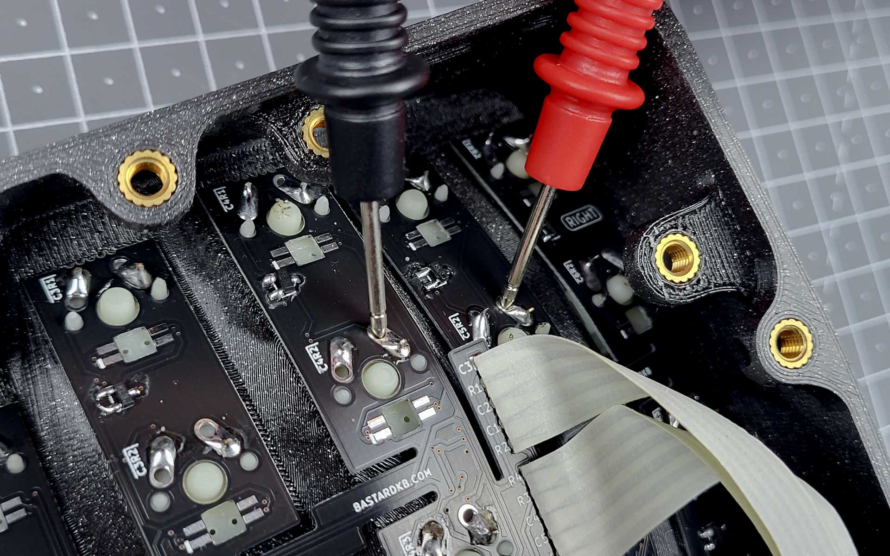

# Bodge wiring

A bodge wire is a connection that was not in the original design and is used to bypass a fault. The following guide will demonstrate how to diagnose a fault and how to apply the bodge.

## Diagnosing

{: .note }
You will need a multimeter for this step.

{: .tip }
To measure for continuity, your board must be powered OFF!

Set your multimeter to continuity mode. Most often a "sound" pictogram represents this mode, and often a diode symbol is placed next to it, because continuity mode often doubles as diode testing mode. Touch the probe tips together to verify you can hear a beep, or observe a change in the multimeter's display, depending on your model.

Place your probe tips on the two points that you suspect to be faulty. For continuity measurements, the direction of your measurement (which side uses which probe tip) does not matter.

In this example, the right switch legs of the switches in the C4R2 and C5R2 position are measured to verify a suspected break in the row trace shared by both switches.

No beep can be heard and no change is observed in the multimeter's display, yet the schematic demands these points are connected. The fault is confirmed.

## Preparing the bodge wire

{: .note }
Solid core wire of low thickness will work best, but stranded wire can also be used.

First, cut a length of wire appropriate to connect both points.

Use your wire strippers to remove a small amount of insulation from both ends. The uninsulated tip should be a few milimeters long.

{: .warning }
If you do not have wire strippers, we do NOT recommend using scissors or a knife instead. If you must use a knife, please be very careful not to injure yourself or to cut the solid core.

## Soldering

All that's left is to apply the wire. Solder it to both points and take note of the uninsulated length. If it is too short, the insulation will be in the way. If it is too long, the bare wire will be prone to touch another point and cause further issues in the future.

You can now plug your keyboard in and test your work. With any luck, the fault will be fixed!

No luck yet? Ask the community on [discord](https://www.bstkbd.com/discord)!

