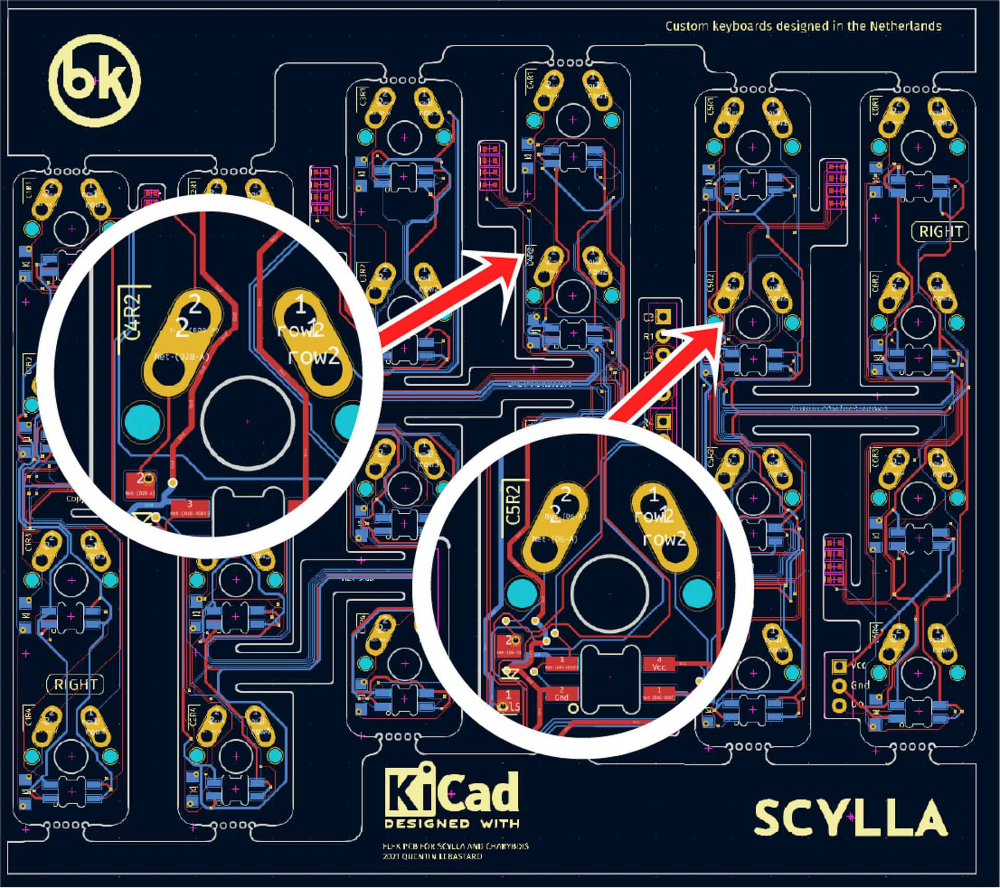
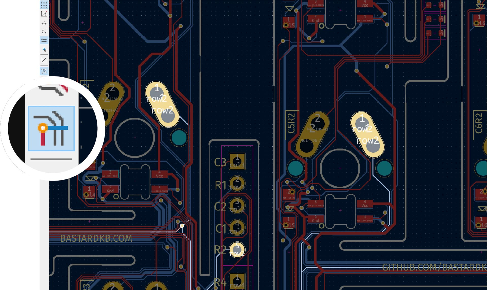

# Table of contents

1. TOC
{:toc}

# Introduction

In the Bastard Keyboards, we use flexible PCBs to connect all the switches together, and to the Splinky's (the "brain" of the keyboard). Because those are complex systems, it can happen sometimes that something breaks.

For example, a switch can stop working, or even a whole row or column. The RGB may not work, or flicker. Because it's difficult to cover all cases, we will instead in this section offer a few different examples of diagnosing **issues related to switches not working**. For each issue, we also offer some steps on how to fix it.

# Required tools and hardware

To diagnose a broken connection, you will need the following tools:

- multimeter
- Kicad 7.0 or later installed
- git command line / github desktop / or others

We will use the multimeter to diagnose if / where a broken trace could be, and git / kicad to figure out how to fix it.

{: .warning }
When doing any kind of measuring or soldering on the keyboard, it is **extremely important** that you unplug it first!

# I, O, P switches not working on 4x6 keyboard

This is a scenario that can happen when building a Scylla or Charybdis keyboard, because of the way the flexible PCB is wired. In this situation, the `I, O, P` switches stop working either permanently or temporarily. This can happen just after finishing a build, or after a long time using it.

## Find the broken connection

In this case, we have:
- `I, O, P` switches do not work
- the `Y, U` switches work

Because all the switches in a same row are connected together, this seems to indicate that something broke in-between `U` and `I`.
Once you've confirmed that those switches don't work when you press them, it's time to check where the connection could have broken.

## Inspect the schematics

- we will inspect the 4x6 PCB: clone it with git from https://github.com/Bastardkb/Scylla-PCB-Plate
- open the schematics file with kicad

If you look at your keyboard, you will see that the `U` key is labeled `C4R2`, while the `I` is labeled `C5R2`. 

Once the schematics open, let's look for those switches:

If you highlight the right pin of the `C4R2` pin with your mouse and toggle `Net highlightning` (in the left toolbar), you will notice all the switches of that row are connected together:

When looking at this, it seems that there might be a broken connection between `C4R2`'s row pin, and `C5R2`'s row pin.

## Confirm the trace is broken

Now that we have an idea of what could be broken, let's confirm that on the keyboard.

{: .warning }
Once again - before you do any kind of measuring, it is **extremely important** that you unplug your keyboard first!

Set your multimeter to continuity mode. Most often a "sound" pictogram represents this mode, and often a diode symbol is placed next to it, because continuity mode often doubles as diode testing mode. Touch the probe tips together to verify you can hear a beep, or observe a change in the multimeter's display, depending on your model.

Place your probe tips on the two points that we suspect to be faulty. 

{: .tip }
For continuity measurements, the direction of your measurement (which side uses which probe tip) does not matter.

No beep can be heard and no change is observed in the multimeter's display, yet the schematic demands these points are connected. **The fault is confirmed.**

## Fix the broken trace

Now that we confirmed there is a broken trace, and we know where it exactly is, the next step is to fix it.

For this, follow the steps in bodge wiring.
// TODO fix link

# Single key not working

// TODO

----

[Discord]: https://www.bstkbd.com/discord
