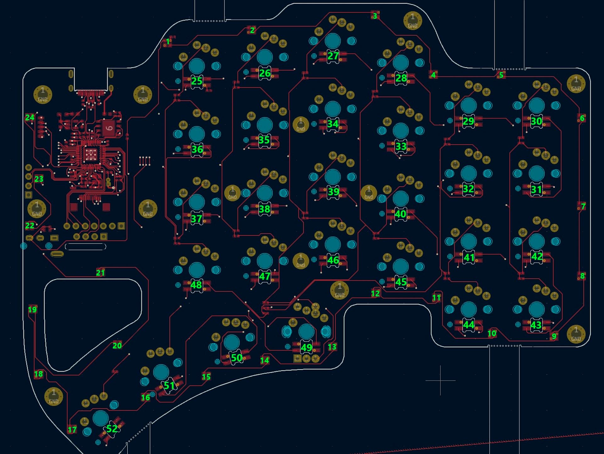

# Table of contents

1. TOC
{:toc}

# Introduction

On this page you will find various resources regarding the Dilemma MAX.

# RGB wiring diagram

If you have issues with per-key RGB, the following diagram illustrates the connection order of all LEDs (including underglow, and per-key). This is for the Right side, and the Left side is symmetric. 

The LEDs are wired in serial (this means if one LED stops working, all the leds after this one will also stop). 

If you need more details, you can find the source schematic files on the [Dilemma github repository](https://github.com/bastardkb/dilemma)